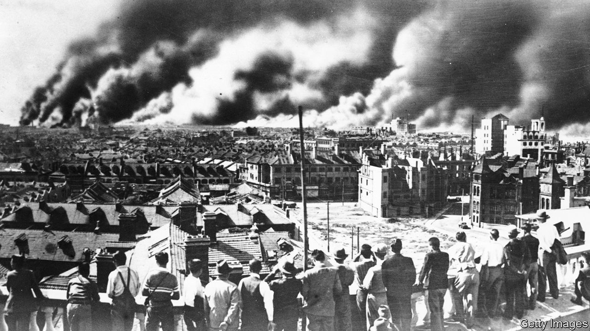
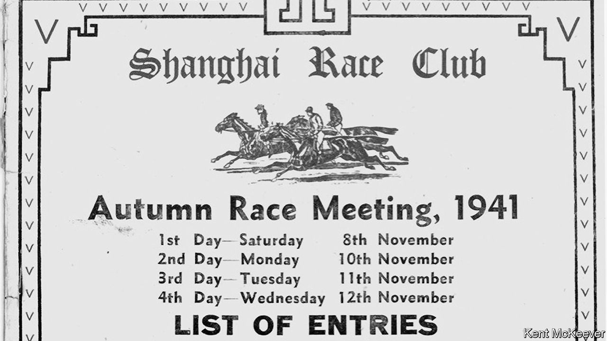

## A night at the Cathay

# A pair of displaced dynasties shaped two extraordinary cities

> Two new books chronicle the making of Shanghai and Hong Kong

> Jul 2nd 2020HONG KONG

The Last Kings of Shanghai. By Jonathan Kaufman.Viking; 384 pages; $28. Little, Brown; £20.

Champions Day: The End of Old Shanghai. By James Carter.W.W. Norton; 352 pages; $28.95 and £22.99.

THE STORIES of Shanghai and Hong Kong, the most remarkable cities in East Asia, begin with the pogroms under Dawud Pasha, the last Mamluk ruler of Iraq. Until his ascendancy, the Sassoons were leaders of a Jewish community in Baghdad that dated back to the Babylonian captivity; for centuries the head of the family acted as the pashas’ chief treasurer. Yet one dark night in 1829 here was David Sassoon, the city’s richest man, fleeing for his life towards the river with a money belt around his waist and pearls sewn into his cloak.

In 1832 the 40-year-old set up anew in cosmopolitan Bombay, no hardscrabble refugee but an heir determined to win back his birthright. The Sassoons never liked being called the Rothschilds of Asia: in their view, the Rothschilds were arrivistes.

David’s timing was lucky. The British empire, under which he sought protection, was at its height. He bought docks and warehouses. He imported new gins to make his raw cotton fit for the powered looms in British factories.

Above all, he ran drugs. The East India Company’s monopoly on opium had been abolished. David backed Britain’s unconscionable war in 1839 to force China to continue to take Indian opium. The British colony of Hong Kong was among the results, as was the “treaty” port of Shanghai.

The arrival there of Elias, the second of David’s eight sons, marked the beginning of a truly global enterprise that would stretch from Yokohama to London. Elias dealt in Indian opium, spices and cotton and Chinese silk and tea; he brokered other merchants’ goods up and down the coast; and he invested in property to house the Chinese and foreign migrants flooding into the boomtown. In Hong Kong, the Sassoons helped set up the Hongkong and Shanghai Bank to get easy loans for their business. As HSBC, it remains one of Asia’s most powerful banks.

The Sassoons held things together through constant correspondence—more than 7,000 letters in all. Clerks and young men of promise from poor Baghdadi Jewish families were dispatched to Sassoon schools in Bombay. One such family was the Kadoories. Recently widowed, Rima Kadoorie sent four sons to the Sassoons in 1876. Elly, the youngest, worked his way up the coast of China. When plague broke out at Weihaiwei he offered disinfectant to Chinese employees. Managers scolded him for giving away goods. “If that’s the value you place on life,” Elly said, “I resign.”

After the patriarch’s death in 1864, Sassoon energies dissipated. A chief distraction was seeking status in Britain. In time Elly, joined later by his two sons, Lawrence and Horace, rivalled the Sassoons in both wealth and influence. The Kadoories brought electricity (or “power”, as they always called it) to Hong Kong. Later, in Shanghai, it was at the Kadoories’ Majestic Hotel that China’s Nationalist leader, Chiang Kai-shek, and his famous bride, Soong Mei-ling, held their wedding party. Still, the Sassoon clan was to produce one last rival, Victor, a crippled playboy of charm and wit whose art-deco Cathay Hotel, which opened on the Bund in 1929, immediately eclipsed the Majestic. Its masked balls became the stuff of legend.

Victor jettisoned the business’s past reliance on Baghdadi families in favour of a global management team. As Jonathan Kaufman, formerly of the Wall Street Journal, puts it in “The Last Kings of Shanghai”, his illuminating book on the Sassoons and the Kadoories, the road to China’s modernisation “ran along the Bund”. That was why Chiang’s Nationalists could not shake down the Sassoons, the Kadoories or other foreign businesses as they did Chinese merchants. They needed Western loans and approval to consolidate power in a fractured land.

To foreign residents, known as “Shanghailanders”, the forces tearing at China were at most a backdrop; few were aware of the part they were themselves playing in history. Shanghai was now the city of glamour—of Charlie Chaplin staying at the Cathay, Noël Coward writing “Private Lives” in the bath there, and Wallis Simpson acquiring sexual techniques that enticed a king from his throne.

The city partied like there was no tomorrow. Mr Kaufman recreates the era well, as does James Carter of Saint Joseph’s University in Philadelphia. With the eye of an unusually perceptive flâneur, in “Champions Day” he tells the story of Shanghai through its former racecourse (now part of the People’s Park). Mr Carter is a wonderful guide for visitors in search of a long-gone city. The ideal Shanghailander was a Briton abroad, he writes, “but the category could be flexible.” Both books are cautionary tales about what happens, in Mr Carter’s words, when the powerful exploit their environment, inviting war and revolution.

For it soon turned out that there was no tomorrow. Shanghailanders blanked from their vision the Chinese corpses on the streets. It took a visitor like Emily Hahn, an American writer and Victor’s lover, to note that the city’s wealth sat on “a heap of underfed coolies”. That China’s Communist Party was founded in Shanghai was no coincidence; Chiang’s brutal suppression of it met with Shanghailanders’ approval.

By then other threats were circling. In 1937 Japanese forces occupied the Chinese parts of the city (see picture above); one bomb from a fleeing Chinese plane spattered flesh up the Cathay’s walls. After the attack on Pearl Harbour in December 1941 the Japanese took the self-governing International Settlement, too. Horse-racing was suspended the next year. A naval commander moved into Victor’s suite; in Hong Kong the Kadoories’ fabled Peninsula hotel became a military headquarters.

During these hard years, as Mr Kaufman recounts, both clans redeemed themselves, whatever original sins their fortunes were founded on. Victor and Horace came together to give sanctuary to fleeing European Jews. They set up schools, workshops and canteens and raised funds (Chaplin donated proceeds from “The Great Dictator”), an effort that involved perilous negotiations with the rapacious Japanese occupiers. Even as Shanghai became a squalid hell, not one of its 18,000 Jewish refugees was persecuted.

Four years after that war, Mao Zedong’s Communists seized power in China. They turned out the lights in Shanghai, that nest of foreign vices. His properties expropriated, Victor Sassoon cursed China and retired to the Bahamas. By contrast, Lawrence and Horace Kadoorie started afresh in Hong Kong. Lawrence’s “power” fired the textile mills that fleeing Shanghai industrialists set up near Kowloon, kickstarting Hong Kong’s post-war boom. The brothers had learned a valuable lesson: don’t neglect those at the bottom of the pile. The gentle Horace devoted his life to helping Chinese refugees in Hong Kong set up small farms with grants, loans, seeds and better pig breeds. The Kadoorie name is revered in the rural New Territories.

The family never criticised the Communists or the seizure of their assets. When China began to open up in the late 1970s somebody quietly replaced Elly’s tombstone, which Red Guards in Shanghai had ripped out. In Beijing Lawrence pleased leaders by praising China’s economic policies and cautioning against democracy in Hong Kong. Today Shanghai is once again international and cosmopolitan—and the Kadoories are back on the Bund. Now, though, modern skyscrapers across the river in Pudong dwarf the famous old skyline: no question who is boss.

Yet is another cautionary tale about to play out in Hong Kong? China this week imposed a draconian security law, undermining what sets Hong Kong apart from the dictatorship on the mainland. The Kadoorie heirs—they are still the biggest generators of power—voiced their approval. Stability is all. But an approach that ignored fundamental injustices did not work out in Shanghai, and may not in Hong Kong either. The new law is intended to shunt popular discontents from view; meanwhile, many elderly Hong Kongers collect cardboard at night for a pittance. The tycoons and officials have stopped noticing. It is surely not the end of the story. ■

## URL

https://www.economist.com/books-and-arts/2020/07/02/a-pair-of-displaced-dynasties-shaped-two-extraordinary-cities
