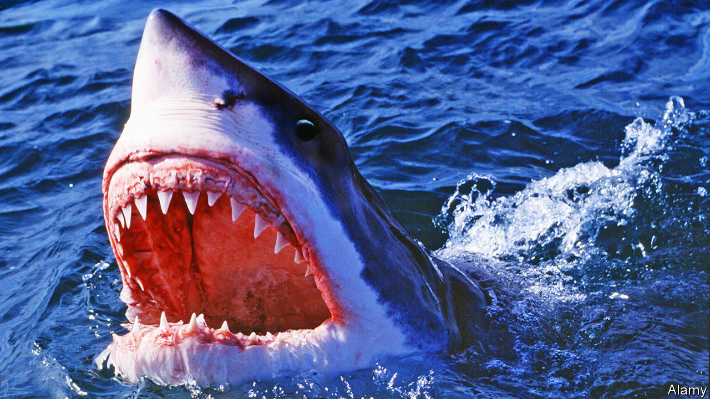

## Home Entertainment

# In “Jaws”, bungling officials confront an invisible threat

> Steven Spielberg’s blockbuster is apt lockdown viewing in more ways than one

> Jul 2nd 2020

“A FILM ABOUT a shark” was Steven Spielberg’s description of “Jaws”, the movie released in 1975 that established his box-office power as a director. More elaborate interpretations abound for his tale of a ravenous great white terrorising the genteel seaside town of Amity on Long Island. Is it a comment on corruption after Watergate, a parable of the Vietnam war or an illustration of Freudian castration anxiety? Fidel Castro, in an excursion into film criticism, reckoned it was a devastating Marxist critique of American capitalism.

The movie supports so many theories because of its layered plot and styles—one reason it is amenable to repeated viewings. Nerve-tingling suspense is intercut with picket-fence melodrama and humour. It is a buddy movie crossed with an adventure on the high seas. From the perspective of the pandemic, though, “Jaws” seems at heart to be a film about the untameable power of nature. An invisible, relentless assailant makes no distinction as to whom it attacks. Like some leaders today, the officials who must confront it are vacillating and helpless.

Much of the tension is achieved through the power of suggestion. The shark is not fully seen until long into the story (mostly because the mechanical models constantly malfunctioned). As in the lockdown, when the streets outside are the domain of a deadly bug, the sea that gives the beast its cover is the enemy, too, made ominous and forbidding by the spare and portentous score. Where can you turn when a killer might be anywhere?

In Amity, those in charge see the danger but fail to act swiftly. Brody, the local police chief (played by Roy Scheider), is well-meaning but unprepared. After the first shark attack the self-important Mayor Vaughn (Murray Hamilton) persuades him to keep the beaches open to save the tourist economy; the men lock down only when three more people are killed. (Boris Johnson, Britain’s prime minister, once cited the mayor as a political hero for his boldness in weighing death against commerce.)

Experts disagree on how to overcome the danger. Hooper (Richard Dreyfuss), a wisecracking academic, prefers brainy methods; Quint (Robert Shaw), a heavy-drinking shark hunter, opts for brawn. Even in a film packed with memorable dialogue, Quint’s description of being torpedoed during the second world war, with its grim mortality statistics, stands out: “So, 1,100 men went into the water; 316 men come out. The sharks took the rest.”

Sadly, it will take more than three misfits in a ramshackle vessel to beat the virus. Metaphorically speaking, “You’re gonna need a bigger boat.” Still, quarantine is another chance to enjoy Mr Spielberg’s yarn, albeit with an after-bite. For many, its legacy was a lifelong fear of the sea; for some, covid-19 may bequeath a lingering queasiness about the world outside. ■

Editor’s note: Some of our covid-19 coverage is free for readers of The Economist Today, our daily [newsletter](https://www.economist.com/https://my.economist.com/user#newsletter). For more stories and our pandemic tracker, see our [coronavirus hub](https://www.economist.com//news/2020/03/11/the-economists-coverage-of-the-coronavirus)