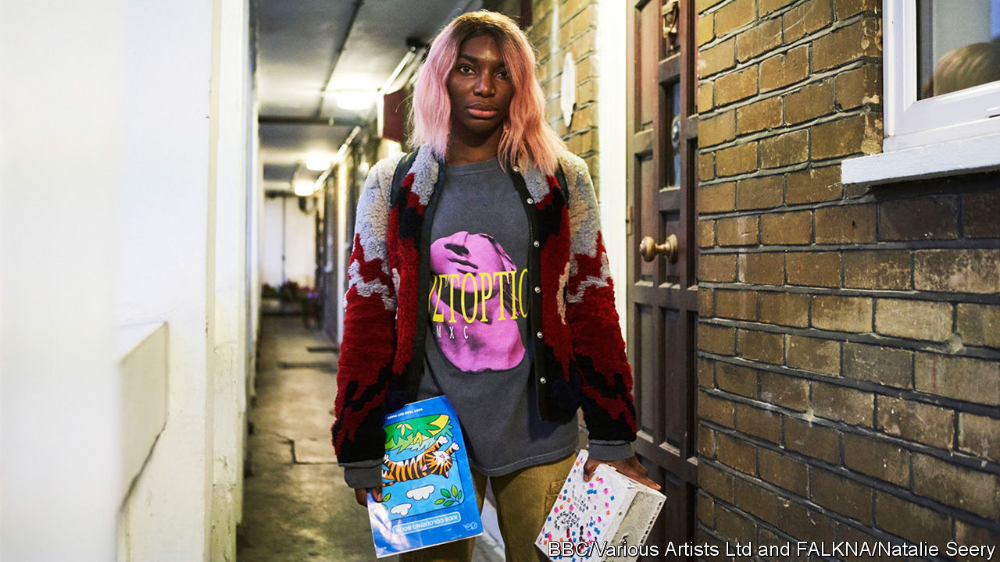

## Creative destruction

# The jolting artistry of Michaela Coel

> The writer and star of “I May Destroy You” explains her arresting style

> Jul 2nd 2020

EVERY YEAR the Edinburgh Television Festival, one of the highlights of the industry’s calendar, invites a prominent figure to deliver a talk known as the MacTaggart lecture. Past speakers have included Rupert Murdoch, Eric Schmidt and Armando Iannucci. In 2018 Michaela Coel, a British writer and actor, took to the podium. She was the first woman from an ethnic minority to do so and, at 30, the youngest lecturer in the festival’s history.

Ms Coel described her upbringing on a council estate in east London, where her family would receive “a bag of shit through our letter-box”. She recalled her time at a Catholic school, finding God (then losing him again) as a young adult, and the racist slurs she endured at the Guildhall School of Music and Drama, where she was “the first black girl they’d accepted in five years”. She lamented the lack of opportunities and support for minorities in television, promising to “play whatever part I can to help fix this house”. The speech was raw and personal, but also shot through with humour. When malicious rumours were spread about her at school, she remembered, she had retorted that “the only thing I was blowing was the clarinet.”

Talking over Zoom, she evinces the same mix of gravity and zaniness, thoughtful pauses alternating with peals of laughter. This jolting blend of moods defines her work, too. Ms Coel draws on her own experiences to fashion compelling, surprising narratives, which tackle solemn subjects with a dizzying lightness of touch. Her stories provoke horror in viewers one moment and mirth the next. As well as distilling a generation’s feelings about sex, race, class and friendship, they have established her as one of television’s most original and provocative dramatists.

“Chewing Gum”, her breakthrough, BAFTA award-winning show, began as a one-person play, which she wrote as part of her final assessment at drama school. Although she loved Shakespeare and Greek tragedy, Ms Coel says, “I wanted to write a [play] where I’m bringing myself, I’m bringing something I understand, into this school.” She recycled memories of her own adolescence to create the figure of Tracey, a 14-year-old navigating school, friends and boys. “I ain’t smart enough to be someone,” Tracey says. “I’m just smart enough to know I’m no one.”

The TV version dropped some of the original play’s darker themes, such as teenage pregnancy and domestic violence, but retained the naivety of its protagonist. Played by Ms Coel, this Tracey is in her early 20s and lives on a housing estate with her devout mother and sister; she shakes off her religious upbringing as she becomes obsessed with having sex. Her interactions with love interests are often insulting. One man says she looks “like a modern, liberated slave”; another asks where she is “really from”, later getting her to dress up in a bikini and perform a “tribal” dance. Like Phoebe Waller-Bridge’s character in “Fleabag” (which “Chewing Gum” preceded), Tracey often breaks the fourth wall to speak directly to viewers. Rachel Springett—formerly of Channel 4, which commissioned the show—says Ms Coel’s work “walks the line between tragedy and humour in a way I’d never seen before”. The writing was “poetic, profound and in your face”.

The two seasons of “Chewing Gum” were broadcast in Britain and America in 2015-17. Ms Coel has since taken lead roles in “Black Earth Rising”, a drama series co-produced by the BBC and Netflix about the prosecution of war criminals in Rwanda, and “Been So Long”, a film musical (for which she also composed part of the soundtrack). She appeared in two episodes of “Black Mirror” and in “Star Wars: The Last Jedi”. But her main project—which has taken two and a half years to come to fruition—has been “I May Destroy You”, a searing, disconcerting drama currently being broadcast on HBO and the BBC.

Ms Coel stars as Arabella, a young writer who has recently shot to fame for her “Chronicles of a Fed-Up Millennial”, a Twitter-account-turned-book. This story, too, is partly drawn from life. As a deadline for the second season of “Chewing Gum” loomed, Ms Coel startlingly recounted in her Edinburgh lecture, she “took a break and had a drink with a good friend”; when, hours later, she “emerged into consciousness”, she realised that she had been sexually assaulted by strangers. She says now that it was in the police investigation room, as she waited to give her statement, that she knew she wanted to write about the trauma. “While my right hand was going through this, it’s like my left hand was beginning to almost observe and take notes of what was happening.”

The BBC responded to the idea by commissioning the whole series, without the usual pilot. Piers Wenger, head of BBC Drama, says he seized the opportunity to collaborate with Ms Coel and gave her total creative freedom. “It’s rare that you get a voice that can occupy so many different extremes and still have a really strong unity and coherence to it,” Mr Wenger says. The director of the series, Sam Miller, observes that Ms Coel is “unafraid to go to the other side of the border”. (As well as writing and starring in them, Ms Coel co-directed nine of the 12 episodes.)

Though some of the scenes are difficult to watch, “I May Destroy You” is also fun. Ms Coel explores the subjects of sexual consent and abuse through young lives in a big city in the 21st century, replete, as they often are, with money troubles, unsuitable flings, social media and house parties. The morning after Arabella is assaulted, she stumbles onto the streets of central London, disoriented, her ears ringing; a fan approaches her at a bus stop, gleefully quoting passages of her book and asking for a selfie. After she goes to the police, the show jumps back three months to a trip to Italy, on which she and her best friend Terry indulge in a drugs binge (and, in Terry’s case, in a threesome).

Those characteristic tonal shifts have become even more pronounced and arresting. The emotional whiplash is meant, Ms Coel explains, to capture a fundamental truth. “I think a lot of people of colour, their lives are not a gag a minute,” she says. “There is darkness and there is light—and we should take both.” ■