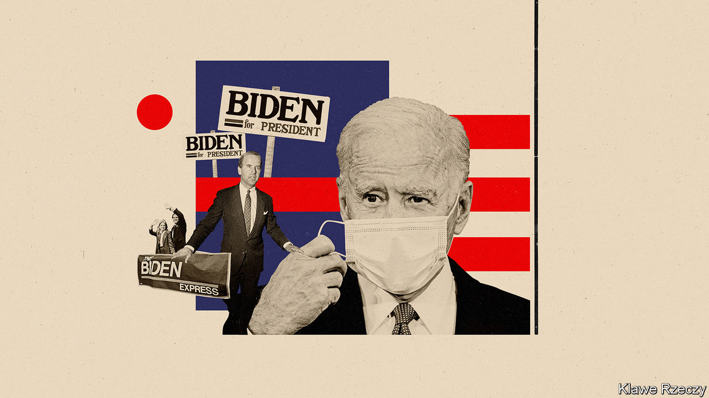
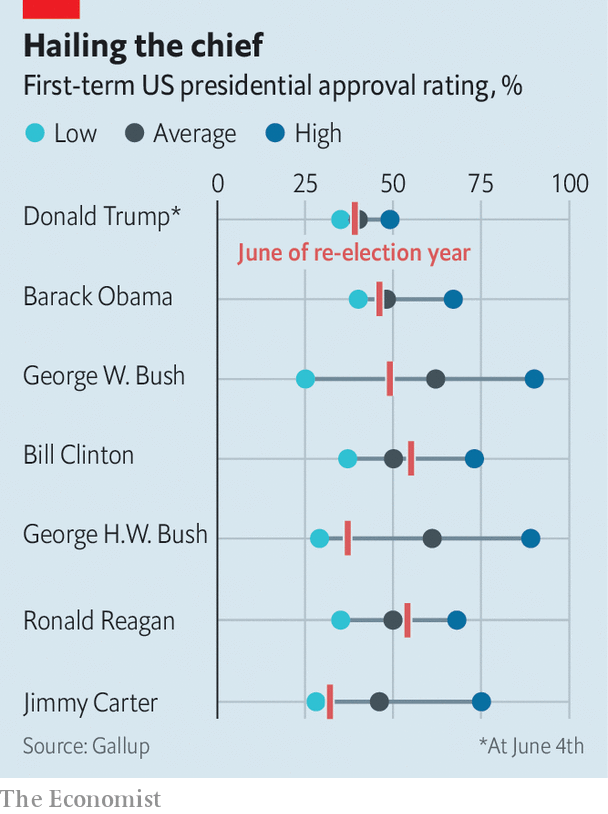
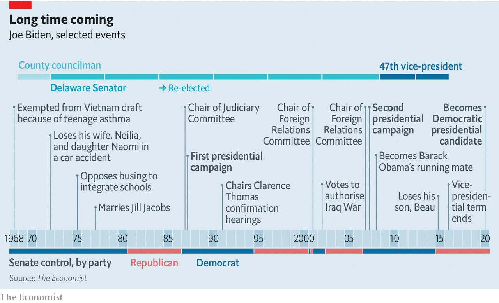
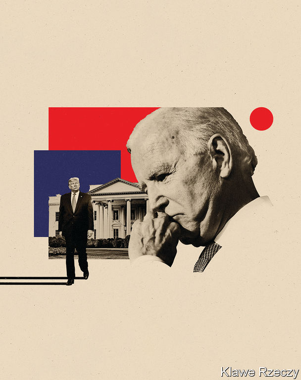

## America’s extraordinary election

# Joe Biden has a good chance of becoming a surprisingly activist president

> He is reassuring and popular and has come to boast an ambitious policy platform

> Jul 4th 2020WASHINGTON, DC

ON NOVEMBER 7TH 1972 the people of Delaware voted to send Joe Biden, a brash, garrulous county councilman, to the United States Senate—even though he would not turn 30, the Senate’s age minimum, for another two weeks. During the campaign he had sought both to use and downplay his youth. His ads touted “new thinking” and “new solutions”; the compliments he paid his 63-year-old opponent on the success of his fights against Stalin and polio were delivered with a faultless backhand. But he remained vague about precisely what all that novelty meant. In his slogan, “He understands what’s happening today”, the word “understands” was well chosen: it suggested to young voters that he got the counterculture and discontent over Vietnam, while reassuringly signalling to older ones that he did not fully condone them. As he told the Wilmington News Journal, “I’m not as liberal as people think.”

America’s youngest senator then is now its oldest ever presumptive nominee as a presidential candidate, running in a campaign as far removed from his debut in 1972 as 1972 was from Calvin Coolidge’s campaign of 1924. His age, at times, has been painfully apparent on the campaign trail: his loquacity is less bounded, his stories meander without necessarily reaching their conclusion. His primary campaign was, for the most part, poor. Yet as things stand he has a good chance of winning November’s election. If so he may, more through circumstance than design, bring real change to a country long gridlocked and polarised.

President Donald Trump is a highly divisive figure. He is the only president in modern history to never have seen more than 49% of the population approve of his performance in the role (see chart); his current rating is around 40%. At 74 he is the oldest president ever to stand for re-election, which goes some way to neutralising concerns about Mr Biden’s age. He is also the first ever to seek re-election after being impeached. Stories that might have destroyed another presidency—tear-gassing peaceful protesters for a photo opportunity, asking the president of China for help in re-election—seem to break around his ears every few weeks.

On top of an extraordinary incumbent, extraordinary times. America’s covid-19 epidemic has, so far, cost the country over 120,000 lives. Not yet controlled, it could claim almost that many again by election day. Mr Trump had hoped to run on a booming economy, and had he been able to he might well have won, despite his lack of broad support. Instead, he will run in a country ravaged by a misfortune he has done too little to deal with and blighted by unemployment and bankruptcy. Social distancing’s constraints have created a campaign unlike any other. An unprecedented number of Americans will vote by mail, a development that has already seen Mr Trump whipping up false fears of fraud.

All re-election bids are to a large extent referendums on the incumbent; this one is little else. Looking like a plausible president, the support of the party and not being Mr Trump seem to be more or less all that is required of Mr Biden, and the polls show that his familiar, unchallenging avuncularity is meeting the challenge well: a comforting figure for an uncomfortable time. On average he enjoys a polling advantage of about 9%, comfortably above that seen by Hillary Clinton in 2016. He holds solid leads in the “Blue Wall” states—Michigan, Pennsylvania, Wisconsin—that Mrs Clinton lost and stands a fighting chance in solidly Republican states such as Arizona, Georgia and Texas. The Economist’s election forecast, which combines polling data with economic and other fundamentals, currently puts Mr Trump’s chance of holding on to the White House at just one in ten.

Mr Trump will try to fight his way out of this with personal smears against Mr Biden. It was for extorting favours aimed at helping him paint Mr Biden as a nepotist corrupting foreign policy for the benefit of his son, Hunter, that Mr Trump was impeached. But Mr Biden looks likely to prove a tougher target for such tactics than Mrs Clinton was in 2016, largely because people like him.

It is not just that Americans by and large see him as approachable and good-hearted. They also know his life’s sorrows. Mr Biden’s first wife, Neilia, died in a car crash with their one-year-old daughter, Naomi, shortly after that first victory in 1972. His son Beau, who gave a moving speech about that loss when Mr Biden was nominated to be Barack Obama’s running mate in 2008, died of cancer in 2015. The tempering of grief has given Mr Biden deep reserves of empathy.

He will also be attacked on policy. Mr Biden has always sat close to his party’s ideological centre. At points in his career he has been lukewarm on abortion rights and federally enforced school integration, an advocate of harsh criminal penalties and a proponent of financial deregulation. But as the party’s centre has moved to the left, so has he. Perhaps Mr Biden has shifted with the political winds; perhaps he has a commendable willingness to rethink outdated positions. Either way, he has become something a bit akin to a radical, a seemingly centrist grand-dad running on as bold a Democratic policy platform as has been seen in generations. It looks set to include a public option on health care and an ambitious effort to fight climate change which will include a carbon tax.

Many on the party’s progressive wing give him little credit for this. In the primaries, they wanted to abolish private health insurance; today, many want to defund police departments. Some warn, or threaten, that if he fails to take a turn to the left on such causes he risks losing the election. Aimee Allison, who heads She the People, an organising and advocacy group for women of colour, urges Mr Biden to “meet the moment [and] turn protesters into voters. If he doesn’t...he’s not going to be able to close this fatal enthusiasm gap he has now.”

There are two problems with this. One is that the Democrats’ greatest recent success, winning back the House in 2018, was brought about not by progressives who retained safely Democratic seats but by centrists taking seats previously held by Republicans. The voters they won over then are the sort of people Mr Biden needs now. The second is that it would be inauthentic. Mr Biden’s persona is that of a moderate: a decent, reassuring figure running, as he often says, to “restore America’s soul”, and offering, as a surrogate put it, “a return to civility.” That is the Joe Biden for whom a majority of Americans twice voted when he was on the same ticket as Mr Obama.

Vice-presidents have every chance of getting their party’s nomination if they want it. But in 2015, wracked by grief over Beau’s death, Mr Biden decided that he didn’t. He left public office, seemingly for good. Family and close advisers say it was Mr Trump’s coddling of white supremacists who marched on Charlottesville, Virginia, in 2017 which prompted him to rejoin the political fray. He campaigned for dozens of Democrats in the midterms; in March last year he announced his candidacy (accidentally, at a dinner in Delaware: distilled essence of Joe Biden).

It was his third such campaign. In his first, in 1987, he quit early after the media piled on to questions of plagiarism. Two decades later he dropped out after coming fifth in the Iowa caucuses. This time, with the vice-presidency on his resume, he led in the polls more or less throughout. He won none of the campaign’s first three contests. But no one else in the race managed to convince the party that they, rather than Mr Biden, were the candidate best placed to defeat Senator Bernie Sanders, widely seen as unelectably far to the left.

After Mr Biden won the South Carolina primary handsomely, two other centrist candidates, Amy Klobuchar, a senator from Minnesota, and Pete Buttigieg, then mayor of South Bend, Indiana, quickly dropped out of the race and endorsed him. That allowed Mr Biden to establish an overwhelming lead over Mr Sanders on Super Tuesday.

When Mr Sanders dropped out a month later Mr Biden had another chance to display his disposition towards bringing people together. The two senators created six task-forces to advise Mr Biden on policy all of which include supporters of both men—a way of avoiding a recurrence of the rancour that defined the 2016 primary, when Mr Sanders’s supporters felt the establishment had played dirty pool on Mrs Clinton’s behalf.

The policies that these groups come up with will not necessarily be those that Mr Biden runs on; he already has a substantial policy agenda, and it is coming to the fore. When the election’s sole defining issue was Mr Trump, it was plausible for Mr Biden to focus his run on normalcy in high office. Now the country is suffering through covid-19 and has seen a remarkable spate of protest his campaign has dialled back on talk of restoration, emphasising instead Mr Biden’s policies for meeting the moment.

Much of it is routine stuff for Democrats in 2020: a higher minimum wage, protection for unions, reform of bankruptcy and campaign-finance laws and so on. Two things stand out for their ambition. The first is health care. Republicans are once again pushing to end Mr Obama’s Affordable Care Act (ACA) without offering a replacement. The Democratic left wants it replaced with Medicare for All. Mr Biden plans instead to build on the ACA by letting people buy into a government-run plan—the “public option” deemed too radical just a decade ago. He also wants to lower the Medicare eligibility age from 65 to 60. The two steps could transform American health care: the public option could become big enough and therefore cheap enough that employers and employees prefer it to private insurance.

Similarly, Mr Biden has proposed climate-change plans that go well beyond Mr Obama’s achievements, calling for a net-zero-emissions economy by 2050 and an entirely electric car fleet. But he has not quite embraced the Green New Deal beloved of the left and has kept some centrist options open. He has not renounced the use of either nuclear energy or fracking (which could imperil his chances in otherwise-winnable-looking fracking states such as Pennsylvania and Ohio and just-about-in-play Texas). He is willing to explore technologies that capture carbon from fossil-fuel plants before it gets to the atmosphere, which makes many greens uncomfortable. Though the campaign calls the means by which he will seek to make polluters pay an “enforcement mechanism”, it seems clearly to be a carbon tax, and a more broadly based one than the cap-and-trade scheme which failed to get through the Senate under Mr Obama.

To make such changes the Democrats will need the Senate as well as the presidency and the House. That requires them to win three or more of the 23 Republican-held Senate seats being contested. A few months ago that looked like a long shot. Today’s polls make it look more plausible: but if the odds are better than 50:50, they are not so by much. This is another reason not to expect Mr Biden to make the big rhetorical or policy moves that the progressive wing says would excite the base. Flipping states with Republican senators is an inherently centrist undertaking.

Simply winning the Senate, though, is not enough. It might allow Mr Biden to fulfil his promise to restore the top marginal income-tax rate to 39.6% on those making over $400,000 and partially to reverse Mr Trump’s corporate-tax cuts, raising the rate from 21% to 28%: such measures can be passed as part of a “reconciliation bill” which requires only a simple majority. But almost all other business in the Senate is hostage to filibustering, which can only be overcome with 60 votes. Even were Mr Biden to achieve a landslide—and he has as good a chance of doing so as Mr Trump has of scraping a narrow win, according to our model—his coat-tails will be nowhere near long enough to bring 13 new Democratic senators with him.

Mr Biden, with the sort of respect for Senate procedure that comes from spending almost half your life within its precincts, says that he does not want to end the filibuster. He has also said he expects a Republican “epiphany” when Mr Trump leaves office, one that might make possible new bipartisan approaches to the nation’s problems. But Chuck Schumer, who would become majority leader were the Democrats to take the Senate, does not rule out getting rid of the filibuster. Some suggest that the mere threat of doing so might be enough to bring some Republicans round to the climate and health-care aspects of Mr Biden’s legislative agenda, epiphany or no epiphany.

Not all change needs legislation. Mr Biden could roll back the Trump administration’s own rollbacks of regulations on environmental protection and other things, putting back in force the rules that have been dropped, enforcing those that have been ignored. He could reverse the Trump administration’s immigration policies through executive action. He could also change the tone and manner of the presidency—though not necessarily that of the national conversation. Barracking from a defeated Mr Trump and his supporters would surely be raucous.

Foreign policy, where presidents have the greatest room for manoeuvre, would provide Mr Biden with his comfort zone. Decades as a member of the Senate’s foreign-relations committee and then as vice-president mean that he knows the game and many of the players. Neither the tactics of the opposing teams nor the state of the pitch, though, are as he left them. China is a far more assertive power; Russia has been able to interfere in American elections with minimal retribution. And the pandemic spreads on.

Mr Biden believes the world’s democracies want America to reassert itself in the role, abandoned by Mr Trump, of their leader and protector. He is unlikely to prove it so through force of arms, any more than Mr Obama chose to. But simply playing the part should prove a first step.

Mr Biden’s commitment to arms control is one of the through notes of his career. As president he would seek to pursue that interest in talks with Russia and Iran. He would rejoin the Paris agreement on climate change and hope thereby, and through the ambition of his domestic plans, to reinvigorate it. He has also promised to host “a global Summit for Democracy”, centred on fighting corruption and authoritarianism, and advancing human rights. Summitry is easy to mock; but as an opportunity for the relationship-building at which Mr Biden excels, it could bring benefits. Plenty of Asian countries which have resigned themselves to Chinese pressure would be glad to have an American thumb on the other side of the scale again.

Mr Biden has described himself as a “bridge” to the next generation of Democrats. He has been coy as to whether he sees that bridge as four years long or eight. Given that, should he win in November, he would be in his 80s when campaigning for a second term, this coyness cannot be taken as a simple refusal to look overconfident. His vice-presidential choice, due in early August, will thus be an important one—as Mr Obama’s has turned out to be.

Mr Obama, who represented profound change simply by virtue of his race and background, chose in Mr Biden an old-white-guy complement who represented experience and stability. He went on to govern cautiously and to be succeeded by his old-white-guy antithesis, a cruel man bereft of experience and deeply chaotic. Now Mr Biden, who still represents stability, seems by that very fact to represent the change people want. If they act on that desire, he may find himself in a position to govern more ambitiously than his one-time boss. ■

Dig deeper:

## URL

https://www.economist.com/briefing/2020/07/04/joe-biden-has-a-good-chance-of-becoming-a-surprisingly-activist-president
