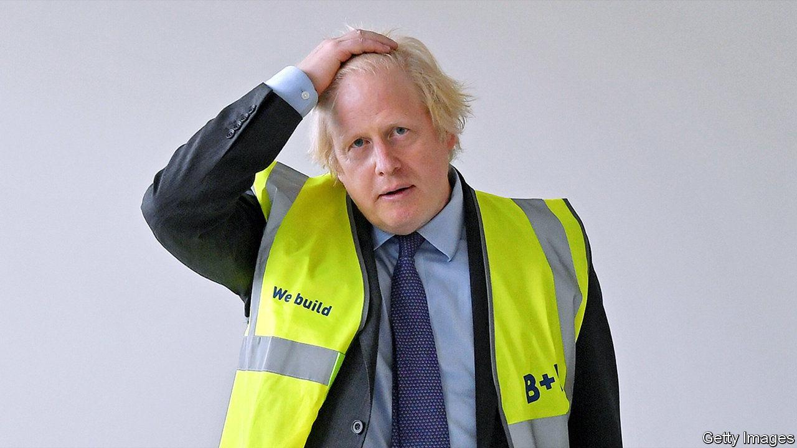
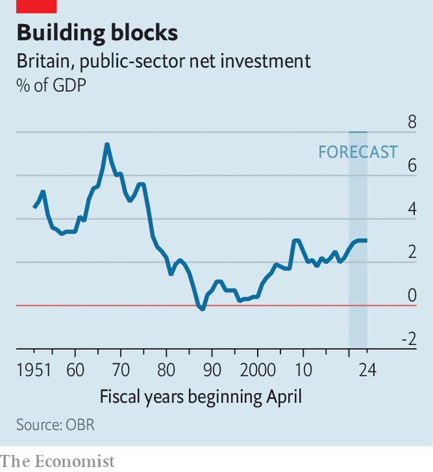

## Build, build, build

# Boris’s infrastructure plans

> The government wants to dig for victory

> Jul 2nd 2020

BORIS JOHNSON loves the smell of wet concrete in the morning. Like a children’s encyclopedia from the 1960s, his speeches imagine a Britain forged in steel and glass, humming with nuclear fusion, spaceports and high-speed trains. His career has been punctuated with plans for daring monuments. A cable car over the Thames got built. A vast island airport, and bridges to France and Ulster, did not.

Mr Johnson’s plans for a spree of infrastructure spending to “level up” poorer places were blown off course by the covid-19 pandemic, but he returned to his theme in a much-trailed speech intended to relaunch his premiership on June 30th, with the catch-phrase “build, build, build”. The pandemic has given it a new purpose: to dig Britain out of recession.

Given the hype, the speech was underwhelming. The government will stick to its original plan to increase capital spending to 3% of GDP, the highest consistent level since the 1970s (see chart), and will speed up £5bn of repairs to roads, schools and hospitals. An announcement that the government was revising up its borrowing plans by an additional £50bn ($62bn), or 2.5% of pre-crisis GDP, this year made barely a ripple in the bond markets.

Since the economy will have no difficulty absorbing the extra demand and worries earlier this year that the construction sector would have difficulty delivering on the government’s grand plans have dissipated, bringing spending forward seems sensible. But Mr Johnson’s comparison of his scheme to Franklin D. Roosevelt’s New Deal, which dragged America out of the Depression, doesn’t bear much scrutiny. FDR increased central government spending from under 4% of GDP in 1930 to over 10% by 1939. In Britain it stood at about 40% just before the crisis and is forecast to be at similar level in 2024. Today’s construction projects are capital-intensive and require skilled labour; unemployed baristas are not going to find work digging sewers.

But there is one big similarity. FDR, according to his biographer Robert Dallek, had no grand plan for rescuing America, only an “uncanny inexplicable feel for what might work and what would stimulate public approval”. Richard Hofstadter, a historian, describes an “era of fumbling and muddling through”. Mr Johnson’s plans, similarly, lack analytical rigour. His observations that Britain needs greener energy, more flexible planning laws and better skills were made in similar speeches by recent predecessors. He does not specify which areas will be targeted for “levelling up” or how success might be measured.

“They don’t have a map. They don’t have a theory of change,” laments a Tory MP. “To say we need more infrastructure hides a series of questions: why, and what for?” says Colin Talbot of the Centre for Business Research at the University of Cambridge. The answer depends in part on whether ailing towns such as Wigan and Keighley are best helped by becoming attractive commuter hubs for their neighbouring cities, which is the Treasury orthodoxy, or by trying to revive their industries, which is more popular with local politicians but harder to do. Henry Overman of the London School of Economics argues that what ultimately makes places prosperous is a high density of skilled workers, which means thinking hard about education, welfare and public health. If infrastructure alone did the job then well-connected Folkestone and Barking would be better off, he notes.

More significant shifts in fiscal policy are likely at what the Treasury is calling a “summer update” and Number 10 dubs “a mini-budget” on July 8th. The chancellor will give details on what, if anything, will replace the furlough scheme which is currently paying the wages of some 9m Britons and due to be wound down by October. There is talk of an extended wage subsidy, perhaps to the sectors such as retail and hospitality more directly impacted by social-distancing measures. A cut in VAT is likely, again perhaps targeted at retail, hospitality and tourism.

But “levelling up” is as much a political project as an economic one. Mr Johnson wants to show the voters who backed him in December that they’ve been heard. His new northern MPs have presented the Treasury with shopping lists of roads and railways. That points to quick, visible projects such as repaving high streets, and discourages serious reflection about their constituencies’ future role in Britain’s economy.

Mr Johnson’s claim that Britain outside London has been “neglected and unloved” is politically convenient, but nonsense. The issue of regional inequality has occupied successive governments over decades, from Harold Macmillan’s National Economic Development Council to Tony Blair’s Regional Development Agencies. Given the lack of progress so far, the question deserves revisiting. But any solution needs 25 years to show results, and a cross-party consensus. Mr Johnson wants something to show by the general election in 2024, and to crush the Labour Party. ■