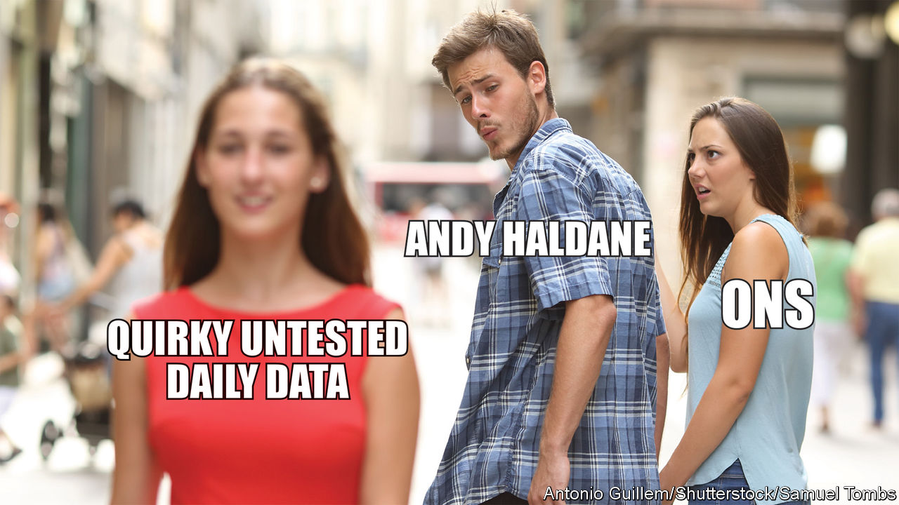
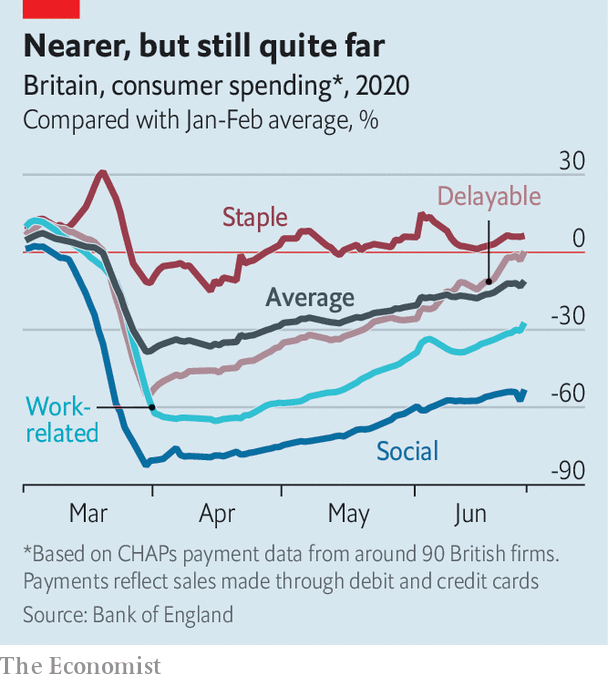

## Recession

# How speedily will the British economy recover?

> Fast, thinks the chief economist of the Bank of England. Many disagree

> Jul 2nd 2020

AT THE MID-JUNE meeting of the Bank of England’s rate-setting Monetary Policy Committee, eight of the committee’s nine members voted to expand quantitative easing by £100bn ($124bn) to provide more support for the economic recovery while one, the bank’s chief economist Andy Haldane, voted against. In a speech on June 30th Mr Haldane set out his reasoning. It makes for cheery reading at a time when most British economy-watchers are still stressing the downside risks to output and inflation. April marked the trough for the economy. The Office for National Statistics (ONS) reckons that GDP contracted by 20.4% in that month.

Few doubt that May and June’s figures will be better, but it will be weeks before they come out. In the meantime, opinion is divided on the question of the shape and speed of the recovery. The optimistic Mr Haldane declared that “It is early days, but my reading of the evidence is so far, so V.” He buttressed his argument by drawing on experimental, real time indicators. Especially striking was his use of the bank’s payment-system data to provide an up-to-date measure of consumer spending based on debit- and credit-card transactions at around 90 British firms (see chart). By this measure, household spending appears to have recovered rapidly from the April drop.

Many analysts are unconvinced. Unemployment looks likely to rise and precautionary savings may remain high. Data on card payments may well be flattered by a shift away from cash and, even if the picture is broadly correct, making up the final lost 10% of GDP will prove tricky if people continue to travel less and do not pack into restaurants and pubs. Samuel Tombs, of Pantheon Macroeconomics, spoke for many who prefer to rely on proven data sources when he tweeted his response (above).