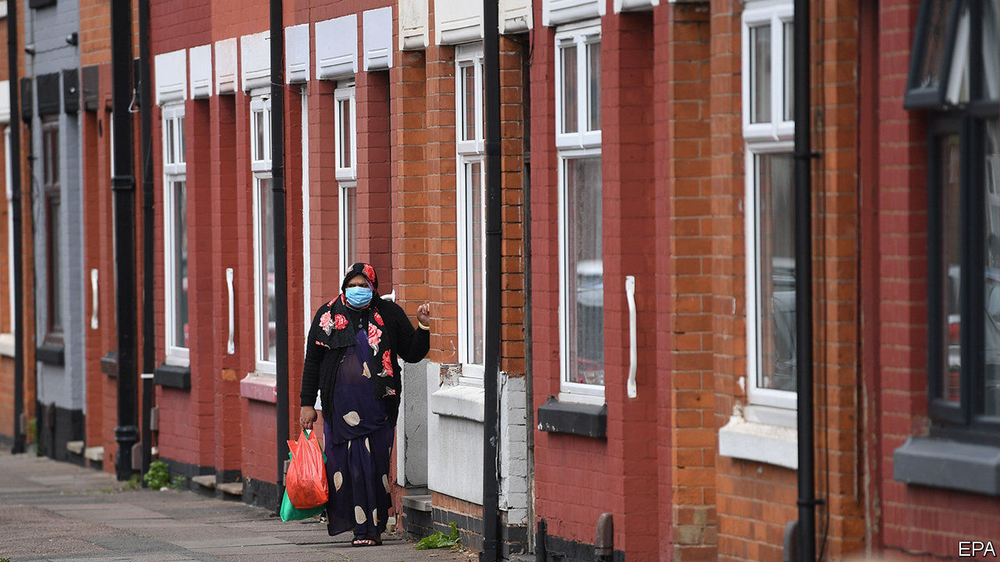

## Whacking moles

# Leicester shuts up shop

> The introduction of a second lockdown has been little smoother than the first

> Jul 2nd 2020LEICESTER

Editor’s note: Some of our covid-19 coverage is free for readers of The Economist Today, our daily [newsletter](https://www.economist.com/https://my.economist.com/user#newsletter). For more stories and our pandemic tracker, see our [hub](https://www.economist.com//news/2020/03/11/the-economists-coverage-of-the-coronavirus)

OVER THE past few months, Boris Johnson has repeatedly said that the government is ready to play “whack a mole”, shutting down any area which sees an outbreak of covid-19. On June 30th Leicester got whacked. As the rest of the country reopened, the East Midlands city, home to 330,000 people, closed down. Schools and most shops have been shut, vulnerable people told to continue shielding. And the rest of the country has been ordered to avoid the city.

Despite Mr Johnson’s fighting talk, the government has tried to avoid such measures. Previous spikes have been stopped with narrower restrictions: closing a hospital in Somerset, two GP surgeries in London and a meat-processing factory in Yorkshire. Yet a surge in testing failed to halt the spread of the virus in Leicester, possibly because the government was unsure exactly where the outbreak sprang from. It has been worst in the east of the city, a place of cramped garment factories and multigenerational residences, home to a large south Asian population.

By the time Matt Hancock, the health secretary, announced the new measures, the seven-day infection rate in the city was 135 cases per 100,000 people, nearly three times the rate at which Germany automatically introduces restrictions. Leicester’s mayor has criticised the government for not giving the city council the granular data needed to suppress an outbreak. Although the quality of publicly available testing data is poor in Britain, other councils say they have begun to receive better information in recent weeks. It is not clear why Leicester did not.

Unlike in other European countries, the government had set out neither the criteria for introducing a local lockdown nor what one would look like. Crucial details, including the area affected and what was banned, only emerged in the days after Mr Hancock’s announcement. “They showed a map which said I was outside. Then on TV they said my area was inside,” says Gaynor, a retiree, walking her dog on Leicester’s western outskirts. “I’m confused.”

Across the city, in North Evington, one of the worst affected neighbourhoods, Aaqib Razzaque, who teaches chemistry at a local sixth-form college, worries about the lack of a public information campaign to support the new measures. “Not everyone watches the news, or understands it,” he says. Indeed, many of the city’s Indian community speak Gujarati as a first language, and have little English. “They should have adverts in different languages,” he adds—something Downing Street has since confirmed it will fund. Although they have become more common in the recent days, masks are still a relatively rare sight, as in the rest of Britain.

In a fortnight’s time the government will review the restrictions it has placed on Leicester. Until then, most residents say they intend to follow the rules, no matter the inconvenience. “It’s got to be done, hasn’t it?” sighs Yusuf, smoking on his doorstep. “It’s for individuals’ safety here.” Yet they are rather less sanguine about how the process has been handled. At the start of the original lockdown, Britons were mostly willing to give the government the benefit of the doubt. That goodwill has since evaporated. ■

Editor’s note: Some of our covid-19 coverage is free for readers of The Economist Today, our daily [newsletter](https://www.economist.com/https://my.economist.com/user#newsletter). For more stories and our pandemic tracker, see our [hub](https://www.economist.com//news/2020/03/11/the-economists-coverage-of-the-coronavirus)

## URL

https://www.economist.com/britain/2020/07/02/leicester-shuts-up-shop
