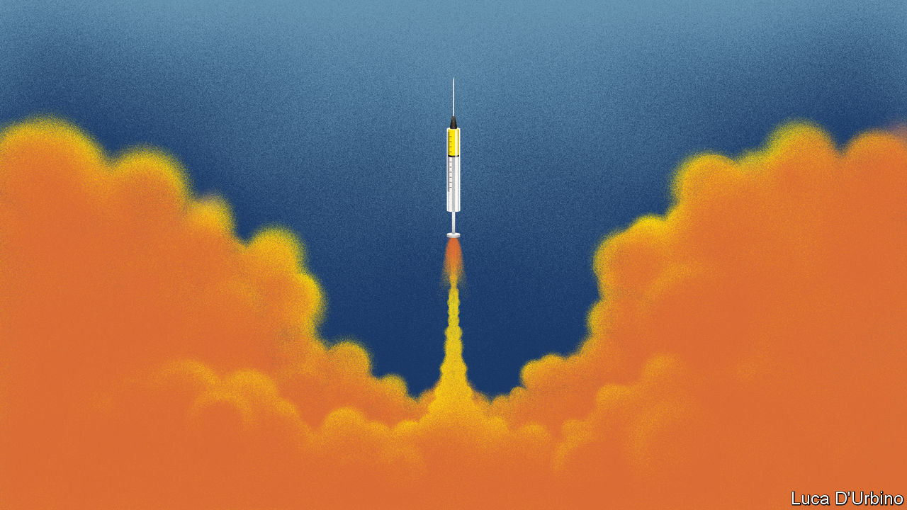

## Covid-19

# Oxford University is leading in the vaccine race

> Governments are pouring money into a more urgent version of the space race

> Jul 2nd 2020

Editor’s note: Some of our covid-19 coverage is free for readers of The Economist Today, our daily [newsletter](https://www.economist.com/https://my.economist.com/user#newsletter). For more stories and our pandemic tracker, see our [hub](https://www.economist.com//news/2020/03/11/the-economists-coverage-of-the-coronavirus)

BY OXFORD’S EASTERN bypass road, some way from the famous spires, sits an unremarkable collection of glass office buildings that includes the Jenner Institute. Described by an industry observer as “a slightly dusty corner” of the university, until six months ago it mostly busied itself with useful but ill-funded research into diseases suffered by people in poor countries. Now it has become the likeliest candidate to produce the world’s first vaccine against covid-19.

With governments all over the world pouring money into it, the effort to get a vaccine has come to resemble a more urgent version of the space race. According to a tally maintained by the Milken Institute, an American think-tank, 180 vaccines are in development. In late June China waved through an emergency authorisation to allow its armed forces to use a vaccine that remains incompletely tested. A number of American vaccines are doing well, but have yet to progress to late-stage testing. Soumya Swaminathan, chief scientist for the World Health Organisation, says the Oxford vaccine is the leading candidate.

Oxford’s vaccine is already in three late-stage trials. Only one other vaccine, developed by Sinopharm, a Chinese firm, has started a late-stage trial, and it does not have the global support and finance that Oxford’s does. AstraZeneca, a British pharmaceutical company, is building an international supply chain to make sure that the vaccine is available “widely and rapidly”.

It might be clear by the end of August whether or not the vaccine is effective. A single successful trial showing efficacy would allow a regulator to approve the vaccine for emergency use—something that would probably pave the way for use in high-risk groups. That could happen in October. The firm thinks that full approval, which would require results from multiple trials, could come early in 2021. Vaccine development routinely takes 10-15 years, so this would be a remarkable result.

Oxford, which rivals Cambridge as Britain’s best life-sciences university, is rich not just in talent but also in research money. None of the 60 or so groups at the university working on the disease waited for government funding. “I think it’s one of the reasons Oxford has done so well in this,” says an insider. “We just got on and did it.” Other Oxford researchers have since identified the first drug proven to reduce mortality from covid-19. But the Jenner Institute may turn out to have made the biggest breakthrough of all.

The institute started work on January 11th, the day after covid-19’s genetic material was sequenced. It had previously developed a vaccine for a closely related virus that causes MERS, another coronavirus disease. Sarah Gilbert, head of the laboratory at the institute that had done the work, and her team have now engineered a chimpanzee virus to deliver a portion of the covid-19 genetic material into the body, thus generating an immune response.

Once the vaccine had been made, the medicines regulator, the MHRA, rushed through approval for clinical trials. In normal times it has 60 days to respond to a request; in this case, it gave its approval in a week. Later-stage trials were expedited by using interim data from earlier trials, rather than waiting for final data.

At the same time, factories had to be found to produce the vaccine. In March the UK Bioindustry Association carried out a survey, which found that “there was limited capability to scale to significant volumes,” says Steve Bates, the association’s chief executive. That changed quickly as Oxford worked with domestic manufacturers. In April it signed a deal with AstraZeneca which soon had hundreds of staff working on scaling up the vaccine.

The vaccine is grown inside cells that are cultured in vats called bioreactors. Production starts small, at 200 litres. When AstraZeneca is happy with what it produces in the smallest bioreactor it will scale up production. Four bioreactors of 2,000 litres can produce a billion doses in two months. Although AstraZeneca is not a vaccine company, the processes for producing a vaccine are similar to those it uses for its biotechnology products.

According to AstraZeneca, making each dose of the vaccine costs about as much as a cup of coffee. Two billion doses have already been ordered. The company has agreed to supply over a billion doses to Europe, Britain, America, and GAVI, a vaccine finance group. The Serum Institute of India is also producing an additional one billion doses of the Oxford vaccine, mainly for low- and middle-income countries, of which 400m will be made before the end of 2020. In Britain, 30m doses will be available by September.

But the big question—whether the immune response that the vaccine generates is enough to protect against the disease—is as yet unanswered. In an ongoing British trial designed to find this out, 7,000 patients have been injected with it; further trials have just started in Brazil and South Africa. These should also determine whether the vaccine is safe, whether it produces a rare reaction in which it exacerbates rather than ameliorates the disease and whether one or two doses are required to provide protection.

If the vaccine works, governments will have to decide who should get it first. In Britain, the Joint Committee on Vaccination and Immunisation, which advises the government, has recommended that front-line health- and social-care workers, then those most vulnerable, should be first in the queue. But it has warned that its advice may change should more data become available on the transmission dynamics of the disease or the effects of a vaccine.

Boris Johnson has called the race for the vaccine “the most urgent shared endeavour of our lifetimes”. It is not, he insists, “a competition between countries”. But he would no doubt be delighted if the world’s first vaccine came from Oxford. Aside from extricating the world from a crisis, such a triumph would go some way to mitigating the blow to Britain’s international reputation dealt by the government’s poor management of the epidemic.■

Editor’s note: Some of our covid-19 coverage is free for readers of The Economist Today, our daily [newsletter](https://www.economist.com/https://my.economist.com/user#newsletter). For more stories and our pandemic tracker, see our [hub](https://www.economist.com//news/2020/03/11/the-economists-coverage-of-the-coronavirus)

## URL

https://www.economist.com/britain/2020/07/02/oxford-university-is-leading-in-the-vaccine-race
