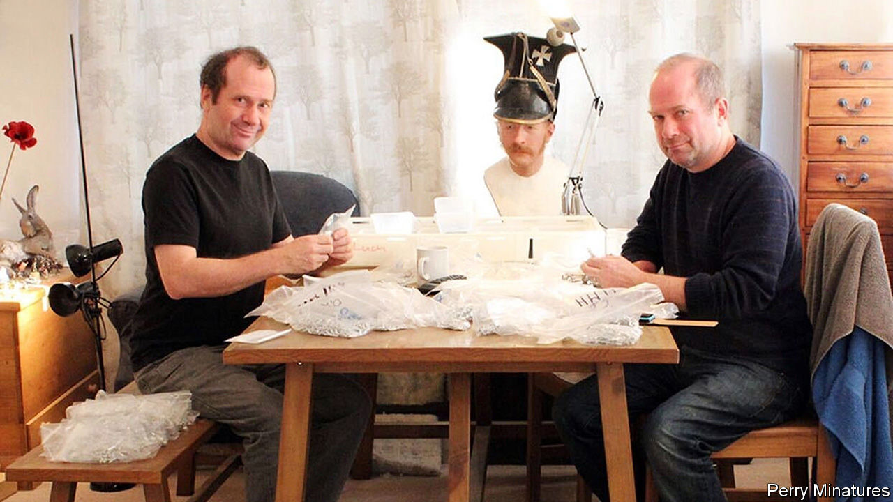

## The lead belt

# Why Games Workshop is worth more than Marks & Spencer and Centrica

> Disease and demographics have boosted the toy-soldier business

> Jul 2nd 2020

THE FIRMS that are doing well out of the pandemic are, by and large, high-tech ones, helping people to live virtually. But an industry about as unlike Zoom as possible is also flourishing. “It’s like two Christmases’ worth of demand,” according to Alan Perry of Perry miniatures.

Wargaming—collecting and painting toy soldiers before fighting battles using dice, tape measures and often complicated rules—is surprisingly big business in Britain. The share price of Games Workshop, the best-known and biggest player in the industry, has risen 1,500% over the past five years, making it the best-performing British listed share over the period. With a market capitalisation of around £2.7bn ($3.4bn), it has overtaken Centrica, owner of British Gas, and Marks & Spencer.

Games Workshop’s science-fiction and Tolkienesque figures are designed at its headquarters in Nottingham, centre of the “lead belt”—although the figures have not been made from lead since the 1990s. Miniatures are sculpted by hand, and moulds then created. The industry norm is to cast to order rather than carry large inventories, so figures are mostly produced in Britain to reduce delivery times.

Games Workshop’s presence in Nottingham has spawned a local cluster. Many of the city’s figure designers, manufacturers and rules-publishing firms are run by ex-Games Workshop staff. The wider industry is less focused on elves and space marines and more geared to historical gaming: the second world war and the Napoleonic and medieval periods are especially popular. Nottingham is a “mecca of sorts for gamers”, says Teras Cassidy of Canada’s Geek Nation Tours, who organises tours for North American fans.

Games Workshop, which boomed in the 1990s, is enjoying a surge of demand from what the industry calls “returners”—30- or 40-something men who last held a 28mm-high orc in their teens and, now that they no longer have to pretend to be cool, find themselves picking up their paintbrushes once more. “I’ve got a wife and a kid and I don’t feel the need to pretend to have other hobbies any more,” says Paul, a 36-year-old local-government worker. Historical gamers tend to be older: many mention Airfix kits of the 1960s and 1970s as their introduction to the hobby.

Social distancing mostly closed down the wargaming side of the hobby, but that’s not really what aficionados are in it for. Mr Perry, an ex-Games Workshop sculptor who runs Perry Miniatures with his twin brother Michael, says that “for every hour you actually game, you might have spent 25 painting”. Michael Perry lost part of his right arm after a cannon explosion during a medieval re-enactment in 1996, and now sculpts with his left hand.

It’s a good hobby for an anxious time. Gamers talk about the painting process as others might discuss yoga or meditation. “Spending evenings quietly assembling and painting the models is part of the charm,” says Richard, a finance worker. Many gamers added to their “lead piles” of unpainted soldiers during lockdown, and prepare them for the fray right down to the tiny buttons of their Napoleonic uniforms. Let battle commence!■

## URL

https://www.economist.com/britain/2020/07/02/why-games-workshop-is-worth-more-than-marks-and-spencer-and-centrica
