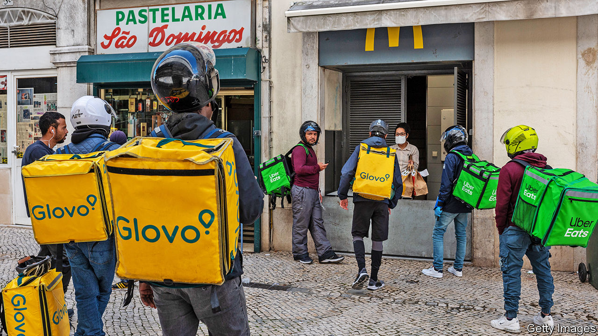

## Appetite for destruction

# Food-delivery wars heat up

> Will winning the battle for locked-down Western stomachs ever translate into profits?

> Jul 2nd 2020

JOSé AVILLEZ, a Portuguese chef, has picked up two Michelin stars for his inventive takes on traditional dishes such as a pudding that daringly combines chocolate ganache with cuttlefish ink. On June 29th he experimented again: his Lisbon-based restaurant, Bairro do Avillez, started serving gourmands at home via Uber Eats.

It joins the likes of London’s Hakkasan and Claro in Brooklyn, which before covid-19 would never have dreamed of relying on a service associated with burgers and pizza. In May Dara Khosrowshahi, Uber’s boss, said the recruitment of such upmarket restaurants would expand the industry.

The veteran is Just Eat Takeaway.com, an Anglo-Dutch firm that in June bulked up by buying Grubhub, an American one, for $7.3bn. Both offer online access to restaurants that for the most part already have delivery drivers (though each is also investing in its own fleet). The trio of later arrivals on the scene—Uber Eats and two American rivals, Postmates and DoorDash—rely instead on armies of gig-economy couriers.

Uber seems bent on dominating the industry. On June 29th it reportedly offered $2.6bn to buy Postmates, which ranks fourth in America by revenue. The approach might relaunch plans for an initial public offering (IPO), which Postmates shelved last year after lukewarm interest from investors. At the time, food-delivery was becoming a poster-child for tech businesses whose footprint in the physical world meant that costs tended to grow as fast as revenues, or faster.

The pandemic has changed the mood again. Demand from locked-down consumers is surging. Grubhub recently reported revenue growth of 50% year on year, which may have accelerated in the past month or so. At Uber Eats, which operates in 45 countries, revenue in April was 89% higher than last year. In recent weeks the overall market has been expanding at rates above 100% in America, according to Mark Shmulik of Bernstein, a research firm. Despite continuing to lose money, DoorDash recently secured a valuation of $16bn, up from $12.7bn in late 2019.

Although sales are growing, profits remain elusive. Early last year the firms reined in spending on subsidies for consumers. Now strong demand has once again aroused hunger for market share. Grubhub’s profitability per order has duly dipped, according to Bernstein. Uber Eats is still losing an estimated $1.10 on each order, on average, though that is an improvement. Its $313m operating loss in the first quarter is some way from its ambition to achieve an operating margin of 30%.

Can the numbers add up? It is too early to tell, says Mr Shmulik. Consolidation may reduce costs and, in time, allow higher prices. At the same time, however, the business’s newfound prominence is drawing the attention of trustbusters and politicians concerned about the treatment of couriers and independent restaurants that rely on them to reach customers. In June Britain’s competition authority waved through Amazon’s investment in Deliveroo, a British firm. But Uber’s earlier talks with Grubhub foundered partly on antitrust concerns that might not have arisen without all the attention. Investors must wait to see if meal-delivery’s sweet ingredients overpower its sour ones. ■

Editor’s note: Some of our covid-19 coverage is free for readers of The Economist Today, our daily [newsletter](https://www.economist.com/https://my.economist.com/user#newsletter). For more stories and our pandemic tracker, see our [coronavirus hub](https://www.economist.com//news/2020/03/11/the-economists-coverage-of-the-coronavirus)