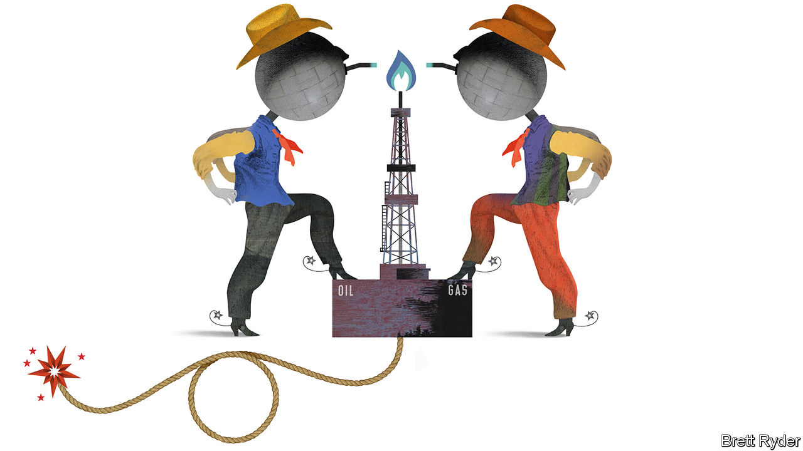

## Schumpeter

# How Chesapeake Energy changed the world

> In times like these, business needs a bit of hubris

> Jul 2nd 2020

DRILLING FOR oil and gas is a contest of man and machine against nature. In America’s shale formations, nature takes the form of rocks, rich in hydrocarbons, buried about a mile (1.6 kilometres) below ground. It is a geologist’s job to find those rocks. It is an engineer’s job to develop the right mix of water, chemicals and drilling technology to “hydraulically fracture” them. One of the core beliefs of America’s shale-fracking revolution, which took off in the late 2000s, is that if you blast enough pressure at the rocks for long enough, they will eventually yield a big bounty.

The two “Okies” who founded Chesapeake Energy, a pioneer of this hydrocarbon upheaval, were neither geologists nor engineers. Tom Ward and the late Aubrey McClendon were “landmen”. Their skill was in leasing mineral rights and persuading investors they would produce a bonanza, particularly of natural gas, if enough wells were drilled. Their success was extraordinary. At times in the 2000s Chesapeake was considered the Google of energy. It had leases with 1m Americans. It became America’s biggest producer of unconventional natural gas.

That was then. On June 28th this once-mighty firm filed for bankruptcy protection, unable to support nearly $9bn of debt. Robert Clarke of Wood Mackenzie, a consultancy, says that ultimately the poor quality of its assets, despite their size, made it unfit for a world of low energy prices. Chesapeake’s tale is a common one of hubris in America Inc, evident in the dotcom bubble, the decline of General Electric and Detroit’s carmakers, or, most recently, the humbling of the tech unicorns. But is hubris really so bad?

In its early years Chesapeake’s self-belief was (literally) ground-breaking. It was a young company, armed with a new technology, offering a compelling growth story at a time when a big market opportunity was opening. That was natural gas, a fuel in such short supply in America in the early 2000s that the country was building liquefied natural-gas (LNG) terminals to import it. Chesapeake was quick to notice rising demand from utilities switching from coal to natural gas. Its land grab put it in a good position to take advantage as the fuel’s price increased. Sure enough, it quintupled to more than $12 per million British thermal units (BTUs) between 2000 and mid-2008, pushing Chesapeake’s market value to $37.5bn.

Its descent into bankruptcy 12 years later, too, displays familiar features. It became hooked on cheap credit. Its net debt grew thirteen-fold to $12.5bn in the decade to 2010. To finance this it needed natural-gas prices of at least $6 per million BTUs—a level seldom reached since the end of 2008. Then there was the evangelistic boss. With his rock-solid faith in shale, McClendon, who was ousted as chief executive in 2013 and indicted on bid-rigging charges the day before his death in 2016, doubled down on new basins even as America’s production tripled between 2008 and 2012.

Finally, Chesapeake was slow to adapt when market forces turned against it. Some of its biggest rivals, such as EOG Resources, switched their focus from shale gas to shale oil as early as 2009, earning bumper profits when prices of crude soared. By the time Chesapeake did so, the best oil assets had already gone. Its Chapter 11 deal, in which creditors have agreed to eliminate $7bn of debt, will do nothing to lower the break-even costs of its oil and gas production. Unless prices soar, which is unlikely given the pandemic-induced slump in demand, these costs remain too high to assume the firm can thrive after emerging from bankruptcy.

Like Chesapeake, the shale industry has become a shadow of its former self. The more investors poured money into shale oil after the financial crisis of 2007-09, the worse life got for gas producers. Oil drillers in basins like the Permian in Texas also extract “associated gas” as a by-product. Although some of it is flared (at great environmental cost), most is dumped on the natural-gas market, exacerbating the glut. The shale-oil euphoria turned against the oilmen, too. Their prodigious output has depressed crude prices since the mid-2010s but, like Chesapeake before them, they have struggled to cut costs fast enough; they were slow to do so even before prices collapsed as a result of covid-19. The pain spreads beyond the wildcatters. On June 30th Royal Dutch Shell became the latest supermajor to slash the value of its global energy holdings because of falling prices. ExxonMobil, its bigger rival, remains one of the few holdouts. But, in a sign of the times, it is now worth less than Tesla, a maker of electric cars.

Nonetheless, Chesapeake’s legacy leaves plenty to marvel at. It played a role in changing America’s energy narrative from concern about overdependence on foreign suppliers for its energy, to one of exuberance about domestic energy abundance and industrial competitiveness. This boosted American business confidence after the financial crisis. It left a diplomatic and geopolitical windfall, too—though one that has faded in recent years. The switch from coal to gas lowered America’s carbon emissions, enabling Barack Obama to broker the Paris agreement on climate change in 2015 while he was president. It unlocked the possibility of LNG exports to weaken Russia’s natural-gas stranglehold on Europe and to improve trade with China.

Ironically, the recent collapse in American oil production will curb associated-gas supply, potentially supporting natural-gas prices. Moreover, the coronavirus crisis may well lead to further bankruptcies and more consolidation in the shale industry, which could put assets into the hands of big firms with stronger balance-sheets, boosting profitability.

The romance of the early wildcatters and landmen will be gone. The revolutionaries will be replaced by bureaucrats. The over-exuberant and undercapitalised industry’s financial discipline will improve. But especially in these troubled times, spare a thought for Chesapeake. Until it got the better of the company, its hubris helped change the world. ■