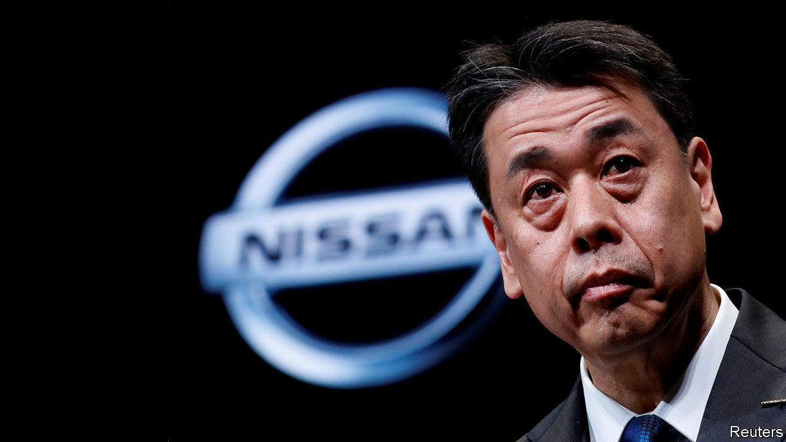

## Turning down the volume

# Nissan’s newish boss wants to re-engineer the troubled carmaker

> Remodelling the global alliance with Renault and Mitsubishi will be tougher

> Jul 2nd 2020

NISSAN IS IN for a makeover. On July 15th the Japanese car giant will unveil what is rumoured to be a sleeker, more minimalist logo more in line with the contemporary aesthetic. To its boss, Uchida Makoto, the redesign is the outward expression of deeper reinvention after a turbulent period. He wants to streamline not just the marque but Nissan, too, as a smaller, more efficient business. The new vision was launched in May and he discussed it in a recent interview with The Economist.

Until 2017 Nissan was racing ahead. That year it sold 5.8m vehicles and raked in an operating profit of $5.2bn. Its alliance with Renault of France and Mitsubishi, another Japanese firm, overtook Germany’s Volkswagen to become the world’s biggest carmaker, selling a grand total of 10.6m sets of wheels.

Then things took a turn for the worse. Nissan fell short of targets in America, one of its biggest markets. Chasing volume with ageing models forced heavy discounting, irritating dealers and sullying Nissan’s reputation. A costly push into emerging markets failed to pay off as economies in Brazil and Russia soured. Car sales in China, hitherto a reliable growth market, slumped. The alliance, always fractious, nearly fell apart after its chief architect and chairman (as well as boss of Renault), Carlos Ghosn, was arrested in late 2018 on charges of financial misconduct.

As a result of all this disruption, Nissan’s revenues dipped in 2018, then again in 2019. Its share price fell by nearly half over the two-year period. With the covid-19 slump and an operating loss of $380m in the first quarter, this year it has fallen by another 40% or so.

Enter Mr Uchida. He took over as boss in December after his predecessor, embroiled in the Ghosn scandal, was forced out. Half a year into his stint he cuts a relaxed figure, at least by the standards of corporate Japan. What he lacks in Mr Ghosn’s brashness he makes up for in quiet focus.

His downsizing plan looks both wise and just about achievable. Each of the alliance partners will concentrate on what it does best; in Nissan’s case that is selling medium-sized vehicles, electric and sports cars in America, China and Japan. Closing factories in Spain and Indonesia and cutting production elsewhere will reduce capacity by 20% to 5.4m cars a year. The idea to share more parts to keep costs in check is sensible, though details of the arrangement remain sketchy. The target of slashing costs by $2.8bn in total by 2021 may be within reach. Mr Uchida hopes to achieve a 5% operating margin by 2023. That may look “conservative” with respect to past ambitions, he concedes. But it would be a marked improvement on -0.4% last year.

Conservative or not, Mr Ushida’s profitability goal may be hard to attain. Boosting margins will require not just cutting costs but also buffing up a tarnished brand. As a start, Mr Uchida promises 12 new models in the next 18 months to replenish the line-up. But consumers hit by the coronavirus recession may be reluctant to splurge on new wheels, no matter how snazzy.

And even if Mr Uchida succeeds in fixing Nissan, he will struggle inside an alliance fraying with internal tensions but too intertwined to unpick. Nissan’s grievances over Renault’s 43% controlling interest in Nissan (well above its 15% stake in Renault) have not gone away. The most notable thing about Nissan’s annual meeting on June 29th was strident denial that its executives conspired to oust Mr Ghosn, in part to forestall his plan for a full merger with the French firm.

Mr Ushida is less categorical about the future of the alliance, which he has been asked about “100 times” since taking the job. Further integration, he insists, is not something he and his opposite numbers at Renault and Mitsubishi talk about, and “we don’t intend to”. As for rebalancing the shareholder structure, he says, “it is not a discussion for us”. Such prevarication will only store up trouble. A smaller Nissan may not automatically translate into smaller problems. ■

## URL

https://www.economist.com/business/2020/07/02/nissans-newish-boss-wants-to-re-engineer-the-troubled-carmaker
