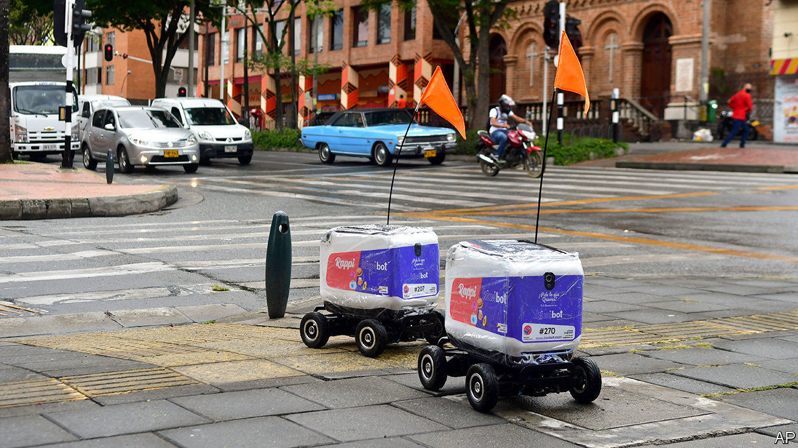

## Droning on

# The pandemic is giving unmanned deliveries a fillip

> Demand is surging for contactless provision of meals, medical supplies and other products

> Jul 4th 2020

UNMANNED VEHICLES, airborne or earthbound, have been pressed into anti-pandemic service the world over. In Mexican slums they spray disinfectant from the sky. “Shout drones” with loudspeakers scold socially undistanced Americans, Chinese and Europeans. Most consequential, the popularity of contactless provision of food and medical supplies is boosting the drone-delivery business.

Before covid-19 MarketsandMarkets, a research firm, reckoned this would generate revenues of $800m this year. Now it says $1bn is closer to the mark, and has revised its forecast for 2022 from $1.6bn to $2.2bn. Many other analysts agree.

Drone-delivery firms typically operate vehicles on behalf of corporate clients. Some bigger drones, like those made by TwinswHeel of France, which can carry up to 300kg, can cost $20,000 or more apiece, as much as a van. Kiwibot of California makes $2,500 cart-like drones.

Kiwibot’s pre-pandemic fleet of 20 or so has grown to about 50, ferrying meals and shopping in two Californian cities, and two others in Colombia and Taiwan; 500 more Kiwibots are in production. Using them adds just $2 to a shopper’s bill. Another Californian firm, Starship Technologies (which despite its name makes wheeled drones), has seen its fleet expand three-fold in a year, to 1,000 across five countries

Since wheeled drones are in effect self-driving cars, albeit passenger-less ones, they need authorities’ approval to operate. This has not always been forthcoming. Now the “corona shock” is softening up regulators, says Ryu Kentaro of ZMP, a maker of rolling drones in Tokyo. ZMP plans to begin a trial in Japan’s capital this summer, faster than expected. In September another pilot project will see TwinswHeel’s “droids” shuttle mail for La Poste, France’s postal service in Montpellier (postal workers will handle the “last mile” to mailboxes). Officials look kindly on covid-proof contactless delivery, says Qi Kong, in charge of drones at JD Logistics, an arm of JD.com, a Chinese e-commerce giant. Its vehicles’ cargo bays open with a scan of a recipient’s face or smartphone screen. On June 26th Amazon said it would buy Zoox, an autonomous-car startup, for $1.2bn.

Drone airmail remains fledgling. Matternet, an American firm, operates a limited network in Switzerland. Wing, Google’s sister company, serves parts of America, Australia and Finland. Zipline, which pioneered medical deliveries by winged drones in Ghana and Rwanda, opened a small droneport in North Carolina in May. But by one reckoning, less than a third of last year’s automated deliveries worldwide were by air. Amazon’s Prime Air, scheduled to launch in late 2019, remains grounded.

At least more regulators are getting on board. After much wavering, Ontario’s have at last allowed a local firm, Drone Delivery Canada, to supply a remote indigenous group called Beausoleil, fearful of lorry drivers bringing in the coronavirus. Flights are to begin in July.■

Editor’s note: Some of our covid-19 coverage is free for readers of The Economist Today, our daily [newsletter](https://www.economist.com/https://my.economist.com/user#newsletter). For more stories and our pandemic tracker, see our [coronavirus hub](https://www.economist.com//news/2020/03/11/the-economists-coverage-of-the-coronavirus)

## URL

https://www.economist.com/business/2020/07/04/the-pandemic-is-giving-unmanned-deliveries-a-fillip
