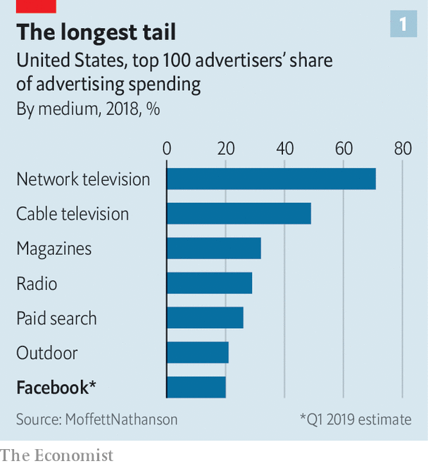
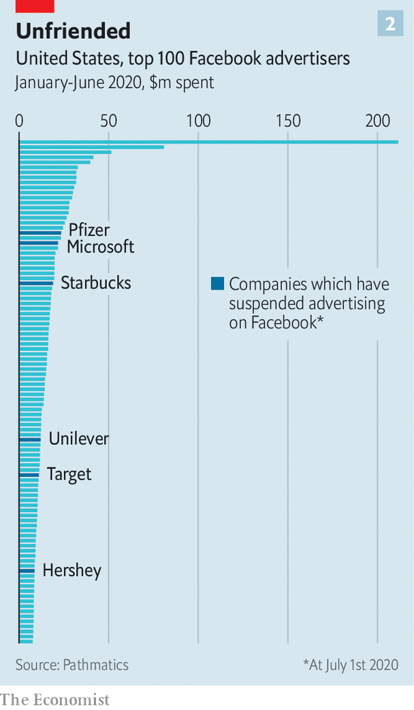

## Getting by with a little help from its friends

# Why Facebook is well placed to weather an advertising boycott

> Its real worry remains regulation

> Jul 2nd 2020

SOCIAL NETWORKS know a thing or two about virality. Still, Facebook was probably surprised by the speed at which a small protest, begun on June 17th by a collection of American civil-rights groups, has gained steam. By July 1st the #StopHateForProfit campaign, which accuses it of publishing material that incites violence, helped persuade more than 600 firms, including giants like Pfizer, Starbucks and Unilever, to pull ads from the platform.

Why the exodus? Principle is presumably part of it. So is peer pressure, which is rising as the list of boycotters lengthens. Admittedly, it is a particularly convenient time to make a stand, as firms pare back ad dollars amid the coronavirus recession. Starbucks, for instance, has spent $11m on Facebook ads in America since March, when lockdowns began. During the same period in 2019 it spent $29m, according to Pathmatics, a data company.

If ad dollars move elsewhere, possible beneficiaries include smaller rivals like Snapchat, Pinterest and TikTok, as well as YouTube, owned by Google. Some advertisers may even go back to quaint things like newspapers and TV, believes Andrew Lipsman of eMarketer, a research firm.

Yet the damage to Facebook is likely to be small. After a brief boycott-induced dip its share price is back up near its all-time high. Its $70bn ad business is built on 8m advertisers, most of them tiny companies with marketing budgets in the hundreds or thousands of dollars and often reliant on Facebook as an essential digital storefront. The 100 largest advertisers on the site account for less than 20% of total revenue, compared with 71% for the 100 largest advertisers on American network television (see chart 1). And so far only a handful of Facebook’s top 50 ad-buyers have joined the boycott (see chart 2).

Facebook has promised tweaks. Like Twitter, it will label posts that break its rules but are newsworthy enough to remain up. Other tech firms have tightened their moderation, too. On June 29th YouTube blocked various white-supremacist channels. Twitch, a video site, suspended President Donald Trump’s own channel for “hateful conduct”. Reddit deleted a forum, “The_Donald”, over hate speech.

This points to a pressure greater than advertising: politics. American tech firms have walked a fine line between Republicans, who accuse them of being too censorious, and Democrats, who want closer moderation. Now, as Mr Trump’s poll numbers swoon, Silicon Valley seems to be edging towards the Democratic view of things. Time, perhaps, to make new friends. ■

## URL

https://www.economist.com/business/2020/07/02/why-facebook-is-well-placed-to-weather-an-advertising-boycott
