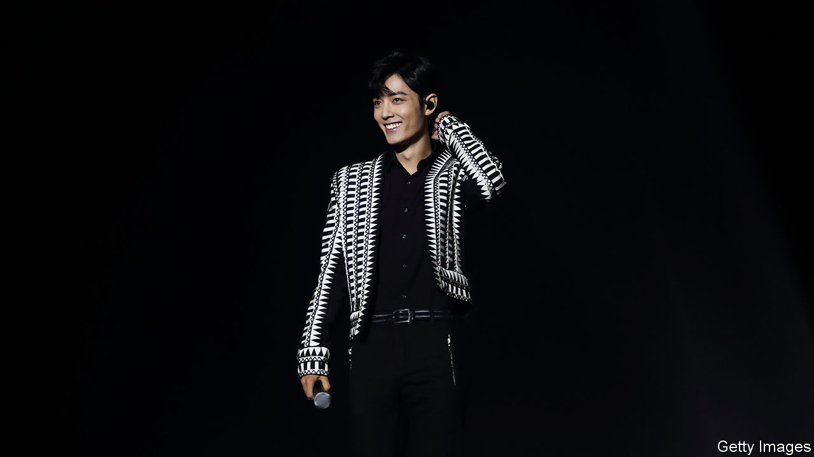

## Star wars

# China’s devoted, combative celebrity fan clubs

> A true fan downloads multiple copies of the same song and insults rival stars

> Jul 2nd 2020

“THE UNTAMED”, a costume martial-arts drama, is one of the most-watched television series in China. Since its online release last year it has been viewed 8bn times. Its heart-throb star, Xiao Zhan (pictured), has gained a legion of fans. In October so many of them crowded an airport in Beijing to see him that they delayed a flight.

In February Mr Xiao’s devotees flooded the internet with complaints about a website hosting raunchy fiction about him. The government shut it down. In May a video went viral of a classroom full of primary-school students chanting: “Brother Xiao Zhan, you are very good!” The teacher who filmed them was suspended.

Mr Xiao’s millions of admirers belong to what are known in Chinese as fanquan, or “meal circles” (because the word for meal sounds like the English word “fan”). These are passionate and sometimes combative online groups devoted to particular celebrities. The Chinese government has long demanded patriotism and good behaviour from stars, but it has placed few limits on fans. On the internet, where debate and organising are usually tightly controlled, fanquan enjoy rare freedom to do both.

But as fanquan have grown, so too has official scrutiny of them. State media have criticised their “irrational” behaviour. Aviation authorities have pleaded with them not to stalk stars at airports. (Some fans buy information about their idol’s movements.) In May a member of China’s rubber-stamp parliament called on the government to “strictly rectify” fanquan because of the threat they posed to the “inheritance of red culture”. Mr Xiao, who is 28, has asked his fans to calm down. “I hope everyone puts their studies, work and life before chasing stars,” he said.

Members of fanquan are mainly women in their 20s. Some teenagers join the fun, too. A government report shows that 12.8m internet users under 18 frequently engaged in “fan-support” activities. These include posting praise, attacking critics and insulting devotees of other stars. After Mr Xiao’s fans turned their guns on the sexually provocative fiction website, the site’s supporters boycotted brands he represented and filled their social-media pages with furious abuse. Among defamation cases that were heard by the Beijing Internet Court between January and November last year, nearly 12% were filed by celebrities, often against fans of rival stars.

Fandom also entails spending. Nearly 15% of fans born since 2000 lavish at least 5,000 yuan ($707) on their favourite stars each month—about 40% more than the average urban disposable income. Sometimes they crowdfund shows of affection, such as adulatory billboards in New York’s Times Square. More often they help celebrities ascend online charts. Take Mr Xiao’s latest single—he is also a singer— “Spot of Light”. In the first 48 hours after its release, it notched more than 25m downloads, a record. His fans reportedly helped by buying an average of nearly 66 copies each.

Despite the unruliness of fanquan, the government may see occasional benefit in their ability to organise. After Wuhan, the city where covid-19 cases first soared, went into lockdown on January 23rd, fanquan raised and helped to distribute more than 7.4m yuan in relief money within about ten days. Last year, during pro-democracy unrest in Hong Kong, the mainland’s state media urged fanquan to praise “brother China” against critics abroad. They duly complied, and launched tirades against the protesters. The Communist Youth League called it #thefangirlscrusade.

But the fanquan are not always biddable. This year the League tried in vain to encourage their members to praise animated idols named after Mao Zedong’s writings. The idea was scrapped within hours. ■