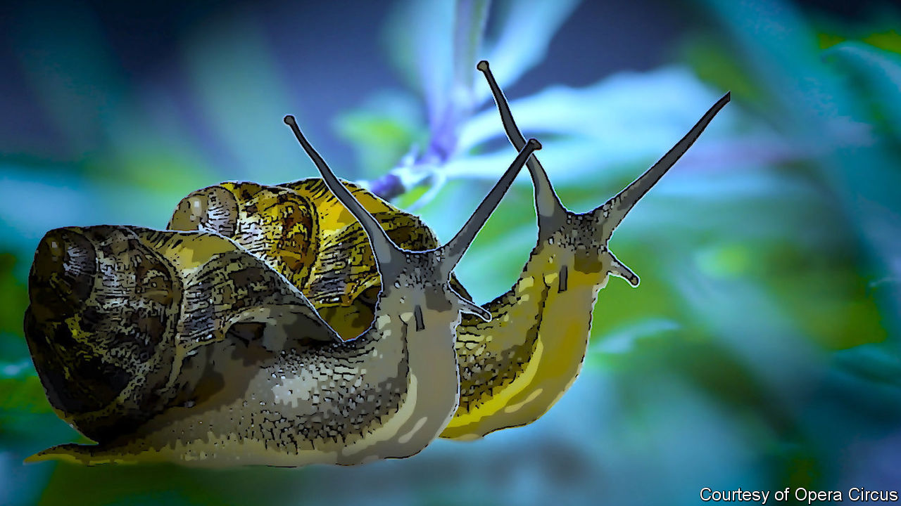

## Snails in a cell

# A lockdown opera pays tribute to a political prisoner in Turkey

> Osman Kavala has spent nearly three years locked up on spurious charges

> Jul 2nd 2020

IN A PRISON outside Istanbul, Osman, an inmate held in solitary confinement, finds two snails nestled in his lunch. Longing for company, he decides to look after the gastropods, feeding them lettuce and rice. The snails reward him—with a song. “In some kitchens, we’d end up in a pot with garlic butter and seasoning,” they chant. “Our luck to be here with Osman, a man of such honour and reason.” But even a snail is bound to find prison life dreary. “It’s all very slow,” one sings, “even for me.”

So begins a ten-minute video opera, “Osman Bey and the Snails”, produced by Opera Circus, a performing-arts company based in Britain. It is a tribute, based on a true story, to Osman Kavala, a businessman, philanthropist and one of Turkey’s best-known political prisoners. Mr Kavala has spent nearly three years behind bars on outlandish coup and terrorism charges.

The project began as an exchange between Thomas de Waal, a writer and journalist, and Nigel Osborne, a composer, who have known Mr Kavala for years. Mr de Waal heard about the cellmates his friend had adopted and joked that Mr Osborne should turn the story into an opera. The composer took up the challenge. Mr Osborne infused his work with elements of Arabic, Kurdish, Turkish and Balkan music, a nod to the bridges Mr Kavala has tried to build between artists and communities divided by the bloody collapse of the Ottoman empire. A group of Mr Kavala’s friends and human-rights campaigners wrote the libretto. Opera singers from across the globe recorded the songs from their lockdowns. No money changed hands.

Mr Kavala was originally arrested in connection with the protests that convulsed Turkey in 2013. This year a court cleared him of all charges. But as he prepared to leave prison he was arrested on new, even more preposterous charges, related to an attempted coup in 2016. The snails are now free, and living with his lawyer. But Mr Kavala remains behind bars.