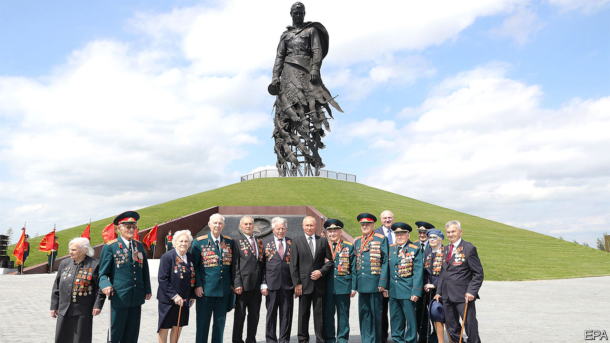
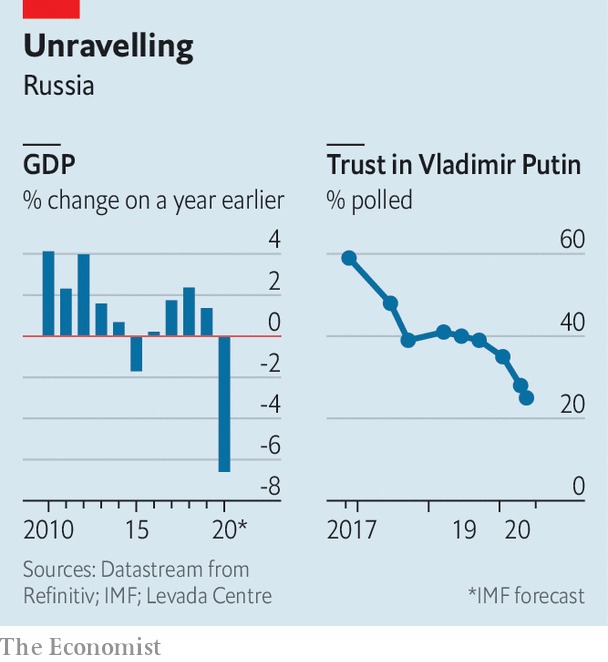
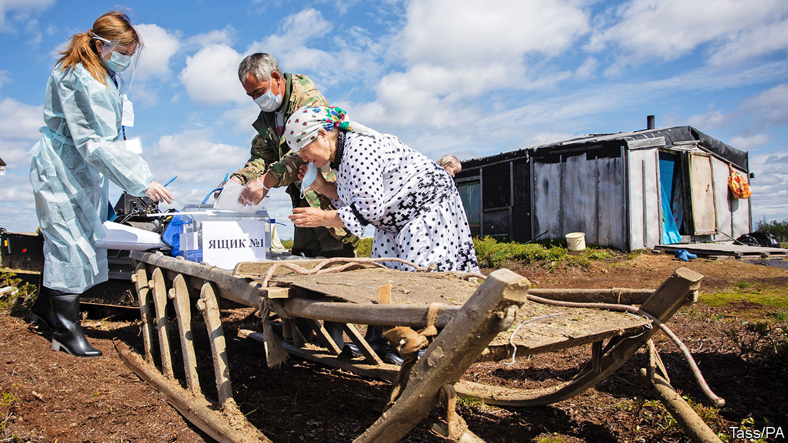

## Parade’s end

# A phoney referendum shows Putin’s legitimacy is fading

> A proposal to extend his rule passes, buried in a huge package of feel-good measures

> Jul 4th 2020

ON JUNE 30TH Vladimir Putin posed in front of a 25-metre bronze statue to the Soviet soldier which he had just unveiled. Filmed from below, to give him extra height, President Putin appealed to his people to vote on a package of constitutional changes, for the sake of the motherland that millions of Russians died to defend against Hitler.

He did not mention the real reason for the vote: to let him stay in power beyond 2024, when he is obliged by the current constitution to stand down. The next day Mr Putin declared victory, after a whopping 78% of Russians were declared to have voted to approve the 200-odd changes which together mark a new phase in his reign. He hopes to move from being merely the second president of post-Soviet Russia to being its life-long supreme leader.

Mr Putin’s moment before the statue was the culmination of a week-long circus, full of parades, trickery, games and prizes. Muscovites received text messages telling them that if they turned out to vote, they could win one of 2m vouchers together worth 10bn roubles ($140m). In Siberia voters were lured with prizes ranging from a smartphone to an apartment. One flat was won by the head of a local polling station. Employers ordered staff to vote.

Mobile polling stations were set up in playgrounds and courtyards, and on lorries parked by the sides of the road, where ballots could be cast into cardboard boxes. The voting was stretched over a week and was partly conducted electronically, creating ample opportunity for rigging.

It was not a proper referendum. It had no precedent or legal basis. It did not require a minimum threshold, was not independently monitored and did not follow any clear rules. The changes had already been passed by Russia’s servile parliament, approved by its constitutional court and signed into law by the president.

The 206 proposals in the referendum were designed to confuse. Voters were asked to approve a long list of crowd-pleasing ideas: inflation-proof pensions, protected status for the Russian language and the banning of gay marriage. Adding to the flim-flam were proclamations of faith in God and ancestors. Voters were not allowed to pick and choose which elements to support: it was either yes or no to the whole lot.

Buried in the middle of this haystack of populist pledges was the real point of the exercise. The number of terms Mr Putin has served as president is to be set back to zero. More power is to be concentrated in his hands. He will be able to fire judges of the supreme and constitutional courts.

It was less brazen than rolling tanks into Red Square and declaring a coup, but only just. The referendum flagrantly violates the post-Soviet constitution of 1993, which Mr Putin swore to uphold. Constitutional amendments are meant to be voted on separately by parliament, so that Russians are not forced to choose between their own moderately comfortable retirement and Mr Putin’s.

Instead, MPs passed a law allowing them to vote on the entire package of changes. Mr Putin’s liberation from the two-term limit was kept out of official advertising material because, so an independent opinion poll showed, three-quarters of Russians opposed it. Kirill Rogov, a political analyst, likens Mr Putin’s win to Russia’s victories in the 2014 Sochi Winter Olympics, achieved by doping athletes and swapping their urine samples through a secret hatch in a laboratory. “It shows Putin can win because nobody can stop him. But it also shows he can only win by breaking the rules,” he says.

Big electoral victories have been at the core of Mr Putin’s claims to legitimacy. He also relies on a mix of personal charisma and appeals to nationalism—hence his constant evocations of the spirit of the second world war. But after 20 years in power, his legitimacy appears to be melting away, and his attempts to restore it through fakery and coercion risk eroding it further.

Appointed as acting president of Russia by Boris Yeltsin at the end of 1999, Mr Putin long ago did away with free and fair elections. Genuine opponents are harassed, imprisoned or barred from standing. State media are thoroughly one-sided. Nonetheless, there has been a degree of popular consent to his rule. It has rested on the concept of “Putin’s supermajority”—an idea first introduced by one of his spin-doctors, Gleb Pavlovsky, months before Mr Putin’s first election victory in 2000. It drew on the antique notion of a special bond between ruler and people. It embraces the populist claim that Mr Putin speaks for the majority of former Soviet citizens who lost out during the country’s transformation in the 1990s, at the hands of a minority who benefited from liberal reforms. In time, the new Russian elite became reliant on Mr Putin to protect their status and (often ill-gotten) wealth.

This broad consent started to crack in 2011, when Mr Putin announced that he would return to the presidency after getting round term limits (for the first time) by spending a spell as prime minister. Protests broke out in large Russian cities. In 2014 Mr Putin arrested that discontent and boosted his faltering popularity by annexing Crimea, a peninsula on the Black Sea belonging to Ukraine. This act of war drew global condemnation but sparked a wave of nationalist euphoria within Russia.

However, by 2018 the Crimean bounce had largely dissipated. International sanctions and the cronyism of the new elite made Russians poorer. With less money to go around, regional bigwigs started to grumble and fight. Mr Putin was too preoccupied with his military adventures in Syria and elsewhere to arbitrate over domestic power struggles. Local mayors and governors were ousted by rivals backed by the security services. Those who tried to resist by appealing to the electorate, like Alexander Shestun, the head of a district near Moscow, ended up in prison.

Still, in presidential elections in March 2018 the Kremlin managed to spend, coerce and finagle its way for Mr Putin to win 77% of the votes cast. Ekaterina Schulmann, a political scientist, characterises this as an election won on credit—and the Kremlin has struggled to pay it off. The government has felt obliged to raise the official retirement age. This has provoked an uproar among Mr Putin’s traditional supporters.

In late 2018 the Kremlin suffered upsets in several regional elections, and in the summer of 2019 mass protests broke out in Moscow after the Kremlin disqualified all the independent candidates in (relatively unimportant) municipal elections. The police brutally put the protests down, but the sympathies of perhaps half the population were with the protesters.

Mr Putin acknowledged the shift in public opinion. On January 15th he told the nation: “Our society is clearly calling for change. People want development, and they strive to move forward.” The package of constitutional tweaks he proposed was supposed to give the impression of real reform, while in fact it cements his power. In initial discussions, Mr Putin did not say anything about his role after 2024. His plan may have been to keep people guessing. This would have been a risky tactic, however. Though no one really expected him to retire at the end of his current term, uncertainty within the Russian elite over what would happen at that point risked turning Mr Putin into a lame duck.

So on March 10th a codicil to the reforms was added. After they were passed, Mr Putin’s term-limit clock would be reset to zero. The deal was to be sealed in an “all people’s vote” on April 22nd—Lenin’s birthday—and followed by a military parade on May 9th, the 75th anniversary of the Soviet victory in the second world war, to be attended by many foreign leaders including the presidents of America, China and France.

Covid-19 disrupted this plan. Mr Putin reluctantly postponed both the parade and the vote, and all but disappeared from view. Sergei Sobyanin, the mayor of Moscow, imposed a strict lockdown on March 29th which he said should last until daily new cases were in only double figures.

According to the Levada Centre, an independent pollster, Mr Putin’s already shaky position has deteriorated further during the covid-19 crisis. Russia has been hit badly by the pandemic—much worse, it appears, than official statistics reveal. A focus group conducted by sociologists and psychologists led by Sergei Belanovsky, who accurately predicted the mass protests of 2011-2012, shows that dissatisfaction is directed personally against Mr Putin. “This is not irritation. This is anger. Anger is boiling over because of their stupid decisions. We should tell them to go to hell,” one respondent said.

Postponing the vote until the autumn seemed too risky. So on May 26th, despite new covid cases running at nearly 9,000 a day, Mr Putin announced that the Victory Day parade would be held on June 24th, the day on which Stalin held his own parade in 1945. The Soviet dictator had stood on the Lenin Mausoleum, watching Red Army soldiers drag captured Nazi banners over the wet cobblestones and toss them in the gutter in front of the podium. Seventy-five years later Mr Putin stood in front of the same mausoleum, surrounded by decorated veterans who had been quarantined for two weeks so as not to infect the commander-in-chief and the few post-Soviet autocrats who attended. Moving the commemoration from May 9th to June 24th had been a setback for Mr Putin. But it ended up being held on the date of the event in 1945 it most closely resembled: the parade of Stalin’s power, not the people’s earlier joyful celebration of victory back on May 9th.

The voting started the day after Mr Putin’s parade. Its result was never in doubt, but whether the exercise succeeds in buttressing Mr Putin’s legitimacy certainly is. A barrage of caricatures and rude comments on social media suggests that the ruse is not working. “Putin has lost his majority,” says Mr Belanovsky. His focus groups show that it is not just democracy-minded Russians who have turned away from him. So have nationalists and communists. Once delighted by Mr Putin’s annexation of Crimea, they now see him as corrupt and deceitful. Most important, Mr Belanovsky writes, is that Mr Putin has lost the backing of the apolitical middle that used to be his main base.

The weaker its support, the more Mr Putin’s regime is likely to rely on repression. Yet using force without even a veneer of legitimacy can quickly bring the parade to an end. In March 1991 the Soviet people were asked whether the Soviet Union should be preserved. Almost 78% of them answered yes. Five months later the KGB mounted a coup to oust Mikhail Gorbachev, a reforming leader, and to stop the disintegration of the state. In two days the coup was crushed, and by the end of the year the Soviet Union was gone. ■

## URL

https://www.economist.com/europe/2020/07/04/a-phoney-referendum-shows-putins-legitimacy-is-fading
