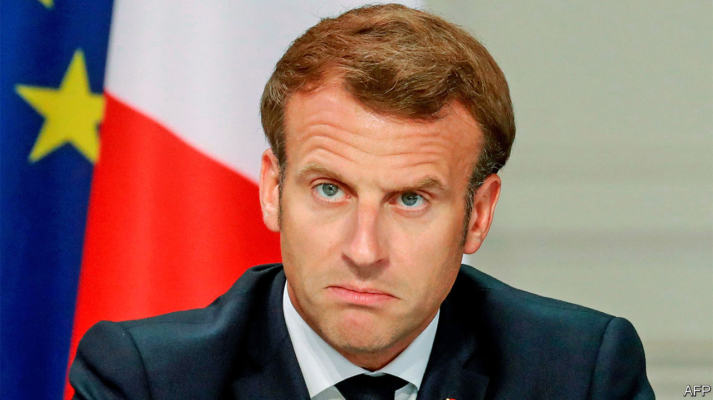

## A slap for Macron

# After hearing birdsong during lockdown, French cities vote Green

> The ruling party performs dismally in local elections

> Jul 2nd 2020PARIS

WHEN HE WON the French presidency in 2017 at the age of 39, Emmanuel Macron triumphed in France’s big cities. In Paris, Lyon, Bordeaux and Strasbourg he topped first-round voting, and grabbed over 81% of the run-off vote against the nationalist Marine Le Pen. The former economy minister, who enthused about tech startups and modernising France, was a natural candidate for bike-riding metropolitans. Yet in the second round of municipal elections on June 28th, his party, La République en Marche (LREM), failed to secure a single big French city. Many of them fell instead to the Greens.

In some ways, a setback was to be expected. Mr Macron is unpopular. This was an opportunity for a mid-term protest vote. And the country has suffered over 29,000 deaths linked to covid-19. Partly because of worries about the virus, the abstention rate, at 58%, was a record high. Yet at last year’s European elections the president’s party nonetheless came in a respectable second place. This time, even in Paris, where polls a year ago suggested victory for LREM, its candidate, Agnès Buzyn, trailed in just third place, with 13% of the vote, behind the Republicans’ Rachida Dati. Anne Hidalgo, the sitting Socialist mayor, kept her job, with a solid 49%. Ms Le Pen’s ex-partner, Louis Aliot, meanwhile triumphed in the city of Perpignan.

This dismal result leaves Mr Macron with two dilemmas. One is how to respond to the surge of the Greens in his electoral base. Often backed by the Socialists, they scored striking victories in big cities, including Lyon, Bordeaux and Strasbourg. Lockdown, which let people hear silence interspersed with birdsong in car-free cities for the first time in decades, may have played a part. In Paris, where the Greens backed the re-elected mayor, Ms Hidalgo has been a longtime anti-car crusader. With just 2.2m people, compared with around 9m in London, Paris is cut off from its suburbs and disproportionately peopled by the car-less.

Mindful of this flourishing greenery, Mr Macron on June 29th promised a “profound change of philosophy”. In a speech to mark the close of France’s 150-member citizens’ assembly, an experiment in direct democracy designed to devise measures to combat climate change, he vowed to take up 146 of its 149 ideas. In the run-up to the presidential election in 2022 it will not be easy for the Greens to match their success in car-averse cities with countrywide appeal. Urban hipsters on bicycles may have voted for the Greens. Rural folk, who depend on cars, tend not to. Indeed, it was from remote and bucolic areas that the gilets jaunes  protesters emerged in response to Mr Macron’s attempt to increase the carbon tax on motor fuel. Yet however much the president embraces greener policies, he may find it hard to match the appeal of their single-issue politics.

The second question is what to do about his insolently popular prime minister, Edouard Philippe, who comes from the centre-right. Presidents have traditionally used their prime ministers as a shield, disposing of them when they outlive their usefulness. Yet Mr Philippe is more popular than his boss, and was elected mayor of Le Havre with a resounding 59% of the vote. This would supply him with an exit point—and potentially a base for his own ambitions—should Mr Macron wish to reshuffle the top job in favour of a greener or left-leaning figure. But his eviction, should it happen, will be hard to justify. ■

## URL

https://www.economist.com/europe/2020/07/02/after-hearing-birdsong-during-lockdown-french-cities-vote-green
