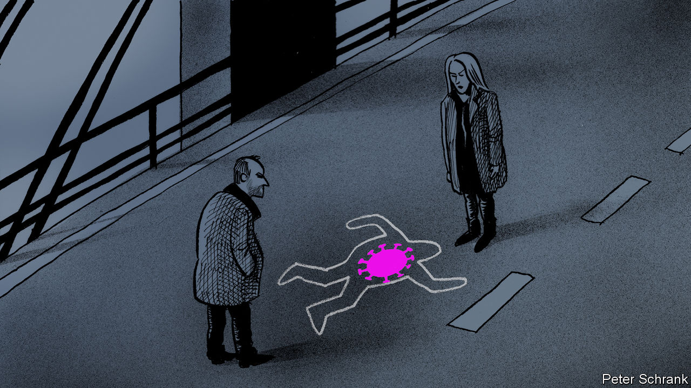

## Borderline personalities

# Covid-19 is scrambling Scandinavian stereotypes

> Danes used to think of Swedes as meticulous and reliable. No longer

> Jul 2nd 2020

Editor’s note: Some of our covid-19 coverage is free for readers of The Economist Today, our daily [newsletter](https://www.economist.com/https://my.economist.com/user#newsletter). For more stories and our pandemic tracker, see our [hub](https://www.economist.com//news/2020/03/11/the-economists-coverage-of-the-coronavirus)

IN THE TELEVISION series “The Bridge”, a Danish and a Swedish detective must collaborate when a body is found on the Oresund bridge between the two countries. The series was an international hit, but few foreign viewers recognised that the cops embody Danish and Swedish stereotypes of each other. The wisecracking, chain-smoking Copenhagen detective hews to the Swedish view of Danes as jolly, messy and unreliable. His counterpart in Malmo seems to have Asperger’s syndrome; the joke is that to Danes, her obsessive literalism and emotion-free sex life simply look like an acute case of Swedishness.

Covid-19 has scrambled these stereotypes. Denmark implemented a meticulous lockdown. Sweden has taken a uniquely laid-back approach, keeping schools and restaurants open. Its infection and death rates are now far above its neighbours’. As a result, when Denmark, Norway and Finland opened their borders to each others’ tourists on June 15th, they kept them closed to Swedes. Sweden’s foreign minister, Ann Linde, begged them not to discriminate against her countryfolk, and warned of permanent harm to Nordic co-operation. But the neighbours say they are simply protecting their own public health.

Swedes tend to consider themselves impeccable in matters moral and sanitary. Being treated as irresponsible carriers of disease has been a bewildering blow. Stefan Lofven, Sweden’s prime minister, insists that his country’s high infection rate is a matter of chance rather than failed policy.

Much of the conflict has played out on the bridge where the TV series was set. Since the 8km-long link across the Oresund Strait opened in 2000, the economies of Copenhagen and Malmo have in effect merged. After the border closed in March, only Swedes with steady jobs were allowed to cross, not tourists or day-trippers. The economic damage was considerable. Swedes were especially galled that Danes continued to visit their country to enjoy its open bars. On June 27th, Denmark began letting in Swedes from provinces where infection rates are low, but not from regions where they are high, such as Stockholm.

Stereotypes shift. The Gotlandsvisan, a 14th-century Swedish ballad, portrays Danes as unreliable, which matches the modern image, and cruel, which does not. Danes once ridiculed Swedes’ cowardice; now they make fun of their formality. Covid-19 is just the latest crisis to give old roles a new twist.

Editor’s note: Some of our covid-19 coverage is free for readers of The Economist Today, our daily [newsletter](https://www.economist.com/https://my.economist.com/user#newsletter). For more stories and our pandemic tracker, see our [hub](https://www.economist.com//news/2020/03/11/the-economists-coverage-of-the-coronavirus)

## URL

https://www.economist.com/europe/2020/07/02/covid-19-is-scrambling-scandinavian-stereotypes
