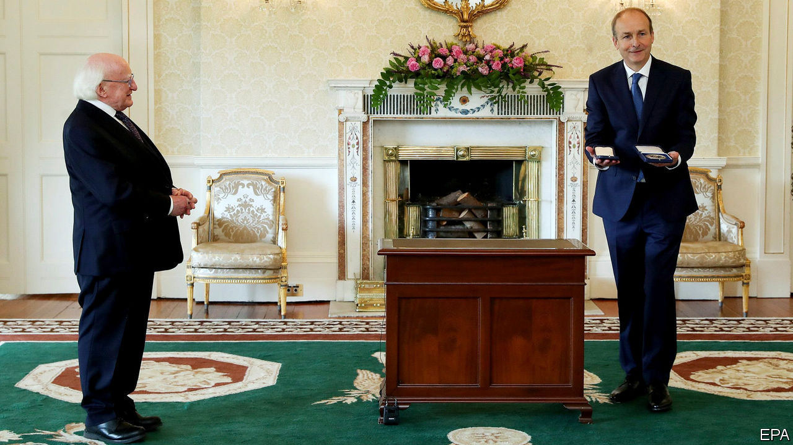

## A tale of two taoiseachs

# Ireland’s two oldest rival parties get together

> But the one closest to the Irish Republican Army is waiting in the wings

> Jul 2nd 2020DUBLIN

YOU CAN tell a lot about the slow-changing culture of Irish politics from the names of its three largest parties. Micheal Martin, who took over as prime minister this week after months of deadlock, has led Fianna Fail, or the “Warriors of Destiny”, for nine years. His predecessor as taoiseach (prime minister), Leo Varadkar, drops to deputy prime minister, but could swap jobs with Mr Martin again if their new coalition lasts more than two years. Mr Varadkar’s party is Fine Gael, the “Tribe of the Gaels”. Meanwhile the parliamentary opposition will be led by the leftists of Sinn Fein, or “We Ourselves”, formerly the political wing of the Irish Republican Army (IRA).

In the rest of Europe, blood-and-soil nationalism mostly went out of fashion after 1945. But Ireland avoided both fascism and the second world war, so its party names still echo the fervour of early-20th-century separatism. Armed uprisings won independence from Britain for most of Ireland in 1922, and Fianna Fail and Fine Gael emerged out of rival Sinn Fein factions in the subsequent short but bitter civil war. Apart from that, there has been little to choose between the two: both are centre-right, pro-business, small-government parties, and—at least until recently—friendly with the once mighty Catholic church. The narcissism of small differences has let them alternate in power since the state was founded, each blaming the other for all the country’s ills.

Yet probably not for much longer. For most of its history Fianna Fail, which has always had a more populist streak, could aspire to winning outright majorities in the Dail, Ireland’s parliament. Fine Gael, a little more posh and a little less loud, had to make coalition deals. Now the two parties cannot even muster a majority between them: with 38 and 35 seats respectively, they needed the Green Party’s 12 MPs to have a majority.

This mainly conservative cabinet will now have to devise uncharacteristically bold responses to crises on several fronts. Like the rest of the world, Ireland will wrestle with the social and economic costs of the covid-19 pandemic. With its intimate links to Britain, it has more to lose than any other EU member state if Brexit proves chaotic. And then pre-existing problems persist in housing and health care, which many voters blame on the inaction of both Fianna Fail and Fine Gael. This was largely why the pair were both punished in elections in February which, for the first time, saw Sinn Fein win more votes than either of the two establishment parties.

Sinn Fein’s leader, Mary Lou McDonald, complains that the new coalition is a “conspiracy” to foil the people’s will, but with the Dail now aligned for the first time on a left-right axis, she will relish the chance to score points against a government with a difficult job that is likely to be unpopular. Her party may be trying to distance itself from its armed republican roots, but the old IRA slogan, “Tiocfaidh Ar La”, is ageing well. It means “Our day will come.” ■