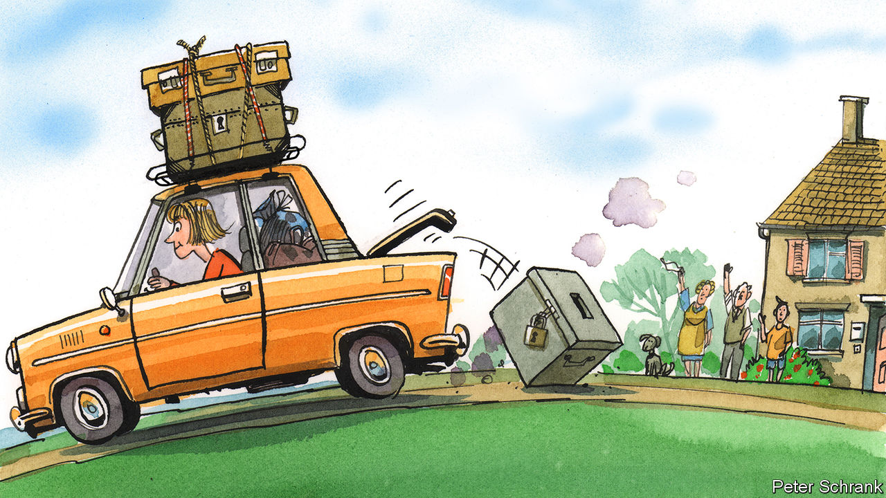

## Charlemagne

# Let expats vote in the countries where they live

> Taxation without representation is unfair

> Jul 2nd 2020

PAYING €7.50 to vote is annoying, but it beats a 10-hour round trip on a bus. Aleksandra Sojka, a Polish academic who works in Spain, had to post her ballot in the first round of the Polish presidential election on June 28th. This is an improvement on 2007, before postal voting was introduced, when Ms Sojka made the 500-mile round trip from Granada to the Polish embassy in Madrid to cast a vote. Voting on matters closer to home is not an option. In Spanish national elections, as in much of the EU, non-citizens who live in the country have no vote. Ms Sojka has no say on the government under which she has lived, worked and paid taxes for over a decade. Yet with her Polish ballot she will help decide on the president of Poland—a place she left for good in 2007.

A quirk lurks at the heart of the EU’s cherished freedom-of-movement rules. Poles who move to Spain can find work, send their children to a local school, claim benefits if they fall on hard times, or enjoy health care if they fall on a hard floor, just like any Spaniard. But they cannot vote in the elections that determine these services, even though they pay for them through their taxes. Free movement is fundamental for the EU, but it comes at a civic cost. Taxation without representation was famously a bugbear of American colonists in the 18th century. It is a fact of life for some EU citizens today.

About 13m people live in a different EU country from the one they were born in, and are thus barred from the main democratic process in the country in which they live. If this group were a country, it would be the EU’s eighth-largest (bigger than Belgium; smaller than the Netherlands). Although they can vote in local and European elections, this gives them a say only on things like bin collections and the transnational business regulations that are still the core of EU governance. Life in between is untouched. When the democratic urge strikes, they can vote only in their home country—setting policy for others, but not themselves.

Some end up disenfranchised altogether. After 18 months away, Irish citizens are kicked off the voting register. For others, voting is simply made difficult, sometimes cynically. In Hungary, citizens abroad with a residential address in Hungary must vote at a consulate, while those without one can vote by post. In practice, this means young Hungarians working abroad temporarily (who are less likely to vote for Viktor Orban’s Fidesz) have to make an often long and inconvenient trip to a consulate. Meanwhile, ethnic Hungarians who live in neighbouring Romania (and who are more likely to back Mr Orban) have a short trip to the post office.

Turnout, unsurprisingly, is much lower among citizens who live abroad. Given that those who emigrate tend to be young, this can do funny things to a nation’s politics. Rather than stay and push for a bad government to be swapped for a good one, fed-up young liberals can head to the door. To stay and fight is hard if you can flee and thrive instead. In this way, freedom of movement acts as a pressure valve for autocratic regimes, argues R. Daniel Kelemen, an academic at Rutgers University, helping them keep power. If it is difficult to vote at home and impossible to vote abroad, expats often become ex-voters.

When expats do vote, they can make all the difference. Ms Sojka is one of more than 500,000 expat Poles who are registered to vote in the next round of the Polish presidential contest, on July 12th. The run-off between Andrzej Duda, the incumbent from the nationalist Law and Justice party, and Rafał Trzaskowski, the liberal mayor of Warsaw, is tight. Polls show both on 50%. Over 100,000 extra expat voters registered the day before the deadline. Among this group in the first round, Mr Trzaskowski had a convincing lead of 27 points (though lagging by 13 points among all voters). Nearly one in 12 Poles of working age lives elsewhere in the EU. It is a large caucus of voters, which could swing a very narrow vote.

Allowing people to vote in a country they have left brings its own problems. In one sense, it is reasonable: EU expats rely on their home government for their right to live in another country (as any British expat in Europe will remind you, at length). It is only fair to ensure that expats have a say over their own legal status, this logic goes. But an objection gnaws away at this principle. What right do those who left many years ago have to decide the fate of a place in which they no longer live? Leaders who revel in blaming forces abroad for their country’s ills would happily cry foul if expats swung an election. Representation without taxation is not much better than its reverse.

Freedom of movement is a unique achievement. But the right to move without the right to vote is a feeble one. It gives those who use it a primarily economic relationship with their new country, rather than a civic one. European workers are reduced to a silent cog in a machine, pumping cash into a system over which they have no control. It pushes against what many EU politicos regard as the bloc’s crowning achievement. The EU is sometimes accused by its more fervent critics of wanting to erase national differences. In this case, it does the opposite, forcing those who move to cling onto their national politics.

Efforts to fix these flaws have fallen flat. National elections are a prerogative of national governments. Handing out votes to new arrivals from abroad falls low down the pecking order. Freedom of movement may be cherished, but that does not mean it is common: barely 4% of EU citizens live in a different country. A European Citizens’ Initiative—a petition to which the European Commission must respond—demanding universal suffrage is circling. It will be a topic of discussion during the upcoming Conference on the Future of Europe, where EU bosses will ponder big ideas. A simple, but politically tricky, option faces them: allow EU citizens to vote based on residency, rather than nationality. No taxation without representation is an old mantra, but a good one. ■