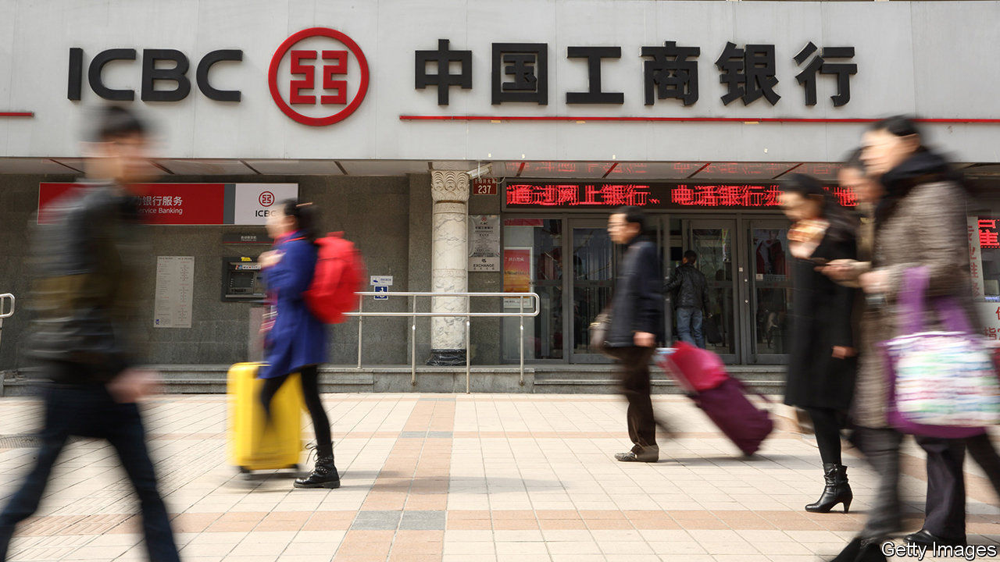
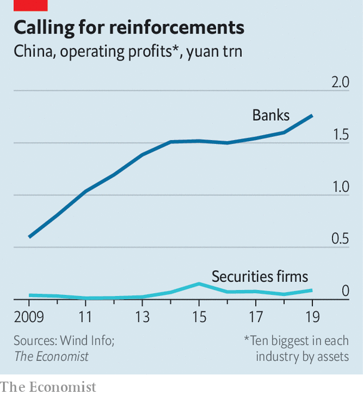

## Xi sank your battleship

# As foreign banks circle, China plots an “aircraft-carrier” defence

> The government may let banks launch brokerages to fend off foreign marauders

> Jul 2nd 2020SHANGHAI

CHINA PUT its first domestically built aircraft-carrier into service last December, the culmination of three decades of work. The government hopes for a faster return on efforts to create what it calls an “aircraft-carrier-class securities firm”—ie, an investment bank powerful enough to prevail amid intensifying competition in the country’s capital markets. It is poised to draft its biggest financial force into battle, by allowing giant state-owned commercial banks to enter investment banking.

China has long had its own version of America’s Glass-Steagall separations, which until 1999 barred retail banks from investment banking. China’s commercial banks can neither underwrite stocks nor offer brokerage services, which are left to securities firms—a division that officials believe makes the financial system safer. But now they may grant securities licences to two commercial banks in a trial, as first reported by Caixin, a business publication.

The immediate prompt is foreign competition. After years of dragging its feet, China scrapped foreign-ownership limits in its securities sector last year. Big Western players—such as Citigroup, Morgan Stanley and UBS—have either gained control of existing joint ventures or launched wholly-owned operations. Foreign firms have struggled to make a dent in commercial banking in China, held back by their limited branch networks. In investment banking, though, they may be more formidable, thanks to their technical knowhow.

Even without the foreign threat, China has been eager to whip its brokers into shape. Officials want capital markets to lessen the burden on banks, which last year provided two-thirds of all new credit. The ten biggest Chinese banks have roughly 30 times more assets than the ten biggest securities firms, and are also far more profitable (see chart). The securities industry’s main problem is extreme fragmentation; 131 registered firms providing similar services fight for clients by slashing fees. Some even underwrite bonds for nothing.

Change is unlikely to be revolutionary at first. “It is not China’s way to suddenly implement a new policy and wipe out existing companies,” says Chen Jiahe of Novem Arcae Technologies, a wealth-management firm. Investors agree: the share prices of China’s largest brokers fell by about 5% on June 29th, when the news first broke, but have since recovered.

Still, the securities industry could look very different in time. The government wants to see consolidation. Granting banks brokerage licences may squeeze out the also-rans. Consider, for example, medium-term notes, a quasi-bond market in which commercial banks can already participate: of the top 20 underwriters by income, 17 are banks and just three are brokers.

A common criticism of universal banking is that it combines two irreconcilable cultures, with the boldness of investment bankers potentially swamping the prudence of commercial bankers. Yet China has shown that there are also dangers to separation. The stockmarket crashed in 2015 after the securities regulator failed to rein in a boom in margin financing by brokers, a risk that the bank regulator might have been better equipped to detect.

In any case, it is hard to imagine China’s lumbering banks becoming red-in-tooth-and-claw brokers. The biggest, such as ICBC, already operate investment banks in Hong Kong, primarily offering plain-vanilla services to state-owned firms. More aggressive mid-tier lenders could outdo them in marketing shares and structuring deals. They are still huge by global standards: China Merchants Bank, for example, has a market capitalisation of $120bn, nearly twice that of Goldman Sachs, a Wall Street institution. In Chinese terms, it would count as a naval cruiser—one step down in size from an aircraft-carrier, but still a big step up from the ragtag flotilla in the country’s capital markets today. ■

## URL

https://www.economist.com/finance-and-economics/2020/07/02/as-foreign-banks-circle-china-plots-an-aircraft-carrier-defence
