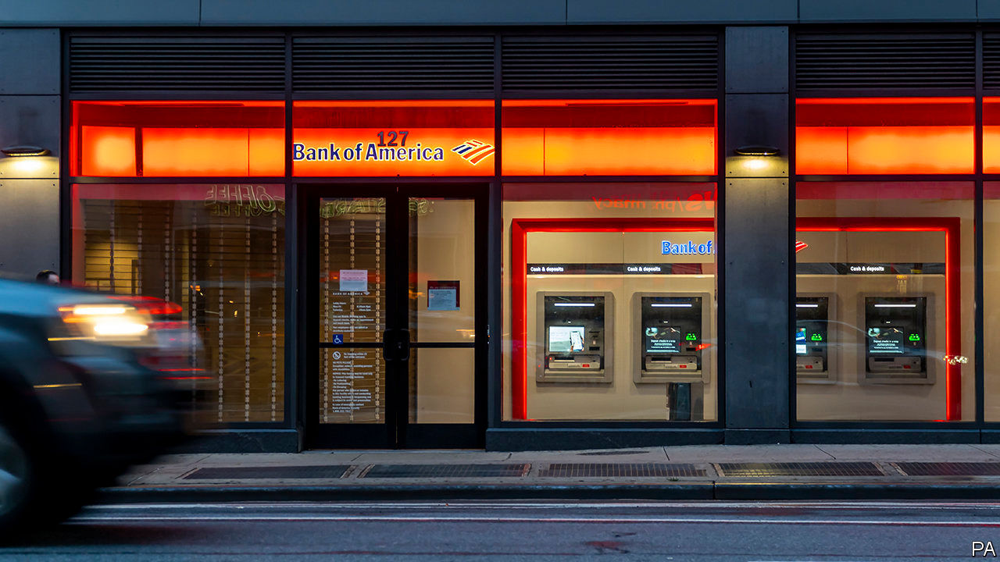
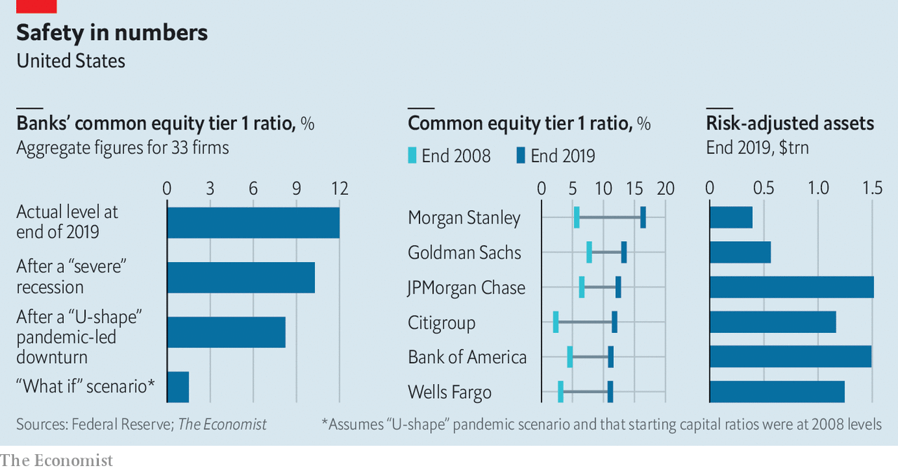

## Banks and the crisis

# How resilient are the banks?

> If today’s lenders were run like they were in 2008 they would be in huge trouble

> Jul 2nd 2020

WHEN FINANCIERS and governments redesigned the financial system in order to make it safer after the debacle of 2007-09, most of them imagined that a shock as bad as the subprime fiasco would be a generation away. In fact it arrived only a decade or so later. Lockdowns have led to a savage recession that is expected to produce huge loan losses as firms and households suffer.

So are too-big-to-fail banks really safer? The latest stress tests conducted by the Federal Reserve suggest the answer in America is “yes”. On June 25th the Fed released the results of its annual exercise, which compares banks’ buffers with the losses they would face in a downturn. In a pessimistic “U-shape” scenario, in which the economy faces prolonged social distancing and repeated outbreaks of the virus, the Fed reckons that banks would face total losses of over $700bn on their collective loan book. The hit is well above the worst case of $465bn that was envisaged in 2009, when the Fed did its first stress test. This year’s scenario implies cumulative losses on loans of about 10%, above the 7% loss rate actually experienced during the subprime crisis.

Happily, the Fed concludes, in this U-shape scenario the banking system’s total core-capital ratio would fall from the present 12% to a still-passable 8%. Some banks might have to limit the dividends they pay their shareholders in order to bolster their capital positions—indeed, on June 29th Wells Fargo said it would have to cut its payout. But this is a small price to pay.

One way to give yourself nightmares is to imagine that nothing had changed at the banks and they were still run with the skimpy capital levels they had at the end of 2008. The Economist has used the Fed’s data to make a rough estimate of the impact today’s loan losses would have had (see chart). If an unreformed banking system had faced this year’s U-shape scenario, its total core-capital ratio would have potentially dropped to 1.5%, with several big banks’ figures touching zero—ie, technical insolvency. Faced with this, depositors and counterparties would have fled, in a full-scale bank run. The taxpayer bail-out in this parallel universe might have been even bigger than in the financial crisis.

Instead, the banking system’s new resilience means that customers and investors did not rush to withdraw funds as in 2007-09. Banks were seen as safe. Lenders in turn have had the resources to extend overdrafts to firms in need.

Don’t sleep easy yet, though. Risky activities have migrated beyond the banking system. The result is that even though taxpayers have not had to bail out banks, they have once again been exposed to huge potential losses. The Fed has made purchases in, and extended implicit guarantees to, many markets—including those for junk bonds and exchange-traded funds—and is also lending directly to firms.

Another worry is that the banking system outside America is less solid. Most European banks have reasonable capital ratios but are far less profitable than American banks, because they are inefficient and face lower interest rates and fragmented markets. America’s stress tests revealed that about a quarter of the total buffers its banks possess to absorb losses come from their healthy profits (which can offset bad-debt provisions), rather than from their core capital. Many European lenders do not have that luxury. The boss of one of the largest warns that though the shock so far has been manageable, a second wave of covid-19 infections this year or next will be “a major test for the financial sector”.■

Editor’s note: Some of our covid-19 coverage is free for readers of The Economist Today, our daily [newsletter](https://www.economist.com/https://my.economist.com/user#newsletter). For more stories and our pandemic tracker, see our [coronavirus hub](https://www.economist.com//news/2020/03/11/the-economists-coverage-of-the-coronavirus)

## URL

https://www.economist.com/finance-and-economics/2020/07/02/how-resilient-are-the-banks
