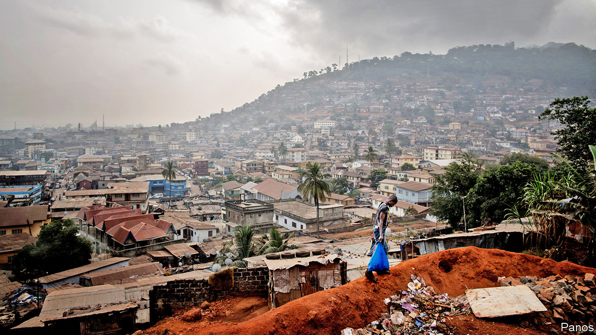
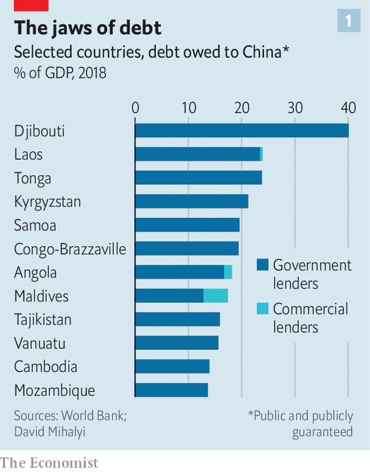
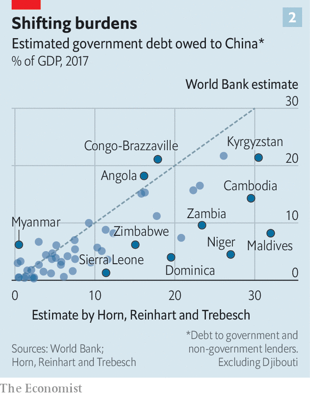

## The debt toll

# The poorest countries may owe less to China than first thought

> Still, China lends more than the members of the Paris Club combined

> Jul 4th 2020HONG KONG

THE FOUR-LANE, 62km toll road being built between Masiaka, a business hub in Sierra Leone, and Freetown, the country’s capital, promises shorter journey times, fewer accidents and smoother drives. It is nonetheless controversial. Awarded to China Railway Seventh Group, the project added over $160m to the country’s foreign debt, according to the China-Africa Research Initiative (CARI) at Johns Hopkins University. The work has suffered delays, which the company blames on the pandemic and the need to compensate property owners, reports the Concord Times, a local newspaper. The firm has also complained that some lorries pass by the toll booths, not through them.

Projects like these have mushroomed across Africa and other developing countries in the past 15 years. “It’s no secret...China is by far the largest bilateral creditor to African governments,” said Mike Pompeo, America’s secretary of state, in June, blaming it for creating an unsustainable debt burden. Plenty else is, however, secret. China does not typically divulge how much it has lent to whom or on what terms. Nor is it a member of the Paris Club of government lenders, which tries to co-ordinate debt forgiveness among its members, making sure that no lender takes advantage of the magnanimity of another.

Many, therefore, have wondered how China would play its part in the debt-relief initiative agreed in April by the G20 group of big economies. That initiative will allow 73 of the world’s poorest countries to delay payments on loans from G20 governments, freeing up resources to fight the pandemic. China, a prominent G20 member, signed up. But would it offer the same terms as the others? And if so, how would they know? Proving China is doing its bit is hard if you do not know how much it has lent.

Recent weeks, however, have yielded a pleasant surprise. To help monitor the G20 initiative, the World Bank told its board it wanted to reveal more data about the government debts of the eligible countries. Though its board is dominated by its bigger shareholders, including China, the bank’s plan faced little resistance. And so after cross-checking its numbers, the bank has now disclosed what eligible governments owe to bondholders, multilateral bodies, private foreign lenders and other governments. The countries covered by the data owed $104bn between them to China at the end of 2018. The total includes soft loans from China’s government, semi-soft loans from “policy banks”, such as China Development Bank, and profit-seeking loans from state-owned commercial lenders. The same countries owed $106bn to the World Bank and $60bn to bondholders.

The data, say Deborah Brautigam and Yufan Huang of CARI, are a “gold mine”. Prior to the release, they had to scour public announcements of loan pledges, cross-checked with reports from Chinese embassies or ministry documents in the borrowing country. Their work fed into a broader set of estimates by Sebastian Horn and Christoph Trebesch of the Kiel Institute for the World Economy and Carmen Reinhart of Harvard University, who in May became the World Bank’s chief economist.

In addition to aiding research, the data should also help the public in developing countries, says David Malpass, the World Bank’s president. Governments—and “this is not unique to developing countries”—sometimes enter into contracts that do not serve the public interest, he points out. Transparency “helps align” these contracts with “the interests of the people”.

The new figures confirm Mr Pompeo’s observation that China is by far the biggest bilateral creditor to Africa, and in many poor countries elsewhere (see chart 1). It accounts for about 20% of the total foreign debt owed by the 73 governments eligible for the G20 initiative (and about 30% of their debt service this year). That is more than all of the Paris Club lenders, including America, Britain and Japan, combined. But it is also smaller than the estimate of over 25% based on figures from Mr Horn, Ms Reinhart and Mr Trebesch. Indeed their estimates for individual countries often exceed the bank’s by large margins (see chart 2).

What explains the gap between Ms Reinhart’s research and her new employer’s data? Some of it may reflect the difference between announcements and disbursements. Just because China says it will lend money, does not mean the entire sum is paid at once (or ever). But even when Mr Horn, Ms Reinhart and Mr Trebesch look at the bank’s figures on commitments, rather than incurred debt, they find some loans missing, suggesting incomplete data.

Another reason for the gap may be that the bank excludes some debt owed by state-owned enterprises and special-purpose vehicles but not guaranteed by the government. In other contexts the bank does consider scenarios in which state-owned firms fail or public-private partnerships sour, requiring the government to step in. Counting these as public debt brings the bank’s estimates closer to the Horn-Reinhart-Trebesch figures.

Such thought experiments could sometimes stretch the definition of public debt, though. The financing raised for Sierra Leone’s controversial toll road, for example, is supposed to be repaid from toll, not tax, revenues. It would only burden the government if those tolls fell short. The World Bank does not seem to count it as government debt—but it is included by CARI.

The bank’s figures for Chinese lending are not always below outside estimates. For Burkina Faso, the Central African Republic and Liberia they are much higher. This, reckons Ms Brautigam, is because they include loans from Taiwan. China’s critics, including Mr Pompeo, may suspect that its true lending is higher than the bank suggests. But even they would not want to chalk up to the People’s Republic what is properly owed to Taiwan. ■

## URL

https://www.economist.com/finance-and-economics/2020/07/04/the-poorest-countries-may-owe-less-to-china-than-first-thought
