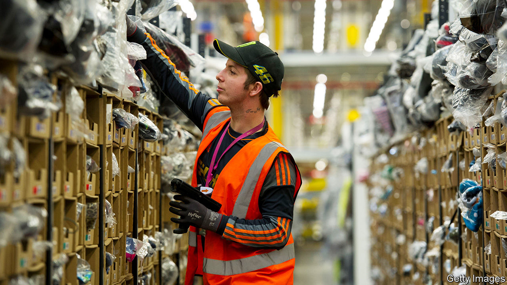

## Collateral damage

# Trade finance stumbles into the digital era

> Covid-19 forces the world’s most complicated paper chase to modernise

> Jul 4th 2020

“IN WARM WEATHER, fewer people wear socks,” says Paul Rotstein of Gold Medal International, a wholesaler in New York. People may not sport socks in the summer but his firm starts shipping them to retailers in July, ahead of the start of the school year. There is, however, a big lag before he is paid. He normally uses trade-credit insurance to protect against the risk that his invoices go unpaid, but this year the insurers have slashed the amounts they are willing to cover by 50-90%. That leaves him with two options: shoulder huge credit risk himself, or walk away from orders.

Mr Rotstein’s dilemma underscores the role of trade finance, an unglamorous but critical bit of the financial system. Many firms are owed a large amount by their customers in the form of receivables; in total the amount is worth around 20% of global GDP. Some firms bear all the risk of non-payment themselves. But others look to an insurer to protect them from default, or take out specialist loans backed by the invoices. Together these financing solutions underpin four-fifths of cross-border transactions, which are worth $15trn a year.

Trade financiers face three problems created by the covid-19 pandemic (and the accompanying recession). It has disrupted normal operations by slowing the travel of documents; it has raised the risk that existing loans will sour; and it has made lenders more cautious about making new loans.

Take operational troubles first. Trade finance is notoriously paper-based. Processing credit requires involved parties, from financiers and carriers to warehouse managers and customs officers, to exchange an average of 36 documents and 240 copies. But lockdowns trapped bits of paper in shut-down offices. Printing became a palaver. When couriers eventually got to banks, they often found no one there.

Financiers have been forced to be nimble. Staff turned up to the Bank of China’s Wuhan office wearing full protective gear. Banks started accepting scanned signatures and documents. A cargo-firm executive says it issued four times as many electronic bills of lading—receipts detailing goods onboard a ship—in March as it did in February. That has helped limit delays, though some in the industry worry that rises in fraud could follow.

A second concern is that the existing stock of credit turns sour. Trade finance has long been super-safe: annual default rates on letters of credit averaged 0.11% of transactions in 2008-18, less than a tenth of those for corporate loans. But insurers already report payment delays. A rise in bankruptcies would make matters worse. Coface, a trade-credit insurer, expects these to rise by a third worldwide by 2021. Still, because trade finance is short-term—usually 30 to 90 days—and backed by collateral, lenders have some recourse. Natalie Blyth of HSBC, a bank, reckons that the performance gap between trade-finance assets and corporate loans will widen.

The third problem is a possible crunch in new financing. To assess clients, banks and insurers rely on credit ratings. These have plummeted as firms’ cashflows have dwindled. The resulting squeeze may linger, says Ebru Pakcan of Citigroup, a bank; firms are downgraded quickly, but upgraded slowly. Some lenders may focus on large clients or exit some markets entirely. Insurers have cut their exposure to the industry by 8-9%, about half as much as in 2008-09. In emerging economies, sovereign downgrades have also pulled down corporate ratings, says Marc Auboin of the World Trade Organisation (WTO). On July 1st the WTO and six multilateral banks promised to alleviate trade-finance shortages.

Still, the damage could have been worse. Thankfully, banks have sturdier equity buffers than in the last recession. Since 2016 Coface has raised its solvency ratios—insurers’ equivalent of banks’ capital-adequacy buffers—from 150% to 190%, says Xavier Durand, its boss. Central-bank action has shored up lenders’ finances. Governments in Europe have let export-credit agencies cover short-term trade, and have offered insurers backstops.

The question is how long the support lasts. Banks and insurers will see their capital eaten up as loans sour. Government aid could be withdrawn too soon, worries Alexis Garatti of Euler Hermes, a trade-credit insurer. Support could be taken away just as the demand for finance returns. As new orders work their way through supply chains, exports appear to be bouncing back faster than manufacturing.

Still, the pandemic could lead to lasting gains by forcing the industry to digitise. Alexander Goulandris of Essdocs, which promotes paperless trade, says 60 chambers of commerce have opted for its electronic certificates of origin in recent months, compared with the usual rate of ten a year. Some countries have also adopted laws recognising the validity of e-documents. Digital standards could make it easier to bundle trade-finance loans into securities that can be sold on to institutional investors, providing more oxygen to commerce. Trade finance has long followed outmoded practices. Now might be its chance to blow everyone’s socks off. ■

## URL

https://www.economist.com/finance-and-economics/2020/07/04/trade-finance-stumbles-into-the-digital-era
