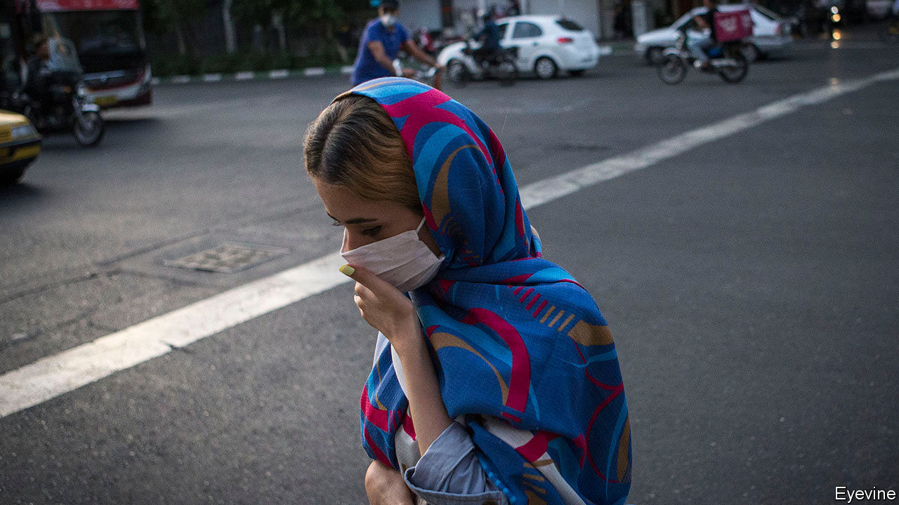
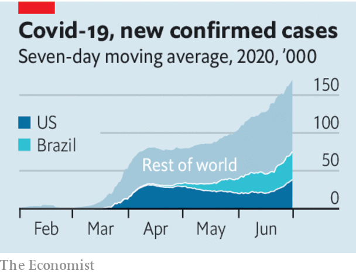

## The way we live now

# Covid-19 is here to stay. People will have to adapt

> The world is not experiencing a second wave: it never got over the first

> Jul 2nd 2020

Editor’s note: Some of our covid-19 coverage is free for readers of The Economist Today, our daily [newsletter](https://www.economist.com/https://my.economist.com/user#newsletter). For more stories and our pandemic tracker, see our [hub](https://www.economist.com//news/2020/03/11/the-economists-coverage-of-the-coronavirus)

IT IS ASTONISHING how rapidly the pandemic has spread, despite all the efforts to stop it. On February 1st, the day covid-19 first appeared on our front cover, the World Health Organisation counted 2,115 new cases. On June 28th its daily tally reached 190,000. That day as many new cases were notched up every 90 minutes as had been recorded in total by February 1st.

The world is not experiencing a second wave: it never got over the first. Some 10m people are known to have been infected. Pretty much everywhere has registered cases (Turkmenistan and North Korea have not, though, like Antarctica). For every country such as China, Taiwan and Vietnam, which seems to be able to contain the virus, there are more, in Latin America and South Asia, where it is raging. Others, including the United States, are at risk of losing control or, in much of Africa, in the early phase of their epidemic. Europe is somewhere in between.

The worst is to come. Based on research in 84 countries, a team at the Massachusetts Institute of Technology reckons that, for each recorded case, 12 go unrecorded and that for every two covid-19 deaths counted, a third is misattributed to other causes. Without a medical breakthrough, it says, the total number of cases will climb to 200m-600m by spring 2021. At that point, between 1.4m and 3.7m people will have died. Even then, well over 90% of the world’s population will still be vulnerable to infection—more if immunity turns out to be transient.

The actual outcome depends on how societies manage the disease. Here the news is better. Epidemiologists understand how to stop covid-19. You catch it indoors, in crowds, when people raise their voices. The poor are vulnerable, as are the elderly and those with other conditions. You can contain the virus with three tactics: changes in behaviour; testing, tracing and isolation; and, if they fail, lockdowns. The worse a country is at testing—and many governments have failed to build enough capacity—the more it has to fall back on the other two. Good public health need not be expensive. Dharavi, a slum of 850,000 people in Mumbai, tamed an outbreak (see [article](https://www.economist.com//international/2020/07/04/covid-19-is-here-to-stay-the-world-is-working-out-how-to-live-with-it)).

Treatments have improved, thanks to research and dealing with patients. Although mass vaccination is still months away at best (see [article](https://www.economist.com//britain/2020/07/02/oxford-university-is-leading-in-the-vaccine-race)), the first therapies are available. More is known about how to manage the disease—don’t rush to put people on respirators, do give them oxygen early. Better treatment helps explain why the share of hospital patients who went on to be admitted to intensive care fell in Britain from 12% at the end of March to 4% in mid to late May.

And economies have adapted. They are still suffering, of course. J.P. Morgan, a bank, predicts that the peak-to-trough decline in the first half of the year in the 39 economies it follows will be around 10% of GDP. But workers stuck in Zoom hell have discovered that they can get a surprising amount done from home. In China Starbucks designed “contactless” ordering, cutting the time customers spend in its coffee shops. Supply chains that struggled now run smoothly. Factories have found ways to stagger shifts, shield staff behind plastic and change work patterns so that personal contact is minimised.

Now that nationwide lockdowns are done, governments can make sensible trade-offs—banning large indoor gatherings, say and allowing the reopening of schools and shops. Sometimes, as in some American states, they will loosen too much and have to reverse course. Others will learn from their mistakes.

The problem is that, without a cure or a vaccine, containment depends on people learning to change their behaviour. After the initial covid-19 panic, many are becoming disenchanted and resistant. Masks help stop the disease, but in Europe and America some refuse to wear one because they see them as emasculating or, worse, Democratic. Thorough handwashing kills the virus, but who has not relapsed into bad old habits? Parties are dangerous but young people cooped up for months have developed a devil-may-care attitude. Most important, as the months drag on, people just need to earn some money. In the autumn, as life moves indoors, infections could soar.

Changing social norms is hard. Just look at AIDS, known for decades to be prevented by safe sex and clean needles. Yet in 2018, 1.7m people were newly infected with HIV, the virus that causes it. Covid-19 is easier to talk about than AIDS, but harder to avoid. Wearing a mask is chiefly about protecting others; the young, fit and asymptomatic are being asked to follow tedious rules to shield the old and infirm.

Changing behaviour requires clear communication from trusted figures, national and local. But many people do not believe their politicians. In countries such as America, Iran, Britain, Russia and Brazil, which have the highest caseloads, presidents and prime ministers minimised the threat, vacillated, issued bad advice or seemed more interested in their own political fortunes than in their country—sometimes all at once.

Covid-19 is here for a while at least. The vulnerable will be afraid to go out and innovation will slow, creating a 90% economy that consistently fails to reach its potential. Many people will fall ill and some of them will die. You may have lost interest in the pandemic. It has not lost interest in you. ■

Editor’s note: Some of our covid-19 coverage is free for readers of The Economist Today, our daily [newsletter](https://www.economist.com/https://my.economist.com/user#newsletter). For more stories and our pandemic tracker, see our [hub](https://www.economist.com//news/2020/03/11/the-economists-coverage-of-the-coronavirus)

## URL

https://www.economist.com/leaders/2020/07/02/covid-19-is-here-to-stay-people-will-have-to-adapt
