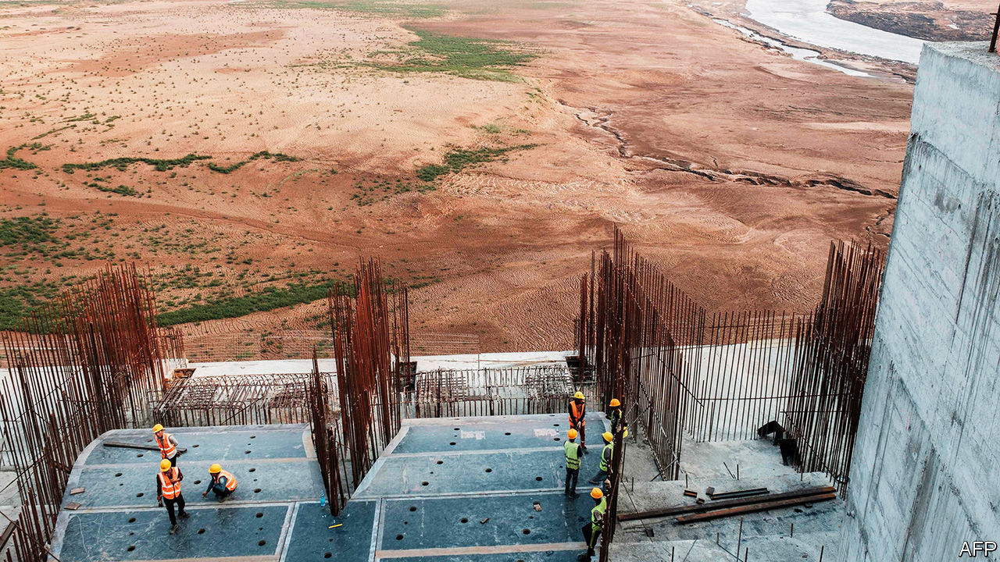

## Dam bluster

# Egypt, Ethiopia and Sudan must learn how to share the Nile river

> Or a squabble over water could turn nastier

> Jul 2nd 2020

ONCE COMPLETED, the Grand Ethiopian Renaissance Dam will be nearly twice as tall as the Statue of Liberty and as wide as the Brooklyn Bridge is long. The reservoir behind it is roughly the size of London. Sitting on the Blue Nile, the main tributary of the Nile river, the dam is the largest hydro-electric project in Africa. Soon it will produce 6,000 megawatts of electricity, more than double Ethiopia’s output today. With a little co-operation between Ethiopia and its downstream neighbours, Egypt and Sudan, the dam could be a boon for the whole region.

Yet so far it has produced only acrimony. Egypt, which depends on the Nile for 90% of its fresh water, sees the dam as an existential threat. Shortly after construction began in 2011, officials in Cairo considered sabotage; a former president even considered bombing it. Last month Ethiopia accused Egypt of sponsoring cyber-attacks to disrupt the project.

In between all the sabre-rattling the three countries have held talks over how fast to fill the reservoir, how much water will be released and how to resolve any future disagreements. So far no deal has been reached. But the latest round comes with a deadline of sorts: Ethiopia says it will begin filling the reservoir behind the dam later this month. Egypt has vowed to use “all means available” to protect its interests (see [article](https://www.economist.com//node/21788885)). All sides will have to make concessions if conflict is to be avoided.

The biggest lack is trust. Start in Egypt, whose people view the Nile as their birthright. As its population has risen, the water supply per person has fallen. Egypt therefore wants Ethiopia to fill its reservoir slowly and to release enough water so that the river’s flow is not disrupted, especially during droughts. Egypt thinks Ethiopia has dragged out the talks to gain bargaining power as construction advances. The dam is now over 70% complete.

Belligerence in Cairo has led to stubbornness in Addis Ababa, where officials are seeking a quick return on their $5bn investment. They think Egypt is stuck in the past, attached to defunct treaties that allowed it to dominate the Nile. Meanwhile, around half of Ethiopians do not have access to electricity. The government hopes the dam will raise Ethiopia out of poverty. So it says it will begin filling the reservoir with or without an agreement. Up for re-election next year and facing serious unrest, Abiy Ahmed, the prime minister, is under pressure to take a hard line.

Sudan, for its part, backs the project, which lies about 20km from its border. It will receive some of the dam’s cheap electricity. More predictable water flows could help it grow more food. But it remains concerned that poorly co-ordinated releases of water could overwhelm its own Roseires Dam.

The three sides are said to have reached 90% of a deal. They can agree on what to do when there is enough rain. The dispute is over how to manage the dam when there isn’t. Ethiopia feels it is being forced to run its reservoir down too much during periods of drought. It would rather take things year by year and settle any disagreements through negotiations. Egypt and Sudan want commitments now, and prefer binding international arbitration to settle disputes.

In the long term, wiser policies would help. Subsidies have long encouraged Egyptians to waste water on a massive scale. These are being cut, but they should be eliminated. The sides should generate more solar power to meet growing demand and take pressure off the dam. All are sunny, and solar panels cost a fraction of what they did when the dam was conceived.

But right now all three need to strike a deal. Ethiopia should pledge to let more water through during long dry spells. An international arbiter should be brought in to handle future disputes. Egypt could compromise by letting the African Union (AU) play that role. Officials in Cairo believe the AU favours Ethiopia, where the AU has its headquarters, but the group is leading the effort to find a deal that works for everyone. If an agreement can be reached, it will make a welcome change. The world abounds with conflicts over water. The stuff is hard to share. But projects like the Grand Ethiopian Renaissance Dam promise a flood of benefits to countries that manage. ■