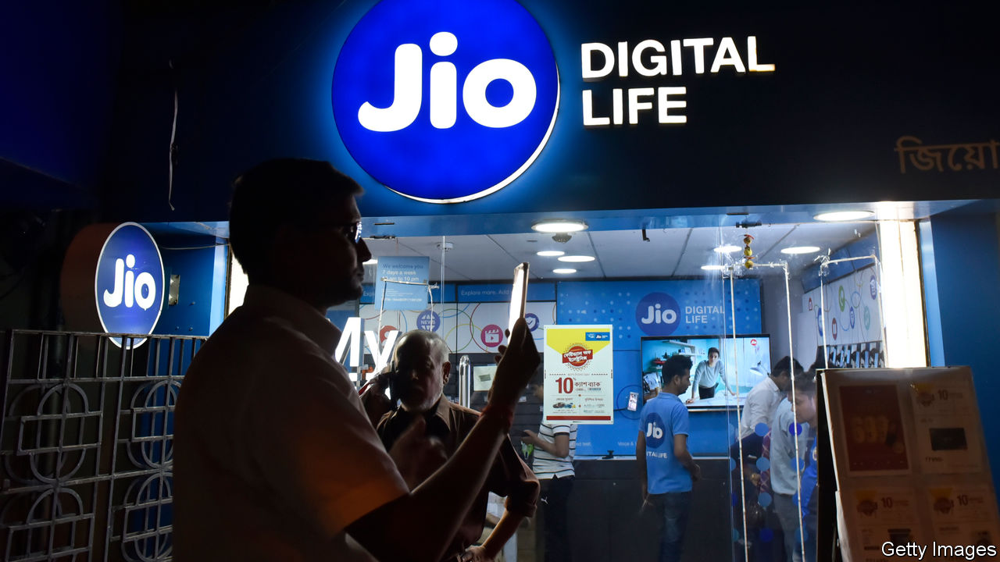

## Foreign firms in India

# Multinationals love India more than it loves them

> By looking inward, Narendra Modi is missing a huge opportunity

> Jul 2nd 2020

IF YOU LOOK at the headline figures, foreign companies still appear to be piling into India even as its economy reels from the pandemic. Since the country went into lockdown in March some $20bn of cross-border deals have been announced, with the likes of Facebook and KKR, a private-equity giant, sticking cash into digital firms, solar parks and more. Optimists argue that India could soon become a place to build factories, as firms seek to diversify their supply chains away from China.

Yet look closely, and a different picture emerges (see [article](https://www.economist.com//business/2020/07/04/india-incs-inward-turn)). Foreign firms are often on the wrong end of regulatory changes. Investors increasingly prefer to take minority stakes alongside local tycoons, rather than set out on their own. And Narendra Modi, the prime minister, is veering towards a policy of capricious self-reliance. This week India banned 59 Chinese-made apps, including TikTok. Unless things change, India and the firms that invest there will not reach their potential.

India was largely closed to foreign firms between independence in 1947 and liberalisation in 1991—it even kicked out Coca-Cola. Since then it has opened up, tentatively at first, and after 2000 more confidently. Cumulatively, multinational firms have invested over $500bn and some have won control of critically important assets. Vodafone took a majority stake in a big mobile network in 2007. The biggest carmaker is run by Suzuki, a Japanese firm. When Mr Modi was elected in 2014, he pledged to make India even more hospitable and to attract more factories. On paper the Sino-American trade war should make it easier to turn India into a global production hub.

How has Mr Modi done? Officials boast that India has moved swiftly up the “ease of doing business” rankings, from 142nd place in 2014 to 63rd place last year. But the reality is less impressive. India’s share of global foreign direct investment (FDI) flows has nudged up only slightly, from 2.5% in 2014 to 3.3% last year. Meanwhile, some troubling problems fester.

Foreign firms don’t always get fair treatment. True, some that have been active in India for many decades, such as Unilever, are treated like locals. But more recent arrivals can get beaten up. Vodafone poured over $20bn into India but found itself subject to a big retroactive tax claim, unfavourable regulation and, most recently, spectrum levies (some local firms got clobbered, too). Amazon and Walmart, which together have also invested over $20bn, faced a sharp change in the e-commerce rules in 2019 that made it harder for them to own or control inventory.

Because the playing field is not level, foreign firms seem to be shifting from owning their own subsidiaries to taking passive stakes in well-connected local firms instead. Ford has folded its business into a joint-venture. Aéroports de Paris has taken a non-controlling stake in an infrastructure firm. A who’s who of world business has bought small stakes in Jio, a mobile-phone and e-commerce firm run by Mukesh Ambani, India’s richest man, which competes with Amazon, Walmart and Vodafone. Of all the $57bn of cross-border deals announced in the past 12 months, 66% involved passive stakes and half involved partnerships with a tiny number of Indian tycoons. The economy is becoming dominated by a few local winners. According to Marcellus, an investment firm, 70% of corporate profits are made by the top 20 firms, only one of them foreign, up from 14% 30 years ago.

With the economy forecast to shrink by 4.5% this year and firms prowling for alternatives to China, you may think that Mr Modi would open the door. But his policies have turned inward, mirroring the lurch to protectionism in the West. On May 12th he made a speech which said that India should take part in global supply chains but also mentioned “self-reliance” 17 times. As military tensions with China rise (see [article](https://www.economist.com//asia/2020/07/02/india-has-few-good-ways-to-punish-china-for-its-himalayan-land-grab)), a new crackdown has begun. As well as banning the Chinese apps, the government is prodding e-commerce firms to have “country of origin” labelling on goods they sell. Foreign firms bring cash, know-how and competition. Once the pandemic passes, India must show that it is still open for business.■

## URL

https://www.economist.com/leaders/2020/07/02/multinationals-love-india-more-than-it-loves-them
