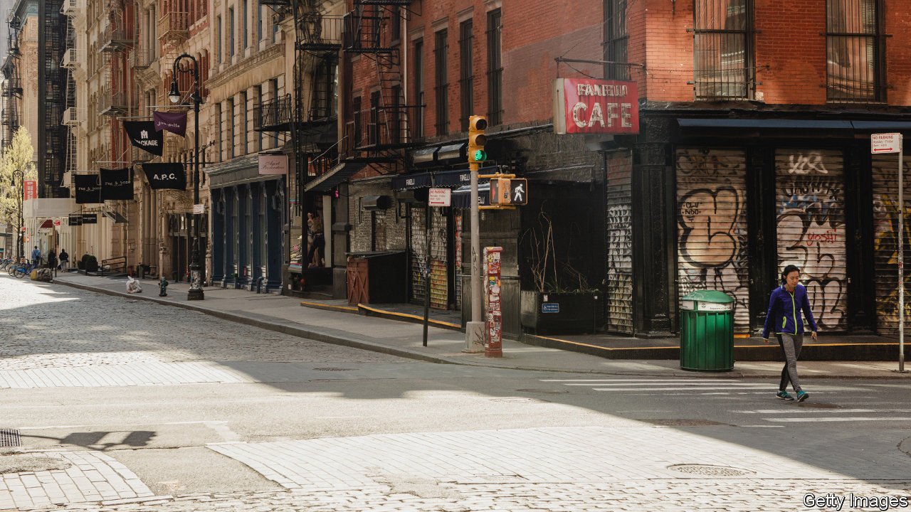
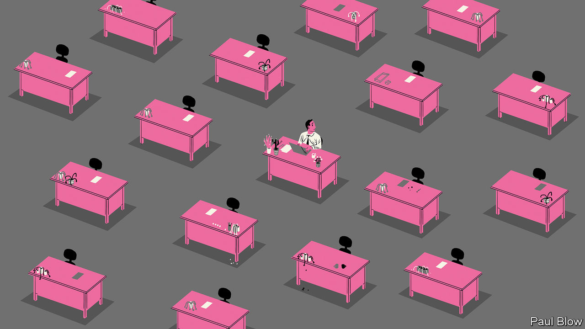

## On artificial intelligence, green investing, GDP, gardens, working from home

# Letters to the editor

> A selection of correspondence

> Jul 2nd 2020

Artificial intelligence is an oxymoron ([Technology quarterly](https://www.economist.com//technology-quarterly/2020/06/11/an-understanding-of-ais-limitations-is-starting-to-sink-in), June 13th). Intelligence is an attribute of living things, and can best be defined as the use of information to further survival and reproduction. When a computer resists being switched off, or a robot worries about the future for its children, then, and only then, may intelligence flow.

I acknowledge Richard Sutton’s “bitter lesson”, that attempts to build human understanding into computers rarely work, although there is nothing new here. I was aware of the folly of anthropomorphism as an AI researcher in the mid-1980s. We learned to fly when we stopped emulating birds and studied lift. Meaning and knowledge don’t result from symbolic representation; they relate directly to the visceral motives of survival and reproduction.

Great strides have been made in widening the applicability of algorithms, but as Mr Sutton says, this progress has been fuelled by Moore’s law. What we call AI is simply pattern discovery. Brilliant, transformative, and powerful, but just pattern discovery. Further progress is dependent on recognising this simple fact, and abandoning the fancy that intelligence can be disembodied from a living host.

ROB MACDONALDRichmond, North Yorkshire

I agree that machine learning is overhyped. Indeed, your claim that such techniques are loosely based on the structure of neurons in the brain is true of neural networks, but these are just one type among a wide array of different machine- learning methods. In fact, machine learning in some cases is no more than a rebranding of existing processes. If by machine learning we simply mean building a model using large amounts of data, then good old ordinary least squares (line of best fit) is a form of machine learning.

TOM ARMSTRONGToronto

The scope of your research into green investing was too narrow to condemn all financial services for their woolly thinking (“[Hotting up](https://www.economist.com//briefing/2020/06/20/how-much-can-financiers-do-about-climate-change)”, June 20th). You restricted your analysis to microeconomic factors and to the ability of investors to engage with companies. It overlooked the bigger picture: investors can also shape the macro environment by structured engagement with the system itself.

For example, the data you used largely originated from the investor-led Carbon Disclosure Project (for which we hosted the first ever meeting, nearly two decades ago). In addition, investors have also helped shape sustainable-finance plans in Britain, the EU and UN. Investors also sit on the industry-led Taskforce on Climate-related Financial Disclosure, convened by the Financial Stability Board, which has proved effective.

It is critical that governments apply a meaningful carbon price. But if we are to move money at the pace and scale required to deal with climate risk, governments need to reconsider the entire architecture of markets. This means focusing a wide-angled climate lens on prudential regulation, listing rules, accounting standards, investor disclosure standards, valuation conventions and stewardship codes, as well as building on new interpretations of legal fiduciary duty. This work is done most effectively in partnership with market participants. Green-thinking investors can help.

STEVE WAYGOODChief responsible investment officerAviva InvestorsLondon

Estimating indirectly observable GDP in real time is indeed a hard job for macro-econometricians, or “wonks”, as you call us (“[Crisis measures](https://www.economist.com//finance-and-economics/2020/05/30/the-pandemic-could-lead-statisticians-to-change-how-they-estimate-gdp)”, May 30th). Most of the components are either highly lagged, as your article mentioned, or altogether unobservable. But the textbook definition of GDP and its components won’t be changing any time soon, as the reader is led to believe. Instead what has always and will continue to change are the proxy indicators used to estimate the estimate of GDP.

MICHAEL BOERMANWashington, DC

Reading Lexington’s account of his garden adventures ([June 20th](https://www.economist.com//united-states/2020/06/18/america-rediscovers-the-joys-of-vegetable-growing)) brought back memories of my own experience with neighbours in Twinsburg, Ohio, in the late 1970s. They also objected to vegetables growing in our front yard (the only available space). We were doing it for the same reasons as Lexington: pleasure, fresh food to eat, and a learning experience for our young children. The neighbours, recently arrived into the suburban middle class, saw it as an affront. They no longer had to grow food for their table. They could buy it at the store and keep it in the deep freeze. Our garden, in their face every day, reminded them of their roots in Appalachian poverty. They called us “hillbillies”.

Arthur C. Clarke once wrote: “Any sufficiently advanced technology is indistinguishable from magic.” Our version read, “Any sufficiently advanced lifestyle is indistinguishable from hillbillies.”

PHILIP RAKITAPhiladelphia

Bartleby ([May 30th](https://www.economist.com//business/2020/05/30/working-life-has-entered-a-new-era)) thinks the benefits of working from home will mean that employees will not want to return to the office. I am not sure that is the case for many people. My husband is lucky. He works for a company that already expected its staff to work remotely, so had the systems and habits in place. He has a spacious room to work in, with an adjustable chair, large monitor and a nice view. I do not work so he is not responsible for child care or “home schooling”.

Many people are working at makeshift workspaces which would make an occupational therapist cringe. Few will have a dedicated room for their home office, so their work invades their mental and physical space.

My husband has noticed that meetings are being set up both earlier and later in the day because there is an assumption that, as people are not commuting, it is fine to extend their work day. Colleagues book a half-hour meeting instead of dropping by someone’s desk to ask a quick question. Any benefit of not commuting is lost. My husband still struggles to finish in time to have dinner with our children. People with especially long commutes now have more time, but even that was a change of scenery and offered some incidental exercise.

JENNIFER ALLENLondon

As Bartleby pointed out, the impact of pandemic working conditions won’t be limited to the current generation. By exacerbating these divides, will covid-19 completely guarantee a future dominated by the baby-Zoomers?

MALCOLM BEGGTokyo

The transition away from the physical office engenders a lackadaisical approach to the work day for many workers. It brings to mind Ignatius Reilly’s reasoning for his late start at the office from “A Confederacy of Dunces”:

ROBERT MOGIELNICKIArlington, Virginia