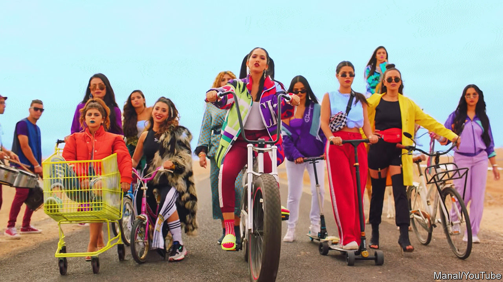

## Rap the casbah

# As Arab rappers challenge the old ways, despots hit back

> Middle Eastern rulers prefer songs without pesky lyrics

> Jul 2nd 2020

“I’M A WOMAN in a land of dicks,” raps Khtek, a Moroccan student, whose first single, “KickOff”, went viral in February. Her lyrics criticise the country’s gaping inequality and stifling political, social and sexual hierarchies. Her tattoos and blue hair defy the kingdom’s traditions. “My rap is a voice for those who don’t have one,” says Khtek, a stage-name which in darija, Morocco’s vernacular, means “your sister”.

Rap music came to the Middle East a generation ago, when Moroccans studying in the West returned with it. King Muhammad VI has promoted hip-hop as a cultural antidote to Islamism. But it has been embraced most enthusiastically by the urban poor, who create their own tracks in local slang. Nowadays Arab rappers challenge conservative mores and articulate the fury of disenfranchised, jobless youths. Last year their protest songs became anthems in the mass demonstrations that toppled leaders in Algeria, Sudan and Iraq.

Morocco’s rap scene is probably the most lit in the Arab world. Manal Benchlikha, simply known as Manal (pictured, on bike), is a symbol of girl power. One of her songs notched up 43m views on YouTube. Female rappers often challenge the taboos of a patriarchal society. “I rap for queers and the discriminated,” says Khtek. Others challenge officials and the police. A song called “Aacha el Chaab” (long live the people) lampoons the king. It went viral last year.

Some Arabs dislike what rappers are saying. As in America, lyrics sometimes promote gangsterism, violence and qarqoubi, north Africa’s version of crack cocaine. Despite the rise of female stars, men still dominate the line-up and often produce misogynistic tunes. Several rappers joined Islamic State, a jihadist group, and tried to lure others with songs like “Dirty Kuffar”(unbelievers). Black Tiger, a Libyan rapper dressed in army fatigues and flanked by a chorus of gunmen, encourages young fighters for Khalifa Haftar, a rebel warlord.

Despots have responded predictably. Morocco jailed one of the rappers behind “Aacha el Chaab”. Saudi Arabia detained a rapper for her track “Girls of Mecca”. Syria has chased most of its rappers abroad, including Bu Kolthoum, who now cheers on rebels from his home in Europe. Egypt is mulling a ban on rap songs that include profanities—in other words, almost all of them. Such is the repression that “political messages have disappeared, even underground,” says Gemyhood, an Egyptian music critic.

A few leaders are following the example of King Muhammad VI and trying to co-opt rap for their own ends. Last year Muhammad bin Salman, the de facto ruler of Saudi Arabia, hosted 50 Cent, an American star, as part of his push to promote more liberal social mores. Some Shia seminarians in Iraq rap their sermons using traditional rhythmic chest-beating as their backing track.

And even autocrats don’t seem to mind Trap, a throbbing rap genre, where the music drowns out the lyrics. The most popular rap song to emerge from the United Arab Emirates is called “Wala Kilma”, meaning “Not a Word”.

## URL

https://www.economist.com/middle-east-and-africa/2020/07/02/as-arab-rappers-challenge-the-old-ways-despots-hit-back
