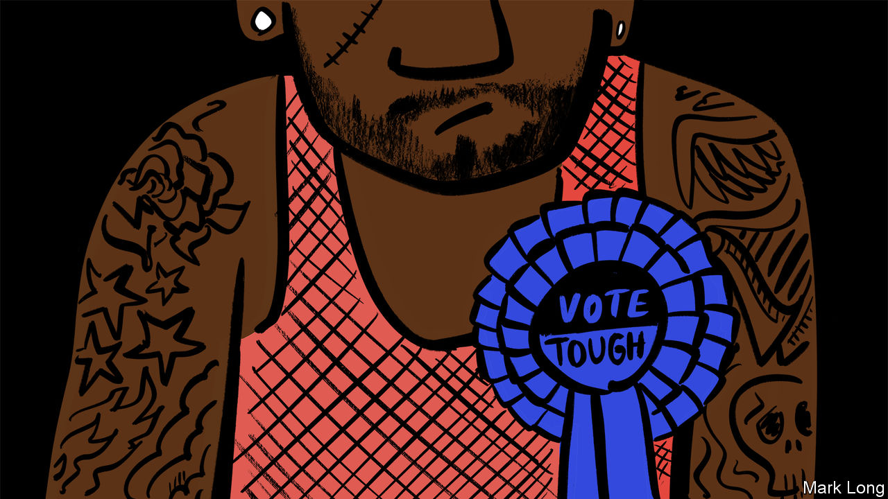

## Club of cutpurses

# Inside the thieves’ guild in Freetown

> Beggars have a union in Sierra Leone; so do sex workers

> Jul 2nd 2020FREETOWN

LIKE MANY clubs, it is selective. Only the right sort of person may join. It has a spokesman, a financial secretary and an interim chairman. But in other ways the Black Street Boys is rather different from, say, a club in Pall Mall or Augusta, Georgia. Members sport matching tattoos of the harp symbol used on bottles of Guinness. And instead of spending their days playing bridge or golf, the Black Street Boys talk about breaking into cars, picking pockets or robbing people at knifepoint.

Before admission, “we’ll interview you, ask where you come from, what your motivation is and why you decided to come here and learn the ways of the streets,” says its interim chairman. He claims to be reforming the gang and that its members now make an honest living patching up car tyres or stitching clothes. But everyone in town says many are still crooks. The chairman took over after the untimely death of his predecessor. He is filling in until an election can be held. His duties include intervening when members scuffle with other gangs, such as Friends of the Dead, whose members loiter at a nearby cemetery.

It is not only thieves who have guilds in Sierra Leone. Every Saturday at 5pm a gaggle of women meet on a beach in Freetown, the capital. Each presents a membership card with her name and photo. A chairwoman leads the discussion while a harried secretary takes minutes. The women then fumble in their handbags for their dues of $2 to the sex-workers’ association.

“Nobody else was going to help us, so we decided to support ourselves,” explains Isha Turay, the chairwoman. The money she collects each week goes into a communal pot. Members can dip into it in an emergency, such as needing to pay a hospital bill or bury a relative. Anyone who abuses the system is immediately thrown out. When, all too often, a client refuses to pay up, the group rallies. A handful of members will turn up on his doorstep, accompanied by a burly male.

There are hundreds of informal associations like these across the country. The youngsters who sell pirated CDs in downtown Freetown answer to a chairman and vice-chairman, as do the beggars who loiter outside a hilltop supermarket in the west of the city. Neighbours band together and form committees to look out for one another. The chairmen mediate squabbles, punish thieves and drum up cash when members are sick. Some are corrupted by power and end up squeezing extra, undue payments from members.

Such groups exist because the state is a shambles. According to a report last year by Transparency International, a Berlin-based watchdog, more than half of Sierra Leoneans paid bribes for public services. When officials are predatory, people turn to their communities for protection.

There are some historical reasons for these structures, too. They mirror the decentralised system of governance that existed when the British colonised Sierra Leone. Without a national leader, each region was controlled by a chief and his underlings. There are still chiefs today who wield a lot of power outside the cities.

“It’s not that much different from any UK village choir or soccer club,” says Paul Richards, an anthropologist. “Someone has to do the work, and they reward themselves with grand titles.” The main difference, perhaps, is that in a country with almost no state, those with the titles have a lot of work to do. ■