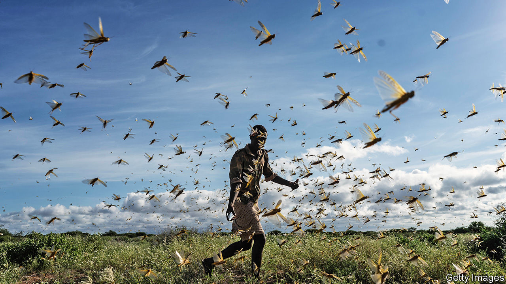
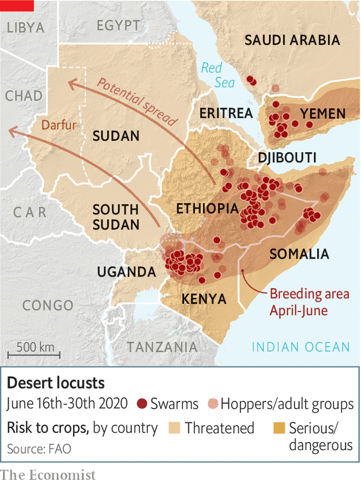

## Another sort of plague

# Locusts have hit east Africa hard

> Farmers, NGOs and investors are all worried. West Africa could be next

> Jul 2nd 2020

VAST SWARMS of locusts have swept through Kenya and Ethiopia since January, devastating fields, pastures and livelihoods. Governments have struggled to suppress them. They have continued to breed in their billions, threatening whole economies, which are also being battered by the covid-19 pandemic.

Last month Fitch, a credit-rating agency, issued its first-ever warning that locusts could shake east Africa’s macroeconomic stability. In Ethiopia the voracious insects may drive up food prices, accelerating consumer inflation that is already running at about 20% a year. They may also cause Ethiopia’s fiscal deficit to widen.

Moody’s, another ratings agency, is just as gloomy. It said the locusts are “credit negative” for governments in the region. The “twin shocks” of covid-19 and locusts have led it to cut by more than half its economic growth forecasts for several countries, including Ethiopia and Kenya. East Africa is particularly vulnerable to locusts because farming and herding generate about a third of its GDP and provide two-thirds of jobs. The only exception to this rule of thumb is Kenya, which has a more diverse economy.

Like humans, locusts eat maize, sorghum and millet. They also chomp the grass that sustains livestock. Swarms like one that ravaged Kenya earlier this year can contain 200bn locusts and eat as much in a day as the entire population of Germany. And more may be on their way. “We are not seeing the end of the tunnel yet,” says Fatouma Seid of the UN’s Food and Agriculture Organisation (FAO).

The bugs’ breeding puts rabbits to shame; each generation can be 20 times larger than the one before. This latest one is now feeding voraciously as the pests grow from immature hoppers into adults that eventually swarm and migrate.

The invasion, which grew dramatically in January, is the biggest in decades for Ethiopia, Kenya and Somalia. Data are patchy on the harm the locusts are causing, because covid-19 makes it hard for bug-watchers to get around. But in April it was reckoned that locusts had already damaged 200,000 hectares of Ethiopia’s arable land and 1.3m hectares of its pasture, despite a spraying campaign. As a result an extra 1m Ethiopians need emergency food. The International Rescue Committee, an NGO, says locusts have damaged more than half of Somalia’s pasture, too. Some 20m people already face hunger in the wider region. Covid-19 and locusts may double that figure, says the World Food Programme.

The World Bank fears that the infestation could cause economic damage in the greater Horn of Africa and Yemen to the tune of $8.5bn if remedial steps are not taken. Even if the outside world piles in with immediate help, losses could exceed $2.5bn, it reckons. Agricultural exports, which dominate the region’s sales abroad, are at risk, too.

Even more worrying is that the zone of devastation is expanding. Swarms could soon swirl over from Somalia to India and Pakistan, which are already suffering infestations. And maturing locusts in northern Kenya are preparing to take flight and ride the winds blowing north. These could carry them as far as 150km in a day.

The FAO’s Keith Cressman hopes they will stop in Sudan, which is generally fairly good at spraying and suppressing them; it has even sent locust-surveillance teams to its embattled western region of Darfur for the first time in 17 years. But unless it rains more in Sudan’s deserts, the locusts will not stay there for long. In search of food, billions may head to west Africa via the Sahel (see map), where they would be harder to control.

After a slow start, governments are reacting. More than half a million hectares in east Africa have been sprayed with pesticides, despite delays in the arrival of experts from abroad and shipments of chemicals because of covid-19. Many of the region’s most valuable crops have been protected. But pastoralists reliant on grasslands have not been so lucky. Foreign donors have pitched in. The World Bank will lend $500m to countries in east Africa and the Middle East, but it is not nearly enough. Ethiopia has received less than two-thirds of the $77m it asked donors for.

The best way to beat the bugs is to track them constantly, then spray them before they can breed again. Prevention is also much more cost-effective than controlling an outbreak once it has taken hold. For example, in 2003 it cost $570m to eliminate swarms of locusts in the Sahel, a sum that could have paid for 170 years of prevention, says the FAO. And that is before taking into account the damage to crops and pastures that the locusts caused. But early action is not happening. Last year the FAO repeatedly and unsuccessfully asked for pre-emptive help for Yemen and Ethiopia. The FAO has since appealed for $23m for surveillance and prevention in west Africa. So far nothing has been pledged. ■