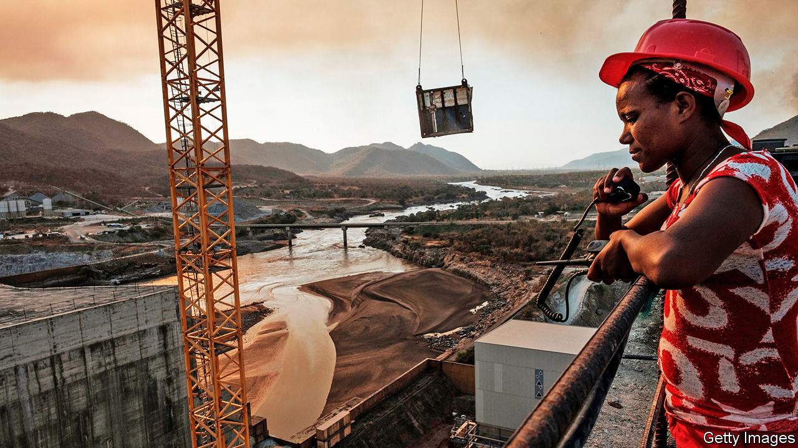
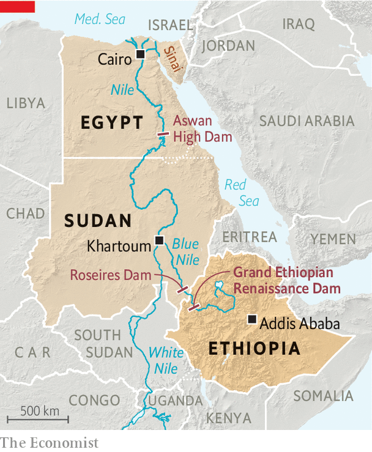

## Showdown on the Nile

# The bitter dispute over Africa’s largest dam

> Egypt, Ethiopia and Sudan are struggling to share water

> Jul 2nd 2020BEIRUT AND ADDIS ABABA

FOR BIRUK NEGAFH, as for millions of Ethiopians, the summer rains may bring the climax of a decade’s work. As a high-school student in 2011 he bought 100-birr bonds (then worth $6 each) to help finance the Grand Ethiopian Renaissance Dam, a giant edifice that would span the Blue Nile, the main tributary of the Nile river (see map). At university he donated to fundraisers for the project. Now, like almost all Ethiopians, he eagerly awaits the day—perhaps weeks away—when Ethiopia begins to fill the reservoir. “It’s a national victory,” he says.

Half a century in the making, the hydro-electric dam is Africa’s largest, with a reservoir able to hold 74bn cubic metres of water, more than the volume of the entire Blue Nile. Once filled it should produce 6,000 megawatts of electricity, double Ethiopia’s current power supply. Millions of people could be connected to the grid for the first time. More than an engineering project, it is a source of national pride.

For Egypt, however, it seems a source of national danger. Over 90% of the country’s 100m people live along the Nile or in its vast delta. The river, long seen as an Egyptian birthright, supplies most of their water. They fear the dam will choke it off. Pro-regime pundits, not known for their subtlety, have urged the army to blow it up.

Both sides have tried diplomacy, but years of talks failed to produce a deal on how Ethiopia would fill and operate the dam. The African Union tried to mediate, as did America earlier this year. Now a deadline looms: Ethiopia wants to start filling the reservoir during this summer’s rainy season. On June 26th, after another round of talks, Egypt, Ethiopia and Sudan pledged to reach a deal within two weeks. Ethiopia agreed not to start filling the dam during that period.

Diplomats say most of the issues are resolved. But the outstanding one is big: how to handle a drought. Egypt wants Ethiopia to promise to release certain amounts of water to top up the Nile. But Ethiopia is loth to “owe” water to downstream countries or to drain the reservoir so much that electric output suffers. It wants a broader deal between all riparian states, including those on the White Nile, which flows out of Lake Victoria down through Uganda and Sudan.

Even if talks fail and Ethiopia starts filling without a deal, Egyptians will not find their taps dry. There is enough water in the reservoir behind Egypt’s Aswan High Dam to make up for any shortfall this year. But the mood in both countries is toxic. Egyptians have cast Ethiopia as a thief bent on drying up their country. In Ethiopia, meanwhile, Egypt is portrayed as a neocolonial power trampling on national sovereignty. The outcome of the talks will have political consequences in both countries, and perhaps push them to the brink of conflict—at a time when Egypt is already contemplating involvement in a war in Libya.

Mooted first by Emperor Haile Selassie in the 1960s, Ethiopia’s grand dam became a reality and a national obsession under Meles Zenawi, the longtime prime minister who ruled until 2012. His political masterstroke was asking Ethiopians to finance it through donations and the purchase of low-denomination bonds. (The World Bank and private investors were unwilling to put up the cash.) Almost every Ethiopian became a stakeholder. Most contributed voluntarily, but there was always an element of coercion. Civil servants had to donate a month’s salary at the start. Local banks and other businesses were expected to buy bonds worth millions of birr.

When he took office in 2018, Abiy Ahmed, Ethiopia’s current prime minister, criticised the dam as a project “used for political expediency” and warned it could take another decade to finish, statements seen as an attack on his predecessors. Some questioned his commitment. The cloud grew heavier after the death in 2018, officially by suicide, of the project’s chief engineer. At a meeting with Abdel-Fattah al-Sisi in Cairo, Abiy reportedly shocked advisers by discarding a planned speech and telling the Egyptian president: “I swear to God, we will never harm you.”

Two years on, Egyptians complain that Abiy has reverted to type. He is “inflexible”, says an Egyptian diplomat. Ethiopia is gripped by jingoism over perhaps the only issue that unites citizens of all ethnicities. On state TV broadcasters compare the dam to the battle of Adwa in 1896, when Ethiopians came together to defeat the Italians. Teddy Afro, perhaps the country’s most famous pop singer, released a song about the Nile on June 29th. Delaying filling would be politically risky for Abiy.

Nor does Mr Sisi have much room to compromise. Egypt is already short of water. The UN sets the threshold for scarcity at an annual 1,000 cubic metres per person. In 2018 Egyptians had just 570 cubic metres; even without the dam, that could drop to 500 cubic metres within five years. Ethiopia has blocked proper studies of how the dam will affect downstream countries.

The shortage is partly Egypt’s own fault. It uses almost 80% of its water, which it subsidises, for agriculture. (In Jordan and Israel, two nearby countries with limited freshwater resources, the figure is closer to 50%.) Irrigation canals, most of them decades old, are notoriously ill maintained and leaky. Farmers grow thirsty crops like bananas, rice and sugar cane, despite government plans meant to deter the practice. All this for a limited pay-off: Egypt still imports half its food. Supplies are further pinched by farm projects in Sudan, where Gulf states have bought large tracts of arable land to help feed their own people.

For years Egyptian officials failed to take the dam seriously. Now they face a deadline—and a pile of other problems. Egypt’s covid-19 outbreak started slowly, but the daily death toll peaked on June 15th and remains at a high plateau. Economic damage is mounting, too. On June 26th the IMF approved a loan of $5.2bn to Egypt.

Mr Sisi is also nervous about developments on his western border. Khalifa Haftar, the Egyptian-backed Libyan warlord who last year vowed to capture Tripoli, beat an ignominious retreat this spring. He was pushed back after Turkey sent armed drones and Syrian militiamen to support the UN-recognised government in Tripoli.

Egypt sees a Turkish presence next door as a threat. Relations have grown steadily worse since 2013, when Mr Sisi overthrew Muhammad Morsi, an Islamist, like Turkey’s president, Recep Tayyip Erdogan. Last month Mr Sisi said his country had a right to intervene in Libya. He warned the Turkish-backed forces not to advance past Sirte, a strategic coastal city that sits near Libya’s main oil-export terminals.

Egypt’s army is wary of foreign wars, a caution that dates back to its ill-fated intervention in Yemen in the 1960s, which cost tens of thousands of lives (and left it unprepared to fend off Israel in 1967). Since then it has largely avoided overseas adventures, save for an unimpressive cameo in the Gulf war in 1991. Instead it has fought jihadists on the Sinai peninsula, overthrown a president and built an economic empire that stretches from luxury hotels to cement. Now Mr Sisi finds himself uncomfortably surveying crises on two fronts.

Abiy’s position in Ethiopia is hardly more comfortable. Rivals at home have seized on his perceived weakness. One opposition leader accuses him of offering the dam as a “sacrificial lamb” to foreign powers. “If he fails to start filling in July, he is in trouble,” says Jawar Mohammed, an influential activist, who was arrested last month. On June 30th protests erupted after a popular musician from the Oromo ethnic group was killed, a reminder of how thin the veneer of national unity is. The technical details of a deal can be worked out, but neither leader has a deep reservoir of political capital to make it a reality. ■

## URL

https://www.economist.com/middle-east-and-africa/2020/07/02/the-bitter-dispute-over-africas-largest-dam
