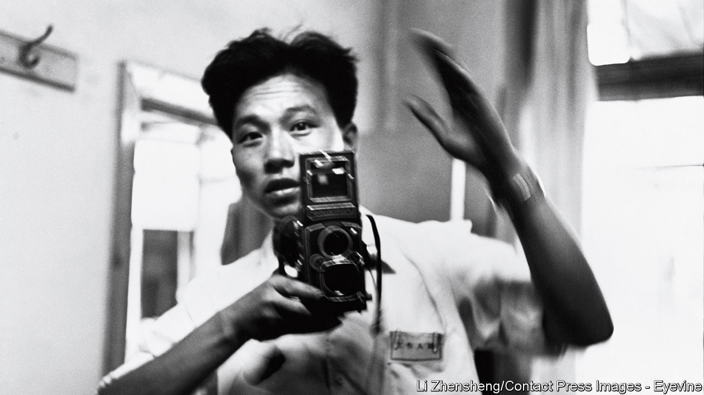

## Facing up to Mao’s horrors

# Li Zhensheng died on June 22nd

> The chronicler in photographs of China’s Cultural Revolution was 79 or 80

> Jul 2nd 2020

ONCE HE GOT back to his office at the Heilongjiang Daily and shrugged off his cameras, Li Zhensheng became a busy man. He had to develop his roll of film, and since he was the youngest photographer at the paper the older guys gave him theirs to develop, too. He would sometimes spend hours in the darkroom, singing to himself when he felt hard done by.

With his own photos he had a system. The negatives he hung up publicly to dry were “useful” to the paper. A beaming little girl performed a loyalty dance to Mao Zedong, the Great Helmsman, while laughing Red Guards applauded her. A cohort of male swimmers, bare torsos shining, lined up to recite from Mao’s Little Red Book before plunging into the Songhua river, in Harbin, to commemorate the Great Leader’s swim in the Yangzi. A crowd gathered with banners in Harbin’s main square for a speech about “Learning and Applying Mao Zedong Thought”, a crowd so vast that he had taken several shots and would splice them together with backing tape. A statue of Mao was raised on a float piled with sunflowers, showing that the people followed him as sunflowers followed the sun.

Any of those could easily run anywhere in the paper. Since the Cultural Revolution had been proclaimed, in 1966, the Daily had printed only pictures like those. And for each one published he earned eight scarce frames of film. So the propaganda pictures were useful to him, too. Thanks to them, he could also shoot what was “not useful”: the negatives he did not hang up, but dried quickly, clipped off the strip, put into small brown envelopes and hid in a hole he slowly sawed in the floor of his one-room flat.

In one of these, the provincial governor of Heilongjiang bowed his head while a chubby Red Guard sheared his hair off and stuffed it down his shirt. A placard round his neck proclaimed him a gangster; he had dared to wear his hair like Mao. A man and woman prominent in the local party stood on a stage to be ritually humiliated: heads shaved, clothes and faces slathered with ink. A man was dragged from the North Plaza Hotel to be “persecuted” on the steps, arms twisted behind his back and head yanked by the hair, for writing a letter defending his denounced father. By an earth bank in the bare fields outside Harbin, eight counter-revolutionaries and “ordinary” criminals knelt in the mud to be shot; a guard tried to separate two of them, who were lovers. In all these photographs, distant, or sitting on bleachers, or pressing round shouting, there was a crowd. The whole country was involved in this.

So was he. He had been allowed to take those pictures only because he made sure to wear a red armband, like the student Red Guards unleashed by Mao to revolutionise China. It bore the words “Red-Colour News Soldier”. He was one of them, therefore, and no one asked questions. Nor was it just a superficial thing. He too was excited by the thought of challenging authority, sweeping old stuff away, remaking the country. He had never liked his elders telling him what to do. Having gone all the way from a childhood labouring in the fields to the Changchun Film School, he had been furious when his teachers diverted him to “socially useful” photo-journalism instead. When they sent him to far north-east Heilongjiang to correct his complaining, he found his own job at the Daily. There, as a red-colour soldier, he naturally photographed the head of the paper’s work group, Luo Zicheng, when he was accused of following the capitalist line and opposing mass movement, standing penitent in his glasses and a tall dunce’s cap among his screaming colleagues. Sometimes, out and about in search of a good shot, he even whipped up such ravening crowds.

He did not know, as he took these useless unpublishable pictures, whether he was doing so for history, or the revolution, or himself. The detailed notes he wrote on the envelopes marked them as evidence, at least. He put feelings aside as he took them. Composition was more important: how to compress the energy of a moving, even frantic scene into his favourite shape, the square. He wavered only when he saw the monks at Harbin’s ransacked Buddhist temple holding a banner which read: “To hell with the Buddhist scriptures. They are full of dog farts.” A bonfire of those scriptures was blazing in the courtyard, and a Buddha lay in a storeroom with its head hanging off. He shot those things, too.

His line was hard to walk. He took pictures of writers and artists marching to do forced labour in the fields, and was not in the batch of journalists and editors from the Daily who were sent to the countryside to be “re-educated” in 1968. He went the next year, though, with his wife Yingxia, for two years’ hard labour for “counter-revolutionary activities”. Ever disobedient, he smuggled two cameras in, but his secret pictures were mostly of nature: the vitality of trees and grasses half-buried in drifts of snow.

Despite his re-education, and a search of his flat, no one found the negatives. He snapped his small son Xiaohan giggling over the secret spot. Back at the Daily he continued taking pictures, both useful and non-useful, adding to the store. Gradually his ambivalence left him; the catastrophe of the Cultural Revolution became undeniable. By the time he moved to be professor of photography at a college in Beijing, in 1982, he had more than 30,000 negatives. It now seemed right—and, after the Tiananmen massacre in 1989, urgent—that his countrymen should see them. But apart from a brief showing of 20 of them in Beijing in 1988, and a small private museum of his work built in 2017 in Sichuan, there was no interest. That chapter was sealed. From America, to which he had moved in 2003 to be near his publisher and his children, he dreamed of smuggling his books to China one by one, like ants moving house.

A fair number of those unseen pictures were self-portraits. If he came back to the Daily with a frame left, he would burn it off with himself: cheeky or heroic in his office mirror, however the mood took him. He snapped himself reading the Little Red Book; as he left for the labour camp, it was the only thing still on his desk. These images went under the floor together with the screaming faces, the dunces’ caps, the hacked Buddhas, the dragged-off bodies. China had to face up to that past, as he had to face up to his.■

## URL

https://www.economist.com/obituary/2020/07/02/li-zhensheng-died-on-june-22nd
