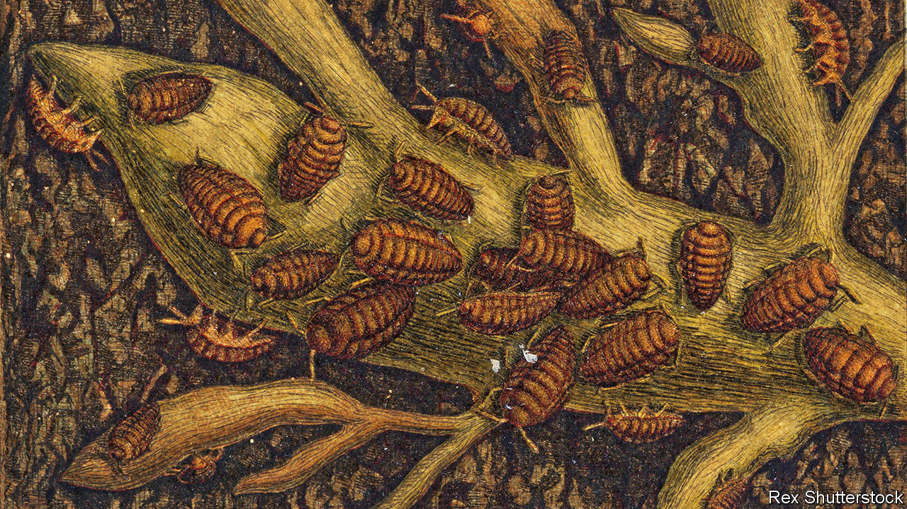
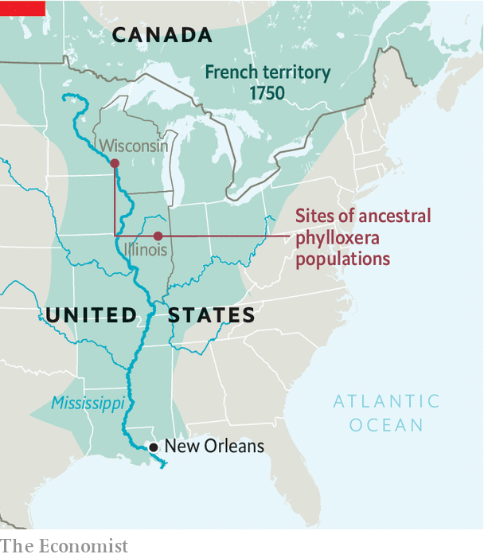

## Phylloxera

# A pest’s genome reveals its past

> And shines light on how to deal with it in future

> Jul 2nd 2020

A  CENTURY AND a half ago an alien insect alighted in Europe. It displaced millions, ruined local economies and forced scientists, politicians and ordinary folk into a frenzy of defensive activity. Phylloxera, a member of the group known to entomologists as Hemiptera, or “true” bugs (as opposed to all the other critters known colloquially as bugs), appeared in France in the 1860s and proceeded to eat its way through many of the Old World’s vines.

It then spread to pastures new. It was first recorded in Australia in 1875 and in South Africa in 1886, threatening similar devastation to the vineyards of those European colonies. Eventually, French and American scientists found a solution by grafting European vines onto the imported roots of American ones. Now, a more recent group of French and American researchers report in  bmc Biology that they have sequenced phylloxera’s genome, and that hidden within this lie clues to the insect’s origins and spread.

Nineteenth-century agronomists rapidly divined that phylloxera had come from North America. That fact provided the rationale behind their graft-based answer to the problem—which is still all that stands between cultivated vines and the bug. This is that having co-evolved with the insect, American vines had developed resistance to it. But where exactly it came from on that continent, nobody knew. One theory held British gardeners responsible because they had brought wild American vines to Europe for decorative purposes. From Britain, this theory went, phylloxera reached the European mainland via the south of France, the first place where it devastated vineyards. That, though, turns out to be a calumny against les Anglais.

By comparing the genetic sequence of European phylloxera with those of populations from wild vines in the United States, Claude Rispe and Fabrice Legeai of the French National Research Institute for Agriculture, Food and the Environment (INRAE) and their colleagues have narrowed the search to the once-French territory of the Mississippi Valley (the upper Mississippi, to be precise—though one of the paper’s authors, Paul Nabity of the University of California, Riverside, plans to keep following the river south, sampling phylloxera as he goes, so the matter is not closed). The evidence is that there is a striking similarity between the European sequence and that of two phylloxera populations on a wild vine called Vitis riparia in Wisconsin and Illinois. This is enough, Dr Nabity says, to indicate that V. riparia was the bug’s original host and the upper Midwest its source.

If correct, says François Delmotte, who works at INRAE’s campus in Bordeaux and is one of the project’s leaders, the finding fits with certain historical facts. Though the Mississippi valley was annexed from France by Britain and Spain in the mid-18th century, and passed eventually to the United States, many French settlers remained in the area and France retained trading links, particularly with New Orleans, for a long time. Dr Delmotte says it would not be surprising if, in the 19th-century age of steamships and naturalists, phylloxera survived on cuttings of V. riparia stored in a cool, dry hold to be brought to a botanical garden in France. Or, even more ironically, that it was imported with vines destined to cure their French cousins of an earlier imported blight—powdery mildew.

The genetic diversity of European phylloxera is limited compared with that of its North American counterpart, says Dr Rispe. That points to there having been only one or two introductions, with subsequent diffusion of the pest by people and their agricultural machines. However, another of the paper’s authors, Astrid Forneck of the University of Natural Resources and Life Sciences in Vienna, says it remains a possibility that a separate introduction infested eastern Europe, perhaps via the Austro-Hungarian empire’s experimental vineyards at Klosterneuburg.

In America phylloxera attacks wild vines’ leaves. It stimulates them to create galls in which it can live and feed, but which, from the plant’s point of view, serve to isolate the problem. When it attacks cultivated vines, though, it goes for the roots. These root galls open a plant to infection by bacteria and fungi, leading to its death. For a long time, researchers hunted for a single molecule, produced by the insect, that stimulated the growth of galls. Blocking the action of this, they hoped, would phylloxera-proof all vines. But here the sequencing project produced a disappointment. There is no such molecule. The researchers identified many genes—2,300 of them, more than a tenth of the insect’s genome—that encode proteins which it secretes while feeding on the vine. These enable it to evade the plant’s immune system while diverting resources from its host.

The work now begins of teasing out what each of those genes does, and, ultimately, how phylloxera manipulates a plant and adapts to a new host. This information may in turn generate new weapons against the creature. That could be valuable in parts of viticulture’s New World, such as Australia, where vines remain ungrafted and phylloxera is still a problem. It might also help if the insect ever evolves the ability to evade the natural resistance of American vine roots that currently stands between European growers and disaster. For Dr Forneck, this prospect is not outlandish. The insect is already adapting to a warmer world, and shifting its range. Further shifts in its physiology are perfectly possible.■