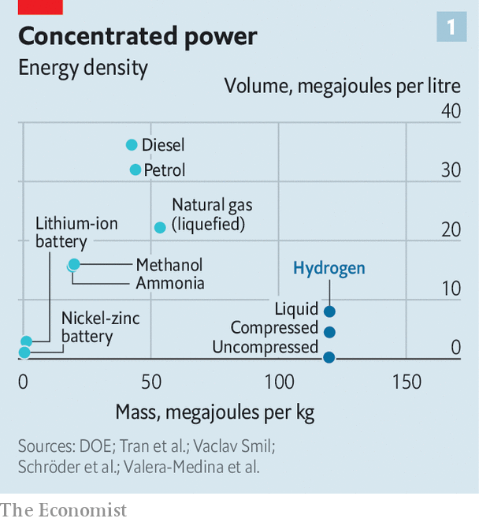
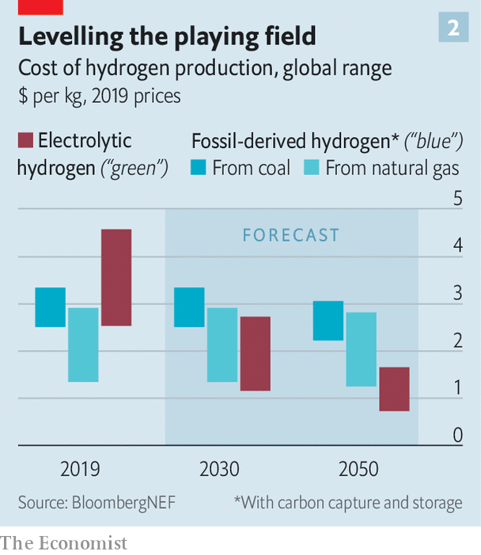
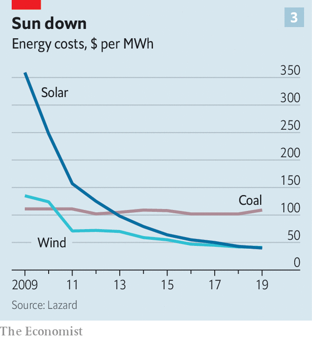

## Hydrogen power

# After many false starts, hydrogen power might now bear fruit

> But it will fill in the gaps, rather than dominating the economy

> Jul 4th 2020

CONVENTIONAL WISDOM holds that battery-powered cars are the future of motoring. But Hyundai, a big South Korean vehicle-maker, is not so sure. Over the past few months it has been running a worldwide public-relations campaign extolling the virtues of an alternative source of electrical power—fuel cells. Instead of storing and then releasing electricity gathered from the mains in the way that a battery does, a fuel cell generates current from a chemical reaction between hydrogen and oxygen. The oxygen comes from the air. The hydrogen, suitably compressed, is stored in a tank on board the vehicle, and is replenished at a filling station, like petrol. Unlike a battery, a fuel cell does create exhaust. But that exhaust is simply the reaction product of hydrogen and oxygen, namely water.

Hyundai’s campaign features members of BTS, a mop-topped South Korean boy-band, staring dreamily into the middle distance amid backdrops of natural beauty. As a reminder of fuel cells’ environmental advantages, water is everywhere. It falls as snow. It roils in oceans. It floats gently through forests as mist. “For rest,” writes Park Ji-min, one of BTS’s members, in a misguided quest for profundity, “our rest comes from for-rests”.

The marketing may be silly, but Hyundai is serious. The firm already sells battery-powered vehicles, but it is hedging its low-carbon bets by developing hydrogen ones as well. The advertising campaign is designed to sell the Nexo, the firm’s second fuel-cell car, which was launched last year. And Hyundai is not the only company keeping its options open in this way. On June 5th Toyota, maker of the Prius, the world’s best selling battery-hybrid vehicle, announced a joint venture with several Chinese carmakers to develop fuel-cell technology. An updated version of Toyota’s Mirai, another hydrogen-powered car, is due out later this year.

Hydrogen is enjoying a purple patch, then, and not just among carmakers. It is being touted as a means of propelling buses and lorries, and even ships and aircraft. There is talk of it replacing natural gas as a source of heat, of it being used to store the surplus output of solar and wind power stations, of it being employed as a chemical feedstock and even of it replacing coke as a means of extracting metallic iron from its ore. If all this came to pass, then hydrogen would become a dominating factor in human life in the way that hydrocarbons currently are. It would, in other words, usher in a hydrogen economy.

Readers of a certain age are now permitted to roll their eyes. At least twice in the past 50 years—in the 1970s, after the oil crisis, and in the 1990s, when climate change started to acquire political salience—there has been excited talk of replacing hydrocarbons with hydrogen. It didn’t happen.

There were several reasons for this. For a start, ripping up and replacing the world’s fossil-fuel infrastructure is a huge job. And even were that an easy thing to accomplish, hydrogen itself has drawbacks. Though better than batteries, it stores less energy in a given volume than fossil fuels can manage (see chart 1). More important, it is not a primary fuel. You have to make it from something else.

This can be done by a chemical reaction called steam reforming but, besides steam, the other ingredient of that process is a hydrocarbon of some sort, which rather defeats the object of the exercise. Or it can be done by the electrolysis of water. This has appropriate green credentials as long as the electricity is either from renewable sources or a nuclear-power plant. But the laws of thermodynamics mean that the energy content of the hydrogen which comes out of the process is less than the electricity that went in. This inbuilt inefficiency raises the question “why not simply power the end-use electrically, rather than using hydrogen as an intermediary?”

To counter these arguments those who believe that things hydrogen-related really are different this time around can point to two things in their favour. Several of the relevant technologies, notably electrolytic equipment, are now at a stage where it is possible to believe they might soon become cheap enough to do the job. And the idea that economies need to be decarbonised fully in order to curb climate change is gathering speed.

Until 2019, for instance, Britain had planned to cut carbon emissions by 80% from their levels in 1990 by 2050. It then, however, upped the ante to become the first big economic power to commit itself to a 100% cut. This has implications for hydrogen. Electrification using renewable sources such as wind and solar power would probably have got the country to 80%, observes David Joffe, a member of the Committee on Climate Change (CCC), an organisation that advises Britain’s government on how to bring the transformation about. But full decarbonisation, he says, is a much bigger task, and one for which hydrogen may prove necessary.

Despite Hyundai’s and Toyota’s enthusiasm, few analysts believe cars will be part of this process. The CCC calculates that a battery-powered car charged with electricity from a wind turbine converts 86% of the turbine’s output into forward motion on the road. For a fuel-cell car, it is 40-45%. Hydrogen cars also suffer from a chicken-and-egg problem. Unlike the battery-powered variety, they cannot be refuelled at home. Yet roadside refuelling stations for them are scarce, and are likely to remain so while the cars themselves remain rare.

In the meantime battery cars are building a formidable lead. The International Energy Agency (IEA), which advises national governments, reckons there were just 11,200 hydrogen-powered cars on the road in 2018, mostly in America and Japan. That compared with 5.1m battery-powered cars. And this number is growing fast. In 2019 sales of new battery-powered cars in China, the world’s biggest automobile market, hit 1.2m—4.7% of the total. In Norway they accounted for more than half of new cars sold. According to the IEA, sales of hydrogen cars around the world in 2018 (the most recent year for which reliable figures are available) were just 4,000.

There is, though, more to transport than private cars. A big problem with batteries is that they have a low energy density—in other words, they have to take up a lot of space if they are to propel a vehicle for any distance. For private cars, which mostly make short journeys, that is manageable. For longer-distance travel, for example by lorries, says Mark Newman, a technology analyst at Bernstein, a bank, hydrogen’s greater energy density becomes more attractive. Hydrogen compressed to 700 atmospheres contains between two and five times more usable energy per litre than a lithium-ion battery. If it is liquefied (which requires more complex technology) that increases further. And since lorries spend most of their time on busy trunk roads, fewer new fuelling stations would be needed.

Exactly where the break-even point lies is still debated. Tesla, a pioneering electric-car maker, thinks that even lorries can usefully be powered by batteries and plans a version that can travel 800km. Hyundai already makes a hydrogen-powered lorry, but its range is only 400km. Several other firms are also investigating fuel cells for lorries. In April, for example, Daimler, a German company, and Volvo, a Swedish one, invested €1.2bn ($1.3bn) in a joint venture to pursue the idea.

Shipping, which accounts for around 2.5% of the world’s industrial greenhouse-gas emissions, is also taking an interest. The International Maritime Organisation, an appendage of the United Nations that regulates the industry, aspires to cut ships’ collective greenhouse-gas emissions to half their levels in 2008 by 2050. How this might be achieved is unclear. Batteries pack far too little energy to power big, ocean-going vessels. Engineers have toyed with everything from nuclear propulsion to high-tech sails. But a study published in March by the International Council on Clean Transportation, an American not-for-profit institution, examined an existing shipping route between China and America and concluded that virtually all the craft plying it could be powered by fuel cells like those used in Hyundai’s cars, albeit with some cargo space removed to make room for the hydrogen itself. Even that could be ameliorated, says Michael Liebreich, an energy consultant, by first reacting the hydrogen with nitrogen to produce ammonia, a chemical that takes up less room than elemental hydrogen, and which can also be used in fuel cells.

Hydrogen might replace natural gas for heating, as well. A big advantage here is that it could make use of current infrastructure in the form of pipelines now employed to transport that natural gas. Several countries, including Australia, Britain and Germany, are experimenting with this idea. “We already have a gas grid that should last for at least another 75 years,” says Antony Green, an engineer at National Grid, which runs Britain’s electricity and gas networks. “Why not make use of that if we can?”

National Grid reckons the gas-fired boilers which heat most British homes can cope with a mix of 20% hydrogen without modification. And, says Dr Green, boilermakers are beginning to offer “hydrogen-ready” models, which are capable of burning either natural gas or pure hydrogen. Since boilers are replaced every ten to 15 years, he reckons the gas grid could plausibly be ready to switch to hydrogen in a couple of decades’ time. In May a group of German pipeline operators unveiled a plan to build a 1,200km hydrogen grid, based on converted natural-gas pipes, by 2030, at a cost of €660m.

How much environmental good this would truly do is debated. Starting from the position that the only green alternative for heating is electricity powered by renewables, Graham Cooley, the boss of ITM Power, a hydrogen-equipment maker, points out that Britain’s natural-gas grid supplies, every year, around 880TWh of energy to homes, factories and offices, most of which is used for heating. That is more than twice as much energy as the country’s electricity grid carries.

A switch to renewably powered electric heating would therefore require a drastic—and expensive—beefing up of the electricity network. Dr Joffe, however, counters that the need to manufacture hydrogen in the first place, with all the inefficiencies this brings, means a hydrogen gas grid would require building even more new power stations than would heating homes or factories with electricity directly.

Another suggested role for hydrogen is large-scale energy storage. As wind and solar power spread, matching supply with demand becomes harder. An obvious solution is to store surpluses in good times for use later, when times are bad. And one way to do that might be to make hydrogen and keep it in underground caverns, as currently happens with natural gas. This could increase capacity enormously—perhaps enough to manage not just day-to-day fluctuations but interseasonal ones as well.

On top of these ideas, heavy industry may provide other niches for hydrogen to fill, says Dr Liebreich. Electric heating may struggle to replace natural gas for many industrial processes involving steel, ceramics and glass because it might not be able to reach the required temperatures. And one of the biggest industrial sources of carbon dioxide is not directly energy-related at all.

This is the reduction of iron ore (usually an oxide of iron) to the metal itself by reacting the ore with carbon monoxide made from coke. That produces iron and carbon dioxide. React the ore with hydrogen instead, and the waste product is water. Several firms—including ArcelorMittal, a multinational steelmaker, and a conglomerate of SSAB, a Finnish-Swedish steelmaker, LKAB, a Swedish iron-ore producer, and Vattenfall, an energy company, also Swedish—are examining this possibility.

All of this does, however, depend on an ability to make hydrogen at scale in a way that does not release CO2 into the atmosphere. And that is tricky.

At the moment, virtually all of the roughly 70m tonnes of hydrogen produced each year is a result of steam reforming. This emits seven tonnes of carbon dioxide for every tonne of hydrogen yielded. For this reason steam-reformed hydrogen is known to environmentalists as grey hydrogen. Its cost varies according to local circumstances, but averages, according to the IEA, around $1.50 a kilogram.

“Blue” hydrogen, though still the result of steam reforming, is somewhat cleaner than the grey variety. Instead of the CO2 being dumped into the air it is captured and buried underground—so-called carbon capture and storage. This is starting to happen. On July 1st, for example, Equinor, a Norwegian energy firm, said it would build one of the world’s biggest blue-hydrogen plants at a site in northern England. More ambitiously, Japan hopes that blue hydrogen might power its future. It envisages creating the gas from lignite deposits in Australia, burying the carbon dioxide locally, and then shipping the hydrogen across the Pacific in tankers akin to those that now carry liquefied natural gas.

The extra equipment needed to capture the carbon dioxide produced by reforming necessarily pushes up the price of blue hydrogen. Bloomberg New Energy Finance (BNEF) a firm of clean-energy analysts, reckons its current cost ranges from $1.50 to $3.50 a kilogram, depending on which fossil fuel is used to produce it (see chart 2). Moreover, the process of capturing CO2 is imperfect, so some of that gas escapes. The real desideratum, therefore, is “green”, electrolytic hydrogen. At $2.50 to $5 or more a kilogram, however, green hydrogen is currently even pricier than the blue sort.

This could all change, though, as the technologies involved in making both blue and green hydrogen are scaled up. Prediction is a mug’s game, but BNEF has had a go anyway. Its analysts reckon green hydrogen might, by 2050, cost between 70 cents and $1.6 a kilogram—in other words the current price of the grey variety. As Kobad Bhavnagri, the firm’s head of special projects, explains, “The cost of electrolysis equipment has fallen by around 40% in the last five years in the West.” Dr Bhavnagri reckons the kit can now be had in Western countries for around $1,200 per kilowatt of capacity and that there may be scope for those numbers to fall much further. “The cost in the Chinese market is drastically lower—around $200 per kW,” he says, which will presumably bring the price down everywhere soon. UBS, a bank, cites a deal recently struck by Nikola, an American firm that says it is planning to make hydrogen lorries, which implies electrolyser costs of just $350 per kW.

Operating costs, meanwhile, can ride on one of the most striking and reliable trends in the energy industry—the relentless fall in the price of solar and wind power (see chart 3). The cost of solar in particular has fallen by 85% in the past decade. Renewables are now cheaper in some parts of the world than energy from fossil fuels, and the process shows no sign of slowing.

The economics, then, seem to be pointing in the right direction for hydrogen to become, if not dominant, then at least an important part of the mix. The Hydrogen Council, a lobby group based in Brussels, thinks the gas could be satisfying 18% of the world’s energy demand by 2050. The share prices of firms that make fuel cells, electrolysis equipment and the like have consequently been marching upward.

Many of the assumptions made in various forecasts rely, however, on governments providing prodigious subsidies to develop the technology. BNEF says subsidies of around $150bn over the next ten years might be needed to make hydrogen competitive. In reality, the IEA reckons that total government spending on hydrogen in 2018 was just $724m.

Official interest is certainly picking up, though. On June 10th Germany announced a €7bn subsidy programme aimed at making it the “world leader” in the technology. A leaked draft of the European Union’s post-covid stimulus plan contains an ambition to install 40GW of green hydrogen capacity by 2030. China’s government hopes to see 1m fuel-cell-powered vehicles on the roads by the same year. Japan, long a fan of hydrogen, wants its price to fall by 90% by 2050. As to retooling vast swathes of the global energy system to accommodate this change, Dr Bhavnagri calculates that replacing natural gas with hydrogen would mean tripling or quadrupling the world’s gas-storage infrastructure, at a cost of perhaps $600bn.

In the end, hydrogen’s impact will be limited by the basic fact that it is, ultimately, just electricity in disguise. It remains an inescapably inefficient option. For some applications, though, its advantages—its energy density, its ability to burn and its compatibility with existing infrastructure—could make it an attractive fit despite that drawback. To paraphrase another famous advert, then, the hope is that hydrogen might prove to be the Heineken of clean energy: able to refresh the parts of an economy that electrification cannot reach. ■

For our latest coverage of climate change, register for The Climate Issue, our fortnightly [newsletter](https://www.economist.com//theclimateissue/), or visit our [climate-change hub](https://www.economist.com//news/2020/04/24/the-economists-coverage-of-climate-change)

## URL

https://www.economist.com/science-and-technology/2020/07/04/after-many-false-starts-hydrogen-power-might-now-bear-fruit
