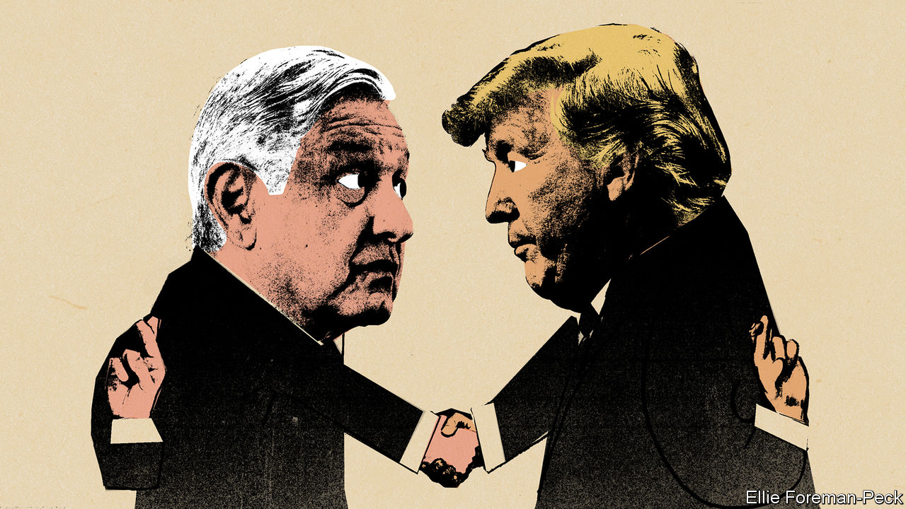

## The two amigos

# AMLO and Trump plan a frenemies’ get-together

> The American president has gained more than the Mexican leader from their relationship

> Jul 2nd 2020MEXICO CITY

HISTORY WILL record the Mexican-American summit to take place on July 8th-9th as one of the odder ones. It will be a rare face-to-face meeting in the covid-19 era, bringing together leaders who are notably reluctant to promote social distancing. (Their countries have bigger caseloads as a result.) President Donald Trump has often bullied Mexico since he announced his candidacy in 2015. Nonetheless, Andrés Manuel López Obrador, who is often called AMLO, has chosen to make the White House his first foreign destination since taking office 19 months ago. The pretext is to celebrate the entry into force on July 1st of the United States-Mexico-Canada Agreement (USMCA), a slightly altered version of a free-trade pact that Mr Trump said he hated. Yet it is not clear that Justin Trudeau, Canada’s prime minister, will join the festivities.

A meeting of Mexican and American presidents normally boosts a relationship that is vital for both countries, especially in the areas of trade, immigration and crime. The Trump-AMLO encounter is unlikely to achieve that. It is not clear what AMLO will gain from the summit except frequent-flyer miles (he flies commercial, and will have to change planes en route to Washington).

Mr Trump’s main goal will probably be to distract attention from the pandemic and the recession that have clobbered his chances of re-election in November. The meeting will provide an occasion to boast that he has got much of what he wanted from his Mexican guest. Even though the pandemic caused bilateral trade to drop by half between May 2019 and the same month this year, he will no doubt call the USMCA a huge win (as will AMLO). The United States International Trade Commission forecast that the USMCA would raise American GDP by a scant 0.35%.

AMLO has gratified Mr Trump by deploying troops on Mexico’s southern border to block migrants from Central America and by co-operating with his “remain-in-Mexico” policy, which obliges asylum-seekers to wait for hearings on the southern side of the United States’ border. In May the United States apprehended 23,000 migrants on the border, a sixth of the level the year before. (The pandemic no doubt played a part in the decline.) At the Trump administration’s bidding, AMLO reopened foreign-owned factories that had been shut down during the pandemic.

The administration helped arrange the sale of 211 ventilators to Mexico. Otherwise, there has been little reciprocity. The USMCA is better than no trade deal from Mexico’s point of view, but it is unlikely to provide the certainty needed to buoy up its sinking economy. The United States is threatening to reimpose tariffs on Canadian aluminium to stop a surge in imports. There will be tension between the Trump and AMLO administrations over enforcement of labour standards set out in the new treaty. Democrats, though at odds with the Trump administration on almost everything, generally sympathise with its tough line on trade. An agreement in October between the two presidents to curb the flow into Mexico of illegal weapons from the United States has so far had little effect.

Though AMLO is a fervent nationalist, his foreign-policy priority has been to shield Mexico from Mr Trump’s animus. The summit will showcase his success. The two leaders are ideological foes but in some ways kindred spirits: populists whose strengths are in the realm of symbols rather than the substance of government.

But AMLO’s friendship with Mr Trump may come at the expense of his relations with Joe Biden, who now looks likely to win the presidency in November. Democrats are thought to be dismayed by AMLO’s subservience to Mr Trump. When Mr Biden visited Mexico as vice-president in 2012 he met all three candidates in Mexico’s presidential election, including AMLO. The Mexican president does not plan to return the favour on his trip. His advisers say that would risk politicising the summit. Some members of Mr Biden’s team think AMLO is trying to help Mr Trump get re-elected. If Mr Biden wins, Mexico’s president may have some fence-mending to do. ■

## URL

https://www.economist.com/the-americas/2020/07/02/amlo-and-trump-plan-a-frenemies-get-together
