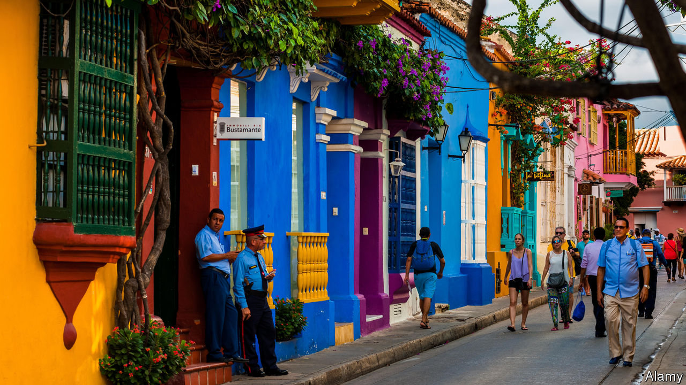

## Post-party town

# Covid-19 gives Cartagena a chance to restrain tourism

> A jewel on Colombia’s Caribbean coast wants a better class of visitor

> Jul 2nd 2020BOGOTÁ

Editor’s note: Some of our covid-19 coverage is free for readers of The Economist Today, our daily [newsletter](https://www.economist.com/https://my.economist.com/user#newsletter). For more stories and our pandemic tracker, see our [hub](https://www.economist.com//news/2020/03/11/the-economists-coverage-of-the-coronavirus)

FOR DECADES Colombia had trouble attracting tourists. Few wanted to visit a country where drug lords bombed passenger jets and guerrillas kidnapped ordinary citizens. The country became safer after the government began peace talks with the FARC, the largest guerrilla group, in 2012 (the war formally ended in 2016). When the shooting stopped, the first destination for many tourists was Cartagena.

Once the Spanish empire’s most important port in northern South America, Cartagena has kept its colonial centre and the limestone walls and forts that shielded the city from pirates. Recently the city has marketed itself too well. In 2019 more than 500,000 foreign tourists came, triple the number in 2012. Domestic visitors outnumber them. A study commissioned by UNESCO, which added Cartagena’s centre to its list of world heritage sites in 1984, warns that “the intensive use of tourism” threatens its preservation. In the covid-19 pandemic, Cartagena’s government sees a chance to ward off the danger.

Too much tourism strains the sewage system, which overflows during rains. Restaurant tables and chairs have conquered the plazas and bars and occupy some of the bastions that jut out from seaside walls. Rooftop bars and home-grown cocaine attract party animals from Europe and the United States. Pimps operating from nightclubs offer them under-age prostitutes. Music blasts until dawn. Martín González, who lives between two nightclubs, says his 76-year-old mother rarely gets a good night’s sleep. He often wakes up to find his terrace strewn with rubbish, including little bags of cocaine, tossed out of the nightclubs’ windows.

Much of the tourism industry operates illegally. The Foundation for The Historic Centre of Cartagena, a pressure group, has reported that more than half of nightclubs have no fire-safety certificate and a third did not pay property taxes in 2019. Some serve alcohol without licences. Some claim to be non-profit organisations. All of Cartagena’s elected mayors from 2013 to 2018 were investigated for corruption.

Just 4,200 people now live in the city centre, a third the number of residents in colonial times. “Cartagena has become this machine that excludes those who cannot afford to pay for a mediocre overpriced drink,” says Eduardo Rojas, a lecturer on heritage preservation at the University of Pennsylvania. But it is also a machine for employment. Tourism makes up a third of the city’s economy. More than half of cartageneros depend on the income it brings.

Covid-19 restrictions have wiped out those earnings. Tables have disappeared from public spaces. Owners of nightclubs and bars, once a powerful lobby, are going bust. Hostels are shutting down.

William Dau, who was elected mayor in October on an anti-corruption platform and took office in January, wants to turn the calamity to advantage. Before the pandemic struck, he commissioned the first study of the centre’s capacity to host tourists. “We want to reactivate, but we want a sustainable kind of tourism, not a predatory one,” says Maria Claudia Peñas, who advises Mr Dau on the economy. She wonders whether the city could thrive by attracting fewer but richer visitors. Perhaps, rather than thronging the city’s centre, visitors could be induced to watch birds and take part in water sports. A Panamanian firm is building a water park near the city.

The central government is supportive. Julián Guerrero, the deputy minister of tourism, suggests making timings of holidays less rigid to spread the influx of domestic tourists across the year. Cartagena joined the “living heritage programme” of the Inter-American Development Bank, which advises cities on how to make historic centres places to live rather than merely visit. Cities that preserve their culture and history attract such agreeable institutions as galleries, street markets and start-up firms, says Jesus Navarrete, the programme’s co-ordinator. After the pandemic ebbs, says Ms Peñas, the walls that once repelled pirates will keep tourist hordes away. ■

Editor’s note: Some of our covid-19 coverage is free for readers of The Economist Today, our daily [newsletter](https://www.economist.com/https://my.economist.com/user#newsletter). For more stories and our pandemic tracker, see our [hub](https://www.economist.com//news/2020/03/11/the-economists-coverage-of-the-coronavirus)