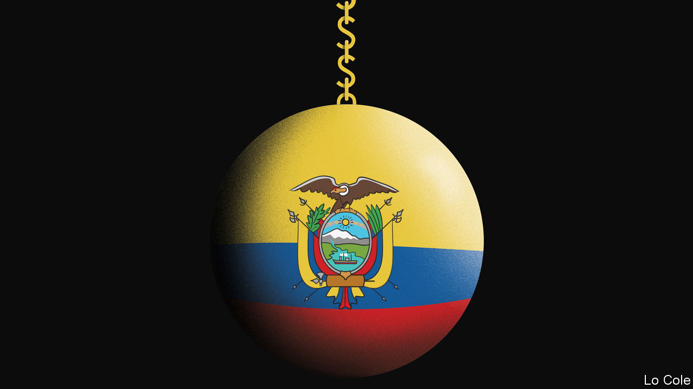

## Bello

# Ecuador is in intensive care, and a straitjacket

> The difficulties of a dollarised economy

> Jul 2nd 2020

Editor’s note: Some of our covid-19 coverage is free for readers of The Economist Today, our daily [newsletter](https://www.economist.com/https://my.economist.com/user#newsletter). For more stories and our pandemic tracker, see our [hub](https://www.economist.com//news/2020/03/11/the-economists-coverage-of-the-coronavirus)

AT THE START of the covid-19 pandemic in Latin America in March and April, Ecuador offered the world Dantesque images of dead bodies dumped in the streets of Guayaquil, a tropical port that is the country’s largest city. The outbreak has eased, but it is not over. After the government relaxed its lockdown last month cases picked up, especially in Quito, the capital. That is happening elsewhere in the region, too. But Ecuador faces additional difficulties.

One is that the centrist government of Lenín Moreno, the president since 2017, was economically and politically weak even before the virus struck. Another is that since 2000 Ecuador has lacked its own currency, using the American dollar instead. That switch was the consequence of hyperinflation and a previous economic crisis. It has brought a degree of stability. But it means that when recession strikes, Ecuador cannot print money. Nor can it easily borrow because Mr Moreno’s populist predecessor, Rafael Correa, piled up debt during his decade in power, which the government has struggled to repay. So while governments elsewhere are loosening the purse-strings, Ecuador has to cut public spending just when it is most painful to do so.

Mr Correa ruled during a commodity boom. He used windfall oil revenue to double the size of the state. Although some of the money was invested in infrastructure, much went on expanding public employment and much was simply wasted or stolen. Despite the spending splurge, in proportion to the population Ecuador scores barely above the Latin American average in number of doctors and below it for hospital beds.

When the commodity boom ended, Ecuador was left with a big fiscal deficit and mounting public debt. Mr Moreno, an ally-turned-foe of Mr Correa, has been left to pay the bill. In March of last year his government signed a $4.2bn, three-year agreement with the IMF aimed at softening the effects of deficit-cutting and at boosting non-oil exports by making the economy more competitive. This reform programme soon went off the rails. In October, without preparing the political ground or compensating those worst hit, the government tried to eliminate indiscriminate subsidies on fuel (the IMF had urged it to raise value-added tax instead). After a fortnight of protests and rioting left ten dead, Mr Moreno backed down.

With the deficit heading back up to at least 6% of GDP, the government is scrambling for cash. Since March it has saved 2.5% of GDP by agreeing with bondholders to postpone interest payments, and another 1% by trimming the working hours of public employees. The public’s anger at scandals over medical procurement has reinforced its resistance to tax increases. The IMF approved an additional $643m emergency loan in May. The government has obtained a loan from China, and further relief from bondholders. It has used money from the Inter-American Development Bank to increase the payments to the poor and the number who get them. To try to boost recovery, it has introduced modest reforms of the labour law and the bankruptcy code.

Unpopular reforms are all the harder because a general election is due in February. But they are vital. Augusto de la Torre, a former Central Bank president, notes that “dollarisation is the most popular institution in my country—more popular than the church or the army.” But, he adds, “the country is learning the hard way that dollarisation means that we can’t print money.”

It is not a substitute for fiscal discipline and a more competitive economy. The problem is “there’s no coalition to pass the necessary reforms,” says Andrés Mejía, an Ecuadorean political scientist at King’s College in London. Instead there are what he calls “ghost coalitions” operating in the shadows, with parties refusing to support austerity publicly but quietly facilitating it. “They do enough to get the country past emergencies but not enough for long-term development.”

Muddle-through may be running out of road. With an approval rating of 19%, Mr Moreno has said he will not stand again. Perhaps sensing the difficulties ahead, Jaime Nebot, a powerful former mayor of Guayaquil, ruled himself out as a candidate on June 25th. Having received a jail sentence in absentia for corruption, Mr Correa, who lives in Belgium, is looking for a proxy candidate. With voters likely to be in an angry mood, unless a credible reformist candidate emerges the stage may be set for a return of populism—but a penniless version this time.

Editor’s note: Some of our covid-19 coverage is free for readers of The Economist Today, our daily [newsletter](https://www.economist.com/https://my.economist.com/user#newsletter). For more stories and our pandemic tracker, see our [hub](https://www.economist.com//news/2020/03/11/the-economists-coverage-of-the-coronavirus)