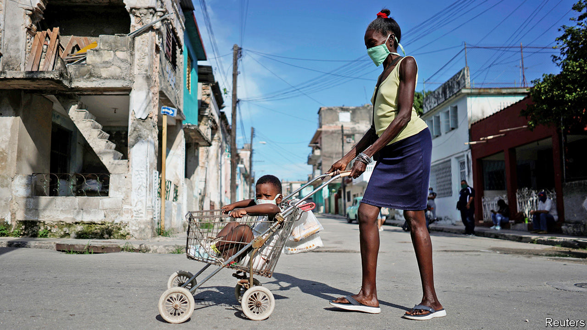

## Neither mulas nor moolah

# The pandemic shuts down a lifeline for Cuba

> “Mules” have stopped bringing in goods and cash

> Jul 2nd 2020

Editor’s note: Some of our covid-19 coverage is free for readers of The Economist Today, our daily [newsletter](https://www.economist.com/https://my.economist.com/user#newsletter). For more stories and our pandemic tracker, see our [hub](https://www.economist.com//news/2020/03/11/the-economists-coverage-of-the-coronavirus)

ALTHOUGH THE United States has embargoed Cuba’s economy since the 1960s, the flow of goods, money and people between them has never stopped. Often the interchange is carried out by mulas, or mules (a term for drug couriers in other parts of Latin America). The first mulas were Cubans who left in the early 1980s and sent money and supplies to families who remained. Cuba’s government encouraged them as a way to support its economy, says Emilio Morales, president of the Havana Consulting Group, based in Miami.

Today’s mulas include 50,000 Cuban residents who travel to the United States, Panama and other places (even Russia) and bring back goods that are otherwise scarce or, when available in state-owned shops, overpriced. They range from kitchen appliances to cosmetics. Mulas also bring nearly half of cash remittances, perhaps $1.8bn a year. The government profits directly, too, by levying tariffs and charging $450 to renew passports that expire every two years.

With the outbreak of covid-19, Cuba’s borders closed and the mule-train stopped running. Prices of soap, appliances, nappies and powdered milk soared. Even the few products that Cuba makes are hard to find. Toothpaste disappeared. Cuban-made dentifrice will not be back before July, said the interior minister, Betsy Velázquez, because the government has no money to buy the raw materials. Cubans are still waiting for it. A shortage of fuel has eased, partly because the pandemic keeps Cubans at home (when they are not searching for necessities).

To replace mulas, Cubans with internet access use Telegram, a messaging app, to form chat groups that help locate products. These are moderated by volunteers and their spirit is altruistic. When members visit a shop, they note which products are available and how long the queue is. Now that mulas no longer bring cash, Telegram users tell each other when they spot an open branch of Western Union, one of the main ways to get money from abroad.

The government, which has controlled the covid-19 outbreak, has done less well in keeping shelves stocked. At a meeting with ministers in May, broadcast on television, President Miguel Díaz-Canel lamented that Cuba didn’t produce more guarapo (sugar-cane juice) and lemons, which he called, weirdly to Cubans, “the basis of everything”. He also emphasised the need for pre-made pizza dough, forgetting that most Cubans can’t lay their hands on cheese and tomato sauce.

Pre-pandemic, mulas brought in goods and cash worth $8bn a year, 8% of Cuba’s (inaccurately reported) GDP, says Mr Morales. Remittances in the first five months of 2020 are $518m lower than during the same period last year, he estimates. The economy is expected to contract by around 8% this year. Cubans hope for a respite in August, when international travel is due to resume. Even then, airline passengers will be allowed to check in just one suitcase, which will restrict what mulas can bring in. Foreign tourists will not be allowed to stray beyond five cays reserved for them. Cubans need mulas and tourists more than lemons and ready-made pizza dough.■

Editor’s note: Some of our covid-19 coverage is free for readers of The Economist Today, our daily [newsletter](https://www.economist.com/https://my.economist.com/user#newsletter). For more stories and our pandemic tracker, see our [hub](https://www.economist.com//news/2020/03/11/the-economists-coverage-of-the-coronavirus)