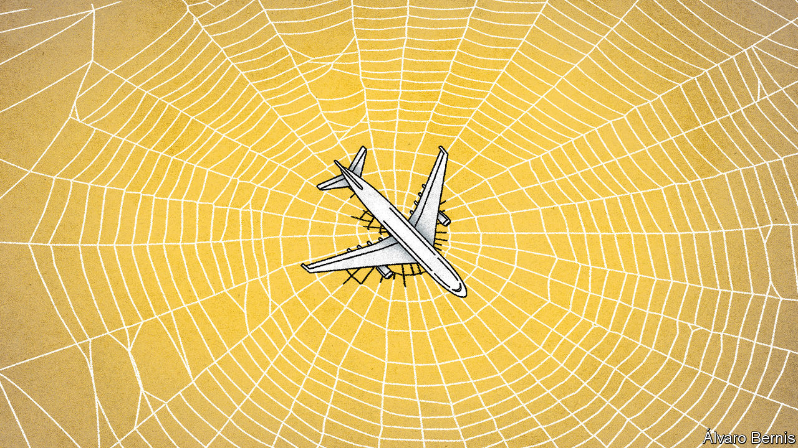
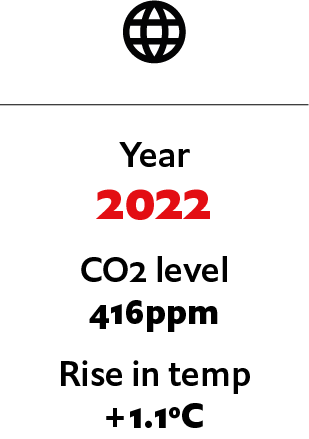
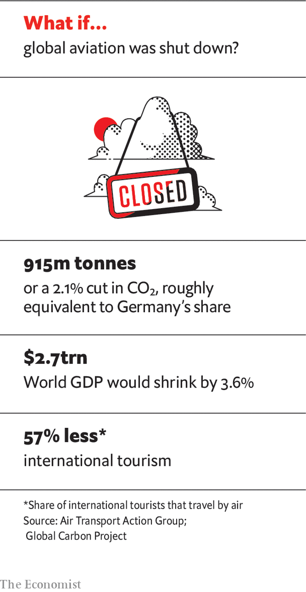
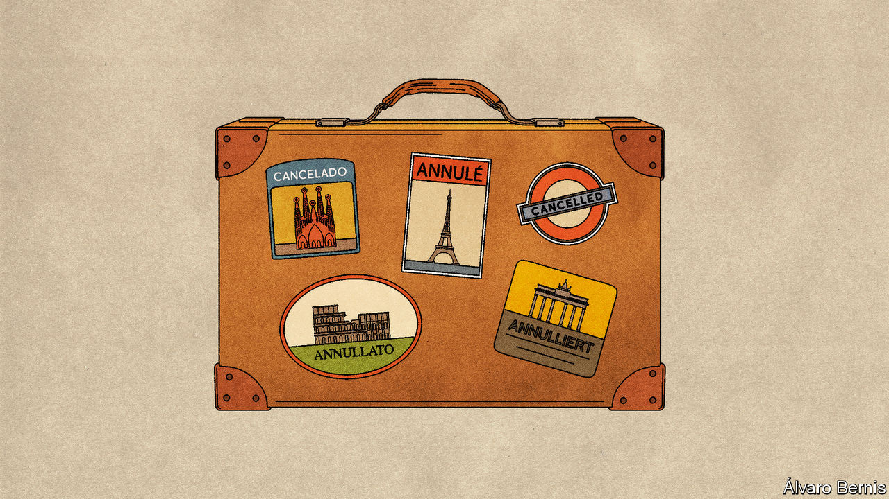

## If covid-19 devastated aviation

# What if aviation doesn’t recover from covid-19?

> How the pandemic transformed the travel industry. An imagined scenario from May 2022

> Jul 4th 2020

Editor’s note: Each of these climate-change articles is fiction, but grounded in historical fact and real science. The year, concentration of carbon dioxide and average temperature rise (above pre-industrial average) are shown for each one. The scenarios do not present a unified narrative but are set in different worlds, with a range of climate sensitivities, on different emissions pathways

IN SEPTEMBER 2019 a group of climate activists formulated a plan to shut down London Heathrow, Europe’s largest airport. Heathrow Pause, a splinter group of the Extinction Rebellion movement, had been inspired by an incident at Gatwick the previous year, when an unauthorised drone closed Britain’s second-largest hub for three days. They hoped to repeat the trick at Heathrow. But their drones failed to get off the ground, due to signal-jamming by the airport. In December 2019, Extinction Rebellion tried again to close Heathrow, this time by blocking its entrance road with a pink bulldozer. But police confined the protest to a single lane of traffic, meaning that incoming passengers could simply drive around the problem.

The activists lying in front of the bulldozer that cold December morning could not have known that a virus just 0.1 microns wide, more than 8,000km away in China, was inadvertently about to help their cause. Few industries were harder hit by the subsequent covid-19 pandemic than air travel. Government lockdowns, travel restrictions and cancellations by fearful passengers soon grounded most of the industry. By April 2020 Heathrow’s passenger numbers had fallen by 97% to the lowest monthly figure since the 1950s. Global passenger numbers did little better, falling that month by 94% year on year, to levels last seen in 1978. Half a year of lost revenue later—amounting to well over $250bn—the industry’s finances were in ruins.

Two years on, the forecast made in May 2020 by the International Air Transport Association (IATA) that passenger numbers would return to pre-pandemic levels by 2023 now looks wildly optimistic. But the trade body’s prediction that only 30 of the world’s 700 or so airlines would survive the crisis without government help was spot on. Carriers that failed to get bail-outs fell like dominoes, starting with Flybe, Europe’s largest regional airline, in March 2020, Virgin Australia in April and LATAM, Latin America’s largest carrier, in May. Sir Richard Branson, founder of the Virgin Group, became an illustration of his old quip: “The easiest way to become a millionaire is to start out as a billionaire and then go into the airline business.”

Even airlines that got government bail-outs did not find life easy. Austria and France led the way by imposing strict environmental conditions. Airlines were forced to cut their emissions to meet aggressive targets and to end competition against greener alternatives such as high-speed rail. That raised their costs and limited their potential revenue. And they were soon cash-strapped again. America’s airlines quickly chewed through $25bn in federal grants and loans; Air France-KLM and Lufthansa of Germany did the same with bail-outs worth nearly €10bn ($11bn) each. The result was a drastic slimming down of the world’s flag-carriers.

Airline executives had initially thought the pandemic would cause manageable, but not catastrophic, disruption. Looking at previous epidemics in Asia, such as SARS in 2002-03 and the South Korean outbreak of MERS in 2015, IATA expected a sharp dip in traffic, followed by a return to the original trend six or seven months later. In retrospect, that was overly hopeful. A short, stuttering recovery during the autumn of 2020 was choked off by the pandemic’s second wave of infections. “This time is very different,” says Leigh Bochicchio of the Association of Corporate Travel Executives, an American industry association. “It’s a very different beast to SARS or 9/11.” After those earlier shocks, there was no second wave of infections or terror attacks to remind people of the danger of flying.

And in retrospect, SARS was much easier for airlines to manage than covid-19. SARS showed symptoms immediately and could be detected with temperature checks at airports. It was not initially contagious; those infected could be isolated before they spread it to others. Covid-19, in contrast, shows no symptoms for up to two weeks after infection, a period in which it is contagious. No wonder experts soon found that airline travel was the primary means by which the disease spread around the world.

In the past, the airline industry has always fully recovered from crises. But this time has been different. “Peak plane”, once Extinction Rebellion’s fantasy, no longer looks so inconceivable. With the prospects for a vaccine still uncertain, business travel began to pick up again in 2021, though only as a trickle. The biggest global downturn since the Depression left corporate travel budgets an easy cost-code to squeeze.

Even firms that are solvent enough to let their employees fly have not been keen to do so. “People are more comfortable with online meetings, and that will never go away,” notes Ms Bochicchio. After the global financial crisis of 2007-09, international business travel fell by a third in many countries, and never recovered. Companies found new ways of doing business using video calls. That story repeated itself in spades after covid-19. Many corporate events and conferences have gone online permanently. Another chilling effect was that firms feared being sued by employees who caught covid-19 on business trips—a possibility their insurers increasingly refused to cover. As a result, the average age of business travellers is now falling: surveys show millennials are more likely to regard business travel as a status symbol than older workers, and consider themselves at less risk from covid-19.

Leisure travel has been much slower to recover. That was not due to any initial reluctance to get back in the sky. Surveys during the pandemic found that 69% of Americans said they missed travelling. Half of Chinese expected to travel more once the crisis was over. Perhaps most remarkably of all, 23% of Britons said they planned to be on the first flight deemed safe.

But many newly established “air bridges” and “travel bubbles”—pairs and groups of countries between which travellers could move without quarantine—collapsed in panic when the second wave of the pandemic hit in autumn 2020. “Staycations”—holidaying within one’s own country—became the norm in 2021, as crowded aeroplane cabins were shunned in favour of cars, trains and even cruise ships (which, despite their association with the early weeks of the outbreak, turn out to be well suited to social distancing).

The aviation industry did its best to win back customers with a marketing blitz, but cabin crew dressed in personal protective equipment, who treated all passengers as biohazards, failed to reassure. The requirement to leave middle seats empty, to maintain social distancing, was dropped by governments when airlines complained that it cut their capacity. But that prompted concerns that airlines were more concerned with profits than with passenger safety.

Rising ticket prices have also deterred travellers from flying away on holiday. Although fares initially fell to put bums back on seats after the first and second waves—dropping by 35% in 2021, just as Dollar Flight Club, an American travel website, had predicted—the low prices didn’t last long. Ryanair, Wizz Air and Air Asia, the world’s biggest budget carriers after the pandemic, waged the “mother of all fare wars” in an effort to put all non-state-subsidised rivals out of business in Europe and Asia. The resulting consolidation has left little competition in the industry. As soon as they could, airlines began to pass on the extra cost of their new counter-coronavirus measures to passengers. Analysts think fares could soon be double what they were before the pandemic.

Perhaps the clearest sign of the long-term change in direction for aviation has been the collapse in demand for new aircraft. The world’s two biggest planemakers, Airbus and Boeing, predicted just before the pandemic that global air travel would grow by 4.3% each year over the next 20 years, requiring around 40,000 new airliners to be built. Now they are not so sure. Airlines permanently grounded over 5,000 planes during the pandemic. Boeing cut future production by 50% and cancelled plans to develop two new airliners in the coming decade. Even Airbus, which has enough orders to keep its assembly lines busy for a decade, decided to slow production by 30%.

The biggest casualties were the biggest birds. Boeing 747 jumbos, once the “Queens of the Skies”, were nearly all grounded in 2020, never to fly again. The even-larger superjumbo fared almost as badly. “The A380 is over,” lamented Sir Tim Clark of Emirates during the pandemic. Having once owned 115 of the 242 in existence, Emirates retired 40% of them in 2020.

Planemakers and airlines alike are pinning hopes of a travel revival on the wanderlust of the young, and of the rising middle classes in the developing world. Their faith may be misplaced. The young are highly climate-conscious and have taken to “train-bragging”, encouraged by campaigners such as Greta Thunberg. Several European governments have stepped up investment in high-speed rail as part of their stimulus packages. Polls suggest people under 25 see climate change and pollution as the two most important issues facing the world. In the developing world, meanwhile, the pandemic shattered the illusion in Africa and India that travelling by plane was any safer or more hygienic than overcrowded diesel trains or by car.

That covid-19 has exposed the fragility of globalisation is particularly apparent in the case of aviation. The industry can no longer rely on the steady growth of the past, or indeed any growth at all. Yet historians will write that it was not radical environmental movements such as Extinction Rebellion that killed the trend. Instead it was the combination of a microscopic virus and free-market capitalism.

The five-year period before the pandemic was the only one since Orville and Wilbur Wright made their first flight in 1903 in which the industry covered its cost of capital. Burned again by covid-19, many investors have now decided to stay away from anything that flies. Warren Buffett, a billionaire investor, once quipped that “if a farsighted capitalist had been present at Kitty Hawk, he would have done his successors a huge favour by shooting Orville down.” During the pandemic, Mr Buffett realised that this historical observation was no joke. Selling his shares in American airlines at a multi-billion dollar loss, he noted that they should be avoided by investors. His reason: “The world has changed after covid-19.” ■

For more coverage of climate change, register for The Climate Issue, our fortnightly [newsletter](https://www.economist.com//theclimateissue/), or visit our [climate-change hub](https://www.economist.com//news/2020/04/24/the-economists-coverage-of-climate-change)

## URL

https://www.economist.com/the-world-if/2020/07/04/what-if-aviation-doesnt-recover-from-covid-19
