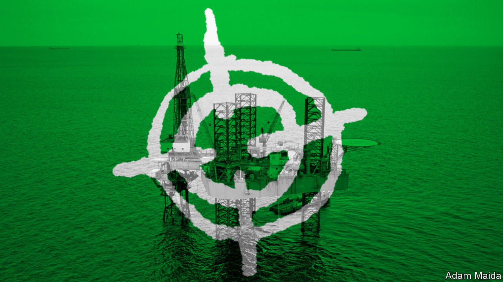
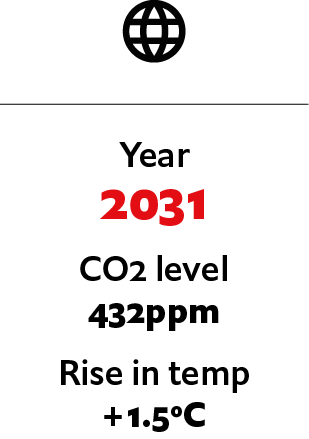

## If climate activists turned to terrorism

# What if climate activists turn to terrorism?

> Protesters against climate change have not resorted to terrorism to advance their cause. This scenario from 2031 imagines what would happen if they did

> Jul 4th 2020

Editor’s note: Each of these climate-change articles is fiction, but grounded in historical fact and real science. The year, concentration of carbon dioxide and average temperature rise (above pre-industrial average) are shown for each one. The scenarios do not present a unified narrative but are set in different worlds, with a range of climate sensitivities, on different emissions pathways

THE FIRST the world heard of the self-styled Earth Defence Army (EDA) was in February 2028, when the Jamnagar oil refinery in Gujarat, the world’s largest, ground to a halt after a crippling cyber-attack. In a video manifesto the EDA claimed responsibility for the attack, providing detailed evidence of its involvement. The group’s masked leaders warned that oil companies around the world would face similar attacks—as would banks and investors associated with them. “The planet cannot fight back,” one EDA member declared, “so we have no choice but to fight back on its behalf.”

Next, the EDA released a trove of messages stolen from four large oil companies and their accountants. These, the group claimed, revealed a covert scheme to undermine emissions-reduction efforts by misreporting numbers. (The companies in question denied wrongdoing.) “Your sabotage will be met with sabotage,” the EDA’s leaders announced. It began a campaign of direct attacks on oil companies’ property, modelled on those conducted by the Earth Liberation Front (ELF), whose arson attacks in America, starting in the 1990s, had caused $100m-worth of damage.

The EDA praised the activities of the ELF and other earlier environmental groups, dating back to the 1970s, that had at the time been considered extremists or eco-terrorists. In March 1979, for example, the crew of a trawler called Sea Shepherd smashed through the ice of the Gulf of St Lawrence, before jumping out to spray baby seals with red paint, rendering their fur worthless. The Sea Shepherd Conservation Society went on to smash and scuttle whaling and sealing vessels around the world, using sledgehammers, paintball guns and even mines. 

Similarly, Earth First!, a group established in 1980, had “spiked” trees with materials intended to damage loggers’ saws. It spawned the ELF, a more radical offshoot. After two decades, the number of so-called “eco-terrorism incidents” peaked in 2001 at 163, according to one study. Yet even as al-Qaeda’s attacks on New York and Washington that year focused attention on Islamist extremism, eco-terror remained a major concern. In 2004 a senior FBI official said animal-rights extremism and eco-terrorism were “our highest domestic terrorism investigative priority”. In practice, right-wing extremists proved a far bigger danger in the two decades that followed. It was not until the late 2020s, with the Paris agreement dissolving amid geopolitical acrimony, that a small fringe of radical climate activists coalesced into what became the EDA.

After its months-long arson campaign had little effect—companies insisted they would not be cowed by terrorists—the EDA turned to deadlier measures. In May 2029 an investment banker, who had been involved in arranging $75bn in financing for oil-and-gas projects a decade earlier, was gunned down outside his home in London. A local EDA cell claimed responsibility. A month later a drone carried a powerful improvised explosive onto an oil rig in the Gulf of Mexico, killing 15 workers and halting production for months.

In 2030 the FBI triumphantly announced that it had rolled up a New York-based eco-terror cell plotting an attack on the city’s stock exchange. But the trial descended into farce when it became clear that the investigation not only relied on a warrantless surveillance programme, later struck down by the courts, but also involved undercover FBI agents who had coaxed the group’s members towards violent action.

Mainstream environmental groups were aghast at the militant turn taken by some of their former colleagues. But the EDA’s leaders claimed that the ends justified the means. They pointed to oil companies’ falling share prices, the shuttering of a series of coal-fired power stations in South-East Asia and growth in the number of banks announcing moratoriums on fossil-fuel investments. Yet it was hard to be sure of the impact of the EDA’s campaign, given the growing influence of more moderate environmental groups willing to break the law—but not to shed blood. As disagreements within its ranks grew, the EDA splintered.

In the end, eco-terrorism remained a fringe ideology, never attracting more than a few thousand ideologues. As mainstream environmentalists realised that extremists were tarnishing the movement and undermining support for effective climate policies, they turned against their former colleagues, quietly helping the security services shut down many of the remaining cells. Although bomb threats remain common, explosions are now few and far between. The eco-terrorists seem likely to end up as footnotes in a larger and darker history of climate calamity. ■

For more coverage of climate change, register for The Climate Issue, our fortnightly [newsletter](https://www.economist.com//theclimateissue/), or visit our [climate-change hub](https://www.economist.com//news/2020/04/24/the-economists-coverage-of-climate-change)