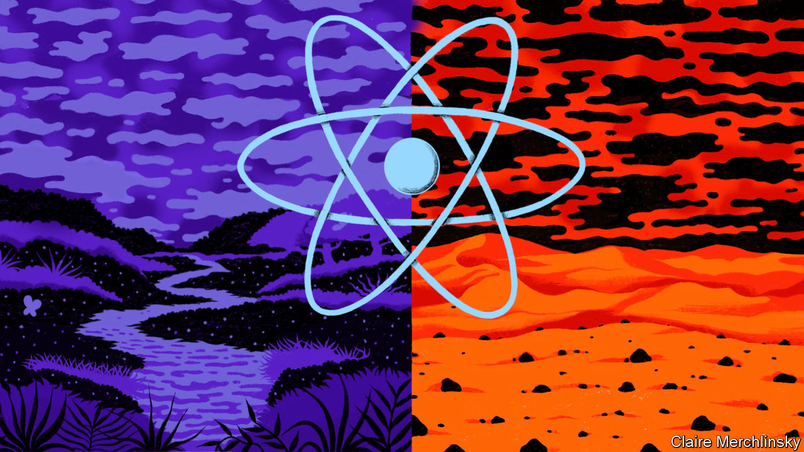

## If nuclear power had taken off

# What if nuclear power had taken off in the 1970s?

> How would the world look today if more countries had adopted nuclear power after the 1973 oil crisis? A look back on an alternative history from a rather different 2020

> Jul 4th 2020

Editor’s note: This scenario is set in a different 2020 from the one we now inhabit, on a timeline that diverged in 1974

IT IS NOT a date that means much to most people. But hindsight suggests that March 6th 1974 may have been a turning-point in human history. The decision announced on that day by Pierre Messmer, France’s prime minister, may have saved the world from a dangerous rise in temperatures—an obscure phenomenon known in scientific circles as “global warming”.

Messmer’s announcement was a plan to construct 80 nuclear-power plants over the following decade, and 170 by the turn of the century. It was a direct response to the oil shock of 1973, when concerted action by the Organisation of Arab Petroleum Exporting Countries pushed the price of crude oil up fourfold. At the time, most French electricity was generated by oil-fired power stations, but France had no oilfields of its own. Messmer and his boss, Georges Pompidou, the country’s president, decided to break French dependency on foreign oil by going nuclear instead.

In other circumstances, that decision might have proved just one more example of France’s desire to be different. Though nuclear power had looked promising in the 1950s, and most industrialised countries had built at least one experimental reactor, progress was unsteady in the 1960s as some people conflated atomic energy with nuclear weapons.

Two days earlier, however, Messmer’s British counterpart, Edward Heath, had almost lost an election called because a strike by coalminers had brought Britain’s economy to a halt. Heath, looking for alternatives to coal and a failed home-grown nuclear-reactor programme, turned to France for help. The two countries revived Euratom, a moribund sister organisation of the EEC. The nuclearisation of western Europe’s electricity was assured.

Events in Europe stiffened the resolve of America’s incoming president, Jimmy Carter, to encourage the consolidation of the American industry. Big engineering companies with nuclear-reactor divisions began lobbying against coal. It was one of their lobbyists who came up with the catchy name, “nu-power”. A small, successfully contained accident at Three Mile Island in Pennsylvania in 1978 convinced the public that reactors really were “fail-safe”.

Nervousness about countries using civil programmes to acquire the plutonium needed for bombmaking was soon put to rest. The technical breakthrough that overcame this objection, and paved the way for nu-power’s ubiquity, came from an unexpected quarter: India. In 1985 the Bhabha Atomic Research Centre (BARC) in Mumbai announced that it had built a successful thorium reactor. Not only is thorium three times more abundant than the uranium previously used to power reactors, it is much harder to weaponise. As well as revolutionising electricity generation, the BARC design triggered a shift in India’s fortunes that has led to it vying with China to challenge the United States as the world’s largest economy.

BARC’s breakthrough unleashed innovations that have made nu-power stations smaller, safer and more efficient, leading to today’s neighbourhood nuclear “batteries”. As well as eliminating the use of coal, they have also steadily replaced natural gas as a source of heat and propelled the rapid development and adoption of electric vehicles, with a resulting fall in the use of oil. All of which prompted Gustaf Arrhenius, a retired researcher at the University of California, San Diego, to do a thought experiment that would probably have occurred to no one else but the grandson of Svante Arrhenius, a great Swedish chemist, who invented electrochemistry more or less single-handedly.

Observing that carbon dioxide is a “greenhouse” gas, which traps solar heat in the atmosphere, and which was, even in the late 19th century, being produced in ever-larger quantities by the burning of coal, the elder Arrhenius predicted that the progress of industry would result in Earth’s surface temperature rising. His grandson’s sums, drawing on obscure research from the late 1960s, suggest that, had people carried on burning coal and oil at the rate predicted from the 1970s onwards, Earth would now be, on average, 0.5ºC warmer than it actually is. By 2050 it might have been two degrees hotter, and as much as six degrees by 2100.

Even two degrees would be enough to bring heatwaves and droughts and to melt polar ice, raising sea levels. Six degrees would turn much of Earth’s surface into a desert. Thank goodness, then, that Messmer’s plan worked more widely and comprehensively than he could possibly have imagined—and that, thanks to the nu-power revolution, people do not have to worry about the danger of such global warming. ■

For more coverage of climate change, register for The Climate Issue, our fortnightly [newsletter](https://www.economist.com//theclimateissue/), or visit our [climate-change hub](https://www.economist.com//news/2020/04/24/the-economists-coverage-of-climate-change)

## URL

https://www.economist.com/the-world-if/2020/07/04/what-if-nuclear-power-had-taken-off-in-the-1970s
