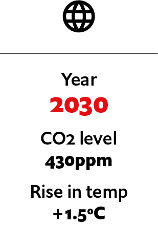
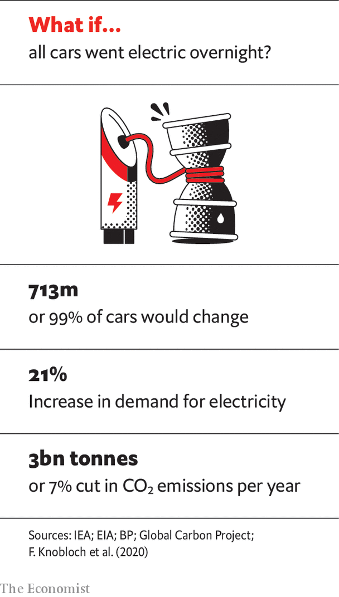

## Data privacy and climate policy

# What if technology tracked all carbon emissions?

> Could governments use smartphones to monitor citizens’ carbon emissions? An imagined scenario from 2030

> Jul 4th 2020

Editor’s note: Each of these climate-change articles is fiction, but grounded in historical fact and real science. The year, concentration of carbon dioxide and average temperature rise (above pre-industrial average) are shown for each one. The scenarios do not present a unified narrative but are set in different worlds, with a range of climate sensitivities, on different emissions pathways

IT STARTED WITH an app. “My Carbon Action” was released in late 2019 by a Finnish company that made banking software. It analysed people’s purchase data automatically to work out how much carbon underpinned their consumption. Its users were the sort of people who were already accounting for carbon emissions manually, typing guesstimates into carbon-footprint calculators and buying offsets for their meat consumption or their flights to alleviate their guilt over contributing to a warming world.

Barely anyone noticed the app at the time, but it was an early example of the automated carbon-accounting that has since transformed the global production system. It started a chain reaction that ran throughout the 2020s and led to today’s ubiquitous surveillance and measurement of emissions across supply chains, manufacturing facilities and consumer activity.

At first, My Carbon Action and its copycat apps were mostly remarkable for their inaccuracy. The details generated by transactions with bank cards or digital payments were too vague to offer a reliable proxy for carbon emissions: who could tell what “MAXIM’S CSD (2973) Food & drink $7.48” meant, let alone the carbon footprint of that transaction? The products people bought, where they had come from and how they had been produced were unknown, even to the companies that sold them. The Finnish system used transaction totals and vendor names to make a rough guess of what had been purchased, and its own internal models to estimate its carbon footprint. Spent eight dollars at Starbucks? You probably bought a coffee and a snack.

Slowly, the guesses became more accurate. Climate campaigners pressed companies to provide more and better emissions data about the products they sold. Neobanks had introduced digital receipts in the late 2010s, but they had been little more than a gimmick. Now they became a place to display the climate worthiness of your operation, and the main channel through which emissions data could be funnelled and collected. In 2021 Pret A Manger, a British sandwich chain, started totting up the carbon footprints of all its products, printing them on the labels in the shop and on its receipts. When customers paid with Pret’s app, a smartphone or a linked bank card, emissions data could be sent directly to their emissions-counting app.

Carbon accountancy improved, but some of the biggest firms held out. That changed in 2023 as the West Coast wildfires raged from California to Oregon and furious Amazon employees, their families choked with smoke, demanded change from their gigantic employer. The world’s largest e-commerce firm promised to start calculating and publishing the full life-cycle emissions of the products it sold. At first Amazon’s emissions values just applied to products it sold directly, calculated by its internal modelling team. Then they were expanded to third-party sellers. By that time the direction of travel was clear, and all e-commerce platforms started to include support for emissions calculations in their systems. Amazon opened up its own platform, turning it into a database that could be queried to determine the carbon footprint of millions of products. Walmart followed suit.

In China, Alibaba and JD.com, Asia’s two biggest retailers, pushed their own carbon-accounting systems, which they had started two years before Amazon’s. The Swiss-based International Organisation for Standardisation held its first meeting on standards for carbon accounting in transactions in November 2022. By 2023 the world’s retailers had the beginnings of a common standard for reporting the emissions that underpinned their products. Real-time data about the carbon implications of consumption started to flow in earnest. Clever hedge funds bought up this data and started trading against it, identifying the manufacturers with the dirtiest footprints and shorting them. Soon they had securitised future negative carbon flows.

Using various “carbon bragging” apps, climate influencers began to publish live feeds of their carbon footprints, determined in real time from data flowing through their smartphones, which had by this time replaced travel passes for public transport, airline and train tickets. Facebook (as the company now known as Instagram used to be called) bought the Finnish company and integrated its code into the Instagram app, instantly making it the market leader among carbon-bragging apps. It launched the new feature on Thanksgiving 2024, when Selena Gomez became the first user to publish her footprint via Instagram.

Other celebrities fell in line, from Bollywood to Hollywood. Some celebrities who had touted their green credentials were shamed when they accidentally revealed their carbon-profligate habits, from gas-guzzling cars to private jets, due to confusion over the app’s privacy settings.

And sometimes the system got things very wrong. In one infamous case Antonia Magnini, an Italian woman, was told that her Pret A Manger lunch was responsible for emissions equivalent to the entire annual carbon output of Suriname. A bug in Pret’s supply-chain software had mistakenly totted up a sandwich’s worth of a new rocket leaf as the entire year’s projected supply for the whole chain worldwide, and rounded up. Ms Magnini was the unlucky first buyer of the first sandwich containing the new rocket. She sued Pret for reputational damage after the alert propagated onto her Instagram page. The company settled out of court.

But things changed dramatically after the Great Hurricanes of 2025, and the upending of climate politics in America that ensued. The bipartisan climate bill passed in the wake of the disaster introduced steadily declining personal carbon allowances (PCAs), linked to the carbon-accounting systems already in widespread use. It also levied carbon surcharges on anyone who exceeded their PCA, and paid carbon rebates to anyone who did not use their whole allowance. To ensure the accuracy of the carbon-accounting infrastructure, the bill mandated regular audits of companies’ accounting systems by independent bodies, and heavy fines for undercounting carbon footprints. People and companies were required to provide “carbon returns” to the newly renamed Internal Revenue and Carbon Service (IRCS), which was given oversight of the entire carbon-accounting system.

This gave the IRCS real-time access to all transaction data. It also pitted privacy advocates, who objected to the extension of government surveillance to the entire economy, against environmentalists, who considered it a price worth paying to tackle climate change, particularly as global average temperatures surged towards 1.5ºC above the pre-industrial level. Consumers had long accepted what was, in effect, surveillance of their internet use by private companies in return for free, ad-supported services such as search, email and social media. Many of them were already using climate-bragging apps. This would promote and extend carbon transparency. And the carbon-rebate system had wide support. So what was the problem?

Other governments around the world followed suit with their own versions of carbon taxes and PCAs, linked to now-standardised carbon-accounting systems. China linked its version to its existing social-credit systems, through a series of compulsory app updates for all citizens.

Globally, carbon-intensive activities such as long-haul travel or private jets became far more expensive. At the same time, the new system encouraged investment in low-, zero- and negative-carbon technologies. Celebrities competed to make their palatial homes and estates carbon-neutral, then carbon-negative. Attempts to hide emissions from the accounting system were punished socially as much as legally. The boss of Goldman Sachs was fired in 2026 after he was found to have registered his private jet under the emergency-services exception for aviation-fuel carbon tax. Social movements to increase carbon taxes and surcharges, and reduce PCAs more quickly, gained traction.

Inevitably, people tried to find loopholes. The use of cash, already in steep decline, had been further discouraged by governments to bring more people into the system. But local alternatives and barter systems emerged, along with an illicit economy based on cryptocurrencies, dominated by ShhCoin, launched in 2026 by Zach De Royland, a 23-year-old libertarian from Arkansas. ShhCoin let users buy and sell services anonymously, outside the carbon-accounting system.

To close this loophole, the American government launched a swarm of satellites in 2028 that used spectroscopy, visual and radar images, analysed by artificial intelligence, to pinpoint undeclared sources of carbon-dioxide emissions. Where the original carbon-accounting system had focused on the consumption that drove emissions, the satellites provided a way to identify them at source. Other governments joined the American scheme. But China launched satellites of its own, claiming the American-led system, which had uncovered several sources of illicit emissions within China, was politically biased. Blanket surveillance of the physical world closed the last big loophole for laundering emissions through informal systems, and shut down the supply chains of the ShhCoin economy.

Today, with carbon-dioxide emissions falling steadily, the carbon-accounting system—or carbon-surveillance system, as it has now become—provides a powerful policy tool that allows governments to set the pace of decarbonisation of their economies. Global temperatures have risen alarmingly, but the target of net-zero emissions by 2050, a policy goal of many countries, seems within reach. The original carbon-tracking app of 2019, like many other inventions in the past, has gone from a diversion for a few rich people to a world-changing technology. Privacy activists object that the system is far more obtrusive than it needs to be. But as they campaign for the dismantling of the surveillance system that has helped saved the planet, they face an uphill struggle. ■

For more coverage of climate change, register for The Climate Issue, our fortnightly [newsletter](https://www.economist.com//theclimateissue/), or visit our [climate-change hub](https://www.economist.com//news/2020/04/24/the-economists-coverage-of-climate-change)