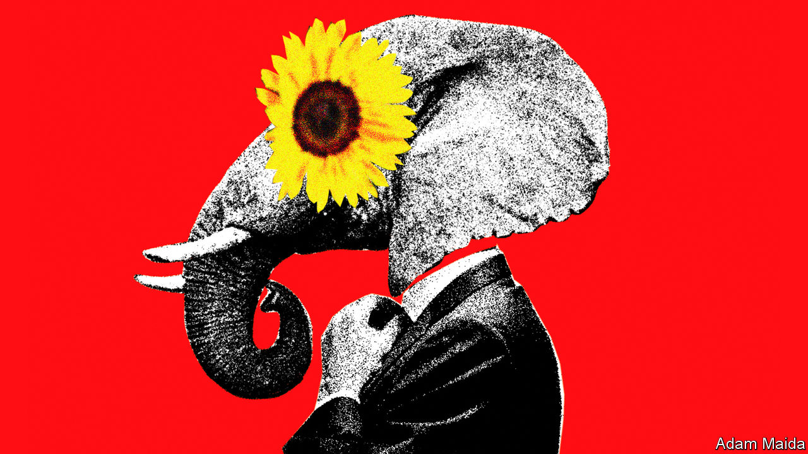
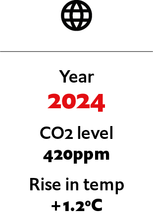

## If the Republicans pivoted on climate

# What if the Republicans pivoted on climate?

> How an ambitious, conservative environmentalism came into being. An imagined scenario from 2024

> Jul 4th 2020

Editor’s note: Each of these climate-change articles is fiction, but grounded in historical fact and real science. The year, concentration of carbon dioxide and average temperature rise (above pre-industrial average) are shown for each one. The scenarios do not present a unified narrative but are set in different worlds, with a range of climate sensitivities, on different emissions pathways

IN THE DETRITUS littering Phoenix’s cavernous arena, the morning after the 2024 Republican convention, were the usual greasy corn-dog wrappers, coffee cups, shrivelled balloons and campaign flyers—but also evidence of the remarkable change Larry Hogan had brought to the party. The wrappers and cups were all recyclable, the balloons not red, white and blue but green—and mixed in with the bumf were copies of the Republican presidential nominee’s stirring “pledge to the Earth”: “We, the party of Lincoln, mindful of the damage humanity is doing to God’s creation, commit to combating climate change, conserving species and environmental consciousness.” Introducing the former governor of Maryland to the stage to deliver his address, Bill Gates called it “perhaps the most hopeful statement ever made in American politics”.

What a change this was from Donald Trump’s pollution-boosting tenure—which was of course largely the point. Mr Hogan, who had emerged from America’s coronavirus crisis as the country’s most popular governor, had been a somewhat reluctant environmentalist during his time in Annapolis. He claimed to have been fully converted to the climate cause during a post-gubernatorial fishing trip to Alaska. But the Republicans’ green shift was more obviously a response to the 2020 election, in which the party lost the presidency, both congressional chambers, a clutch of governors’ mansions, hundreds of state legislators—and seemingly any prospect of returning to national power.

Trumpism had turned out to be a blind alley. Even in the party’s southern heartlands, suburbanites, millennials and a multitude of younger voters, repelled by its philistinism, antediluvian social policies and race-baiting, flocked to the Democrats. A staggering 70% of college-educated Americans rejected the Grand Old Party. High time, then, to slay a holy cow. And as Republican strategists looked around, sharpening their knives, the appeal of abandoning their former antipathy to environmental policy was obvious. It would not only be a hit with science-respecting educated voters. It would also be relatively easy. Immigration reform would be a non-starter with the Trumpist rump. Evangelicals were never going to compromise on abortion. Far fewer conservatives were fundamentally against environmentalism, however.

As Mr Hogan loved to remind them, conservation shared more than a lexical root with conservatism; it was an expression of it. Republicans had been responsible for most of America’s environmental progress. Yellowstone National Park, the national forest reserves, the Environmental Protection Agency (EPA), the emissions-trading scheme that fixed acid rain—all were creations of Republican presidents. To renew conservatism, Mr Hogan insisted, Republicans need only look to their own noble past.

He was right. As recently as the mid-1990s some had worried about climate change just as much as the Democrats. The embrace of climate-change scepticism by the party and its supporters was driven (as Mr Hogan did not say) by a well-funded misinformation campaign by wealthy polluters, waged through conservative think-tanks, lobbyists and direct contributions to Republican candidates. Yet the party’s donors had also shifted. Many traditional Republican backers, including oil companies, were now in favour of Mr Hogan’s greenery. And the party had, in addition, become increasingly dependent on the largesse of the renewable-energy companies that had burgeoned in many conservative states.

A boardroom terror of Democratic tax rises probably played a part in this corporate shift. But the main reason was realism. The combination of ever more alarming climate science and a solid electoral majority for addressing the issue had made ambitious climate action inescapable. Given this reality, the Republicans’ old and new donors alike reckoned that it would be better introduced by a pro-business Republican administration, rather than a hostile Democratic one.

President Joe Biden’s business-throttling environmental policies had hastened that conclusion—even if, ironically, his Republican opponents were largely to blame for them. Having been prevented by the obstructiveness of Senate Republicans from passing almost any legislation—including the carbon tax he had campaigned on—Mr Biden had instead been pushed down a regulatory path. This had in turn so delighted the rowdy Democratic left (which hated market-based solutions) that the president had doubled down.

The Biden EPA’s latest rules made it almost impossible to cut urban trees, build large structures with more than 50% concrete content or develop shale-gas sites. Alexandria Ocasio-Cortez, the climate secretary, even declared a “war on gas”. This leftward lurch opened up a space for a distinctively conservative approach. Mr Hogan could push his “green capitalism”—based on the carbon tax Mr Biden had wanted—as an alternative to the Democrats’ green socialism.

He was not the only Republican presidential hopeful to have made this calculation. The party’s primary contest had featured all sorts of climate talk. Mr Hogan’s main moderate rival, Nikki Haley, also proposed a carbon tax, but less compellingly. She called it a “sustainability levy”, a phrase that convinced no one it would be anything other than a tax. This encapsulated the South Carolinian’s much-hyped yet over-rehearsed and rather cloying candidacy. Mr Hogan called his proposed tax a “polluter fee”, a phrase that appealed to the party’s still-aggrieved working-class base.

Another contender, Senator Marco Rubio, pitched what he called a “pro-environment industrial policy”. It would consist of heavy public investment in low-carbon technology and industries, for two main reasons, neither of which involved the climate: a need to out-compete China and high-quality job creation. Mr Hogan, a flexible small-governmentalist, purloined the proposal after Mr Rubio’s early exit from the contest.

Even the Trumpist candidate, the disgraced former president’s eldest son Donald Trump junior, had an environmental policy of sorts. This was down to his chief policy adviser, Steve Hilton, who had succeeded in getting a British Conservative Party leader, David Cameron, elected prime minister by the same means. Yet expecting Don junior to explain complicated geoengineering schemes proved to be a bad misjudgment.

In a televised debate the younger Trump launched a bizarre sales pitch for “using capitalism to make these huge mirrors that are called aerosols for whitening the climate”. Rightly fearing he had lost his audience, he then ended with a bump: “But, whatever, it’s all green shit!” Mercilessly, Mr Hilton’s former employer, Fox News, cut away to show Mr Hogan, at the adjacent podium, disdainfully shaking his head. “I like you, Don,” he said. “But I’m green and you’re full of it.” It became his unofficial campaign catchphrase. ■

For more coverage of climate change, register for The Climate Issue, our fortnightly [newsletter](https://www.economist.com//theclimateissue/), or visit our [climate-change hub](https://www.economist.com//news/2020/04/24/the-economists-coverage-of-climate-change)

## URL

https://www.economist.com/the-world-if/2020/07/04/what-if-the-republicans-pivoted-on-climate
