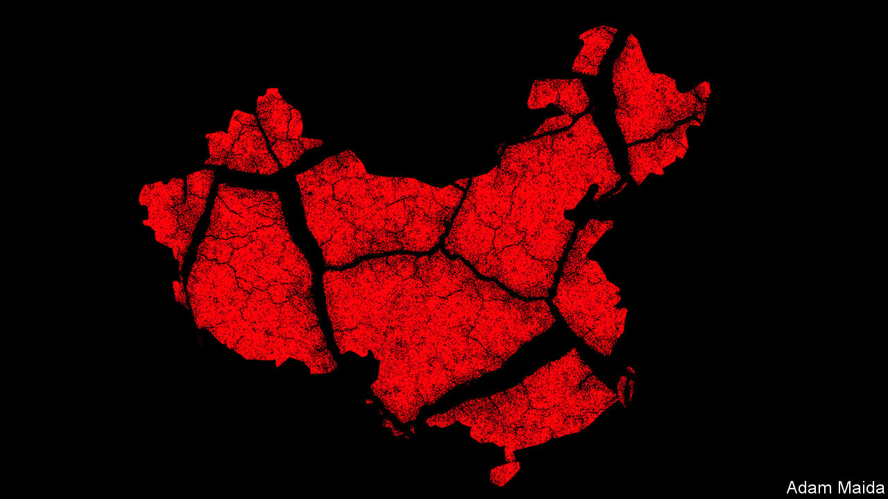
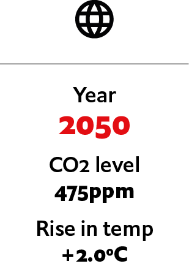
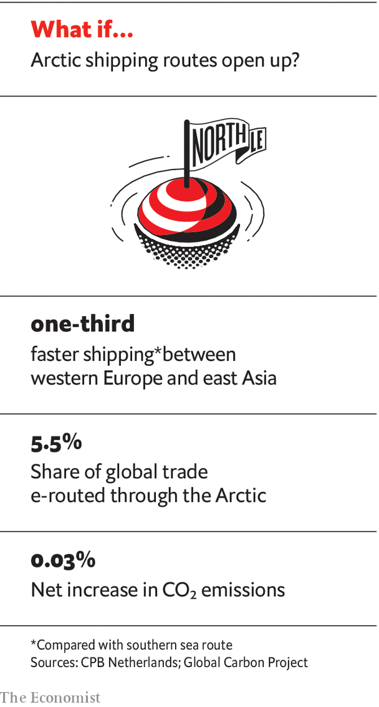

## If water shortages destabilised China

# What if water shortages destabilise China?

> The painfully unequal distribution of water in China reawakens intra-regional resentments not seen in decades. An imagined scenario from 2050

> Jul 4th 2020

Editor’s note: Each of these climate-change articles is fiction, but grounded in historical fact and real science. The year, concentration of carbon dioxide and average temperature rise (above pre-industrial average) are shown for each one. The scenarios do not present a unified narrative but are set in different worlds, with a range of climate sensitivities, on different emissions pathways

THE DEADLY heatwave that has gripped Asia for five months has had many unexpected consequences. One of the more surprising has been Chinese political and business leaders feuding, semi-publicly, about the unequal way China’s water is shared out. This was supposed to be a quiet year for Communist Party rulers, who spent 2049 noisily celebrating their regime’s 100th anniversary. Instead they are on high alert.

The spark for the current political crisis was the success of “Yu the Great”, a two-hour documentary about a nobleman whose flood-fighting genius saw him named emperor 4,000 years ago. The film was watched more than 4bn times before censors cracked its cryptomorphic packaging. Its producer and narrator, one of China’s richest technology magnates, was detained last month in Shenzhen and has not been seen since.

The film was understood by many viewers as a coded complaint about chronic water shortages that have blighted China in recent years, despite ever-larger investments in dams, flood-defence barriers and desalination plants, and campaigns to move millions of people from one side of the country to the other.

In the documentary, Yu the Great is praised for realising that floods cannot be defeated with man-made barriers—the failed approach repeatedly tried by his own father, Lord Gun—but must be harnessed and guided, by building channels. Viewers could not fail to grasp that stubborn, purblind Gun is a proxy for China’s ageing rulers, who draw their authority from the military high command and from Xi Jinping, the country’s unseen and silent 97-year-old paramount leader.

Archeologists have found no physical traces of Yu the Great, but that is not the point. Worshipped for centuries as a deity, Yu is hailed in the documentary as a sort of philosopher king, who bound nine provinces into a single empire by carefully balancing the needs of each. That, too, is a complaint about regional inequalities that have left present-day China a rather resentful, unhappy place. Only a few regions, such as western Sichuan and northern Yunnan, have seen agricultural productivity gains. Climate change has turned much of northern China into an arid semi-desert. The Hai, Liao and Yellow rivers, which once watered great tracts of the North China Plain, the country’s breadbasket, run dry each summer. Farther south, even tributaries of the mighty Yangzi, such as the Han river, flow too slowly in the summer to flush away toxic algal blooms.

In contrast the most southerly provinces, including the high-tech powerhouse of Guangdong, seesaw between having either too much water or not enough. The south is lashed by frequent super-typhoons and flash floods, while storm surges and landslides have destroyed multi-billion-dollar industrial zones and housing developments around the Greater Bay Area, a sprawling, sweltering, permanently gridlocked megalopolis that is home to 120m people, made up of such formerly separate cities as Guangzhou, Shenzhen and Hong Kong. At other times, scorching temperatures have left the south gripped by extended droughts.

Scarcity of water even complicates China’s hold over the great territorial prize of the Xi era, the island of Taiwan. Seven years after being retaken in the short, brutal war of 2043, after an isolationist America said that it would no longer defend it, the island is a harshly policed shadow of its former self. A lack of water has thwarted plans to bring over more mainland settlers.

At emergency global summits to debate climate change, China has talked about playing a leading role as a responsible great power. It is true that it has invested massively in renewable energy. But powerful economic interests have made China cautious. When it comes to dismantling coal-fired power plants, or closing carbon-spewing factories built by Chinese firms in Asia and Africa, China has consistently kept an eye on what rival powers are doing. It has matched American efforts and commitments on greenhouse-gas emissions, but not gone further. In the words of a European diplomat: “China does not do altruism. The approach is to seek maximum credit for minimum effort.”

When it comes to regional diplomacy, China has taken a more conciliatory stance, at least where its largest neighbours are concerned. Swallowing traditional doubts about Chinese settlers overrunning its sparsely peopled east, Russia has worked with China to exploit Arctic sea lanes that are now ice-free for much of the summer. Protective Russian and Chinese icebreakers now lead convoys of oil tankers heading eastward to China, and of container ships steaming westward to European markets. Six states that border the Arctic—Canada, Denmark, Finland, Iceland, Norway and Sweden—have all seen Chinese cargo and cruise ships bring lucrative business to once-sleepy northern ports, tempering domestic political opposition to China’s presence in the high North.

China’s relations with India have been patched up and water-sharing treaties signed between the two nuclear powers, as glaciers high in the Himalaya melt at a dangerous rate. Smaller neighbours have been less fortunate. Brushing aside complaints from Myanmar, Laos and Vietnam, China has hoarded water behind its dams in the upper reaches of the Mekong and other vital rivers, then bought an uneasy peace by selling neighbours cheap electricity from those dams.

At home in China, government scientists do not dispute the dangers posed by man-made global warming. But the response of the Communist Party has been to pour more concrete and to put still more faith in state planning and social controls. Engineering works intended to tame nature and redistribute water, in a country where 80% of it is found in the south, have been a pillar of Communist rule since the days of Mao Zedong. Chinese officials cited Mao’s observation from 1953—“Water is abundant in the south and scarce in the north, so why not borrow a little from the south?”—in 2014 as a giant series of canals and pumping stations, the South to North Water Diversion Project (SNWDP), began carrying water from the Yangzi river system to Beijing and other parched northern cities.

In 2035, with water in ever-shorter supply, China conducted its first Water Census, estimating available water resources per resident of each city and county. Those places with plenty were colour-coded green. Areas suffering from water stress were given an orange code, while those with dangerously few resources were coloured red. The populations of arid, red-coded places may not grow, by law. In practice, many arid areas have emptied, as locals realised no new government funds would be forthcoming for roads, schools or hospitals or to support economic development.

At first, many Chinese did not pay close attention, because a first wave of forced relocations disproportionately affected ethnic minorities living in western regions. In all, perhaps 8m members of the Uighur, Kazakh, Hui and Mongol minorities have now moved from red-coded areas. Some ended up as workers in high-walled factories run with paramilitary discipline. Others, carrying identity cards branding them as migrants from “arid” areas, have suffered discrimination in their new homes. These environmental migrants—though China rejects that label—often struggle to register children in schools or access public services.

Wider public opinion began to sour on the Water Census when a second survey, completed in 2042, handed arid, red-coded identity cards to millions of Chinese from the majority Han ethnic group, triggering a fresh wave of coerced relocations. Farmers from northern and central provinces were obliged to sign family plots of land over to the government in exchange for subsidies to help them start new lives in green-coded regions where the population is allowed to grow. China’s rural areas are ageing rapidly, though, and many farmers said they were too old to move. Impatient with such talk, officials in some red-coded villages are accused of forcefully moving “retired” farmers to hastily built housing blocks.

Water has caused trouble in Hong Kong, the former British colony that has been under strict political supervision since anti-government demonstrations in 2019. Defying local police and mainland security agents, environmental activists staged a string of lightning protests in the late 2030s to block the construction of a nuclear-powered desalination plant, one of dozens being built along the coast. Not only was the plant built but, in a show of force, it was opened in 2047 to mark Hong Kong’s formal absorption into Guangdong province, 50 years after the handover.

The latest Water Census, made public this year, prompted rage on Chinese social media when it emerged that Beijing and its nearby administrative annexe of Xiong’an, a new “smart city” built at the behest of President Xi, both enjoy green codes on the basis of projected deliveries of water from the SNWDP. That is a convenient fiction. In reality the scheme has repeatedly missed its delivery targets as droughts have hit the Yangzi basin. According to government statistics leaked to a news outlet in Guangdong, Xiong’an is desperately short of water. Yet because Mr Xi’s prestige is at stake, its population is still being allowed to grow.

To the central government, it is a special provocation that the leaked Xiong’an water statistics emerged in Guangdong, a wealthy, self-confident province with a mutinous history. The furious response of leaders in Beijing to “Yu the Great” is in part explained by the filmmaker’s close connections to powerful southern politicians. Millions on social media posted images of Yu the Great and his mausoleum near the eastern city of Shaoxing. When those were banned they began sharing pictures of the Zhong Hai and Nan Hai, ornamental lakes inside the party leadership compound in Beijing, labelled “sweet waters”.

Such expressions of grievance may seem somewhat arcane. But in a closely watched surveillance state those voicing them are taking real risks, and their anger should not be ignored. The painfully unequal distribution of water in modern China is reawakening intra-regional resentments not seen for more than a century. Outsiders have spent years speculating what China might do about climate change. Now they are asking: what might climate change do to China? ■

For more coverage of climate change, register for The Climate Issue, our fortnightly [newsletter](https://www.economist.com//theclimateissue/), or visit our [climate-change hub](https://www.economist.com//news/2020/04/24/the-economists-coverage-of-climate-change)