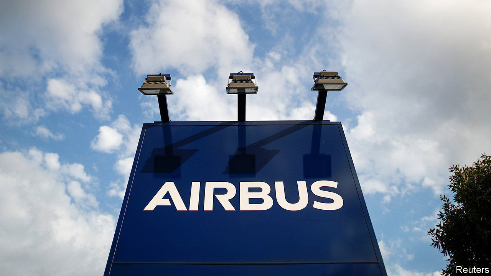
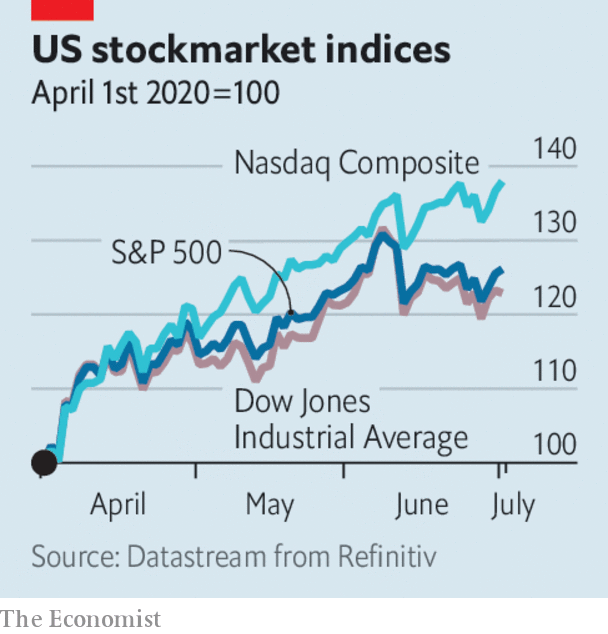

# Business this week

> Jul 4th 2020

In another dreadful week for workers in the aviation industry, Airbus said it would cut 15,000 jobs, about a tenth of its total, because it does not expect demand for its aircraft to return to pre-covid levels until at least 2023, or possibly 2025. The announcement was lambasted in France, where the government has dispensed a huge rescue package. Aeromexico, Mexico’s biggest international airline, filed for bankruptcy protection. And easyJet, a British carrier, started a consultation on redundancies, which could see 727 pilots lose their jobs. Qantas announced 6,000 jobs cuts.

There was some good news for Virgin Australia, after two months in bankruptcy proceedings, as Bain Capital stepped in to buy the business. Shareholders lost their shirts in the deal, but the airline hopes to fly again in September.

The Federal Aviation Administration confirmed that the first certification flights had been conducted for Boeing’s 737 MAX, which has been grounded for 15 months following two crashes. Although the tests were described as a “milestone” in its rehabilitation, Boeing’s passenger plane won’t be returning to the skies soon; the FAA still has to carry out “a number of key tasks”.

Shell joined the list of big oil and gas companies that have had to write down the value of assets because of falling energy demand and lower oil prices. The company expects to record charges of between $15bn and $22bn in the second quarter related to the writedowns. BP, meanwhile, agreed to sell what is left of its petrochemicals business to Ineos, a privately held firm with a record of taking over the chemical divisions of multinational companies, for $5bn. See [article](https://www.economist.com//business/2020/07/02/how-chesapeake-energy-changed-the-world).

Germany became the latest flashpoint for safety concerns at Amazon warehouses during the pandemic, as its workers went on strike. Their union claims that 40 people contracted covid-19 at two sites recently. The online retailer says it has provided enough personal protective equipment.

Meanwhile, Amazon sealed a deal to buy Zoox, a developer of self-driving taxis. Reportedly costing $1.2bn, it is Amazon’s biggest investment in autonomous-vehicle technology, which it may try to adapt for its delivery services.

Wells Fargo became the first big American bank to cut its dividend in light of the Federal Reserve’s recent stress tests. The central bank banned share buy-back programmes and capped dividends for 33 banks during the third quarter. All large banks will be required to resubmit and update their capital plans later this year to show they can cope with an extreme economic scenario. See [article](https://www.economist.com//node/21788901).

Cirque du Soleil filed for bankruptcy protection and laid off 3,500 employees who had been furloughed in March, when it was forced to cancel performances because of covid-19. In other pandemic-related redundancies, SSP Group, which operates food outlets at transport hubs around the world, and is best known in Britain, its home market, for its Upper Crust and Camden Food Co shops, slashed 5,000 jobs. Microsoft announced the permanent closure of all its 83 stores, most of which are in America.

American stockmarkets recorded their best quarter in at least two decades. From April to June the S&P 500 and Dow Jones Industrial Average rose by around 25%, and the Nasdaq by over a third. Most of the gains came in April and May following the market rout in March amid the coronavirus crisis (European stocks actually outperformed the S&P 500 in June). Most share indices are still lower than at the start of the year. The tech-heavy Nasdaq is a notable exception; it has climbed by 10%.

Tesla overtook Toyota to become the world’s biggest carmaker by market capitalisation. The maker of electric vehicles has seen its share price rev up from $225 a year ago to $1,120, giving it a value of more than $205bn. It has yet to turn an annual profit. 

In China, Byton, a startup with ambitions to compete against Tesla, suspended production and sent its staff home. Sales of electric and hybrid vehicles have fallen drastically in China following the end of government tax breaks. Byton is one of several Chinese EV startups that investors piled into hoping for rich returns, though it has not delivered a single vehicle.

Mirror, a home-workout business, was snapped up by Lululemon, a maker of snazzy yoga pants, for $500m. Mirror makes body-length wall-mounted smart screens through which exercisers can interact online with buff personal trainers live or on-demand. The pandemic has been a boon for the high-end fitness industry. But once gyms reopen it remains to be seen whether people will still splash out $1,500 for one of Mirror’s screens, or just plod and puff on a treadmill.