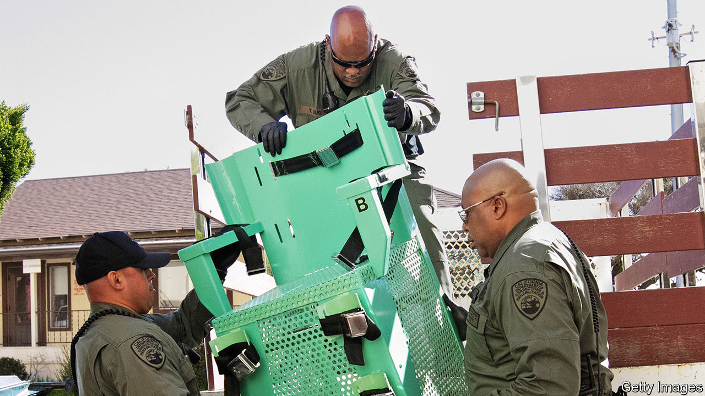

## Cruel, unusual, and costly

# American conservatives are pushing for the repeal of the death penalty

> The federal government’s enthusiasm for executions is at odds with many Republican-led states

> Jul 2nd 2020CHICAGO

PENTOBARBITAL IS due to be injected into Daniel Lee, a white supremacist convicted of a triple murder, on the morning of July 13th. The drug, administered at a federal prison in Indiana, is supposed first to make him unconscious, then stop his heart or prevent breathing. This week the Supreme Court declined to take up a case that might have stopped his death. Instead, barring late legal challenges, his will be the first execution carried out under federal authority in 17 years. It comes a year after William Barr, the attorney-general, ordered them to resume. Three more, all of murderers, are set for the summer.

What will the federal executions achieve? Donald Trump has long yearned for more use of capital punishment. Late in June the president told an interviewer he is “totally in favour of the death penalty”. On Twitter he calls himself a “law and order” leader. His base of supporters should cheer. Among older Republicans a big majority long shared his views: a Pew survey from two years ago found that 81% of 50-64 year-olds supported its use, as did 78% who were 65 or older.

Look more widely, though, and attitudes are turning against the idea of the state killing its prisoners. Younger respondents and independents are less keen on it. Few believe it is an effective deterrent. A poll by Gallup, in late June, found that only 54% of all Americans see its use as moral, the lowest level in two decades since Gallup started asking, and down from 60% last year. Pollsters say a majority of Americans oppose its use once they are reminded of other punishments, such as life in prison without any chance of parole.

Could conservatives, who remain its staunchest supporters, even turn against the death penalty? Hannah Cox, of a national movement founded in 2013 to achieve that, calls Mr Trump’s administration “really remiss” and “out of step with grassroots” on the topic. Her outfit seeks repeal by states and has set up 15 chapters nationally. No longer is it taboo for conservatives to suggest the death penalty should be scrapped: “There’s been a significant shift in culture, attitude,” she says. Whereas a decade ago it was nearly impossible to get state Republicans to back repeal, in the past two years Ms Cox counts ten such bills sponsored by them.

Partly as a result, states increasingly shun its use. Last year only seven of them, mostly in the South, killed a total of 22 prisoners. Just 33 new death sentences were handed down, one of the lowest tallies ever. Last year Republican and Democratic legislators combined in New Hampshire to override their governor’s veto, abolishing the death penalty there. In March Colorado’s governor signed legislation making it the 22nd state to end it. Utah, Nebraska, Wyoming and others have come close. California last year called a moratorium. Many others keep the option, but have not applied it for a decade or more.

Jack Tate, a state senator in Colorado, says his fellow Republicans came to see “a common-sense case, this policy ain’t working”. One strand in the party, he says, are pro-lifers, especially Catholics (their church now opposes its use), who find it inconsistent to favour the death penalty but oppose abortion. Others, especially younger colleagues, warm to a libertarian view, doubting “whether the state should have the power of life and death”, especially when executions don’t provide any “healing” for victims’ families and when, too often, legal mistakes are made.

In overwhelmingly Republican Wyoming a representative, Jared Olsen, last year got a repeal bill passed by the House; it failed only narrowly in the Senate. He argued that capital punishment has become too costly and unequal. Hordes of Republicans lined up to sponsor a new version of his bill, suggesting it will fare well when reintroduced next year. Only wealthy counties pursue capital cases, he points out, because they typically require $1m or more to prosecute. (Just 2% of American counties have been responsible for more than half of all executions since 1976.)

Even in the past couple of months, believes Mr Olsen, opposition to the death penalty has grown. Awareness has spread of its unacceptable “racial application”, because African-Americans nationally are the likeliest to be sentenced and put to death. Recent Black Lives Matter protests have prompted understanding of “huge flaws in the justice system”, he says. As a result, he doubts the summer resumption of federal executions will be popular.

Views on the death penalty may thus be shifting, just as public attitudes swung towards gay marriage and legalisation of marijuana. In Ohio, for example, Republicans look likely to get round to supporting repeal—significant in a state with 141 prisoners on death row. The state’s governor, Mike De Wine, who is Catholic, has already made clear he will not approve any executions. He has hinted that he wants the state house to bring a repeal bill. Mike Hartley, a Republican strategist, calls the moment ripe for change.

Mr Hartley predicts that a test repeal bill will get to Ohio’s state legislature late this year, with the goal of building momentum for a big push next year. A recent convert to the cause himself, he points to growing conservative “distrust in institutions” to explain the shift, along with a better general grasp of racial inequities and, especially, of the gruesome details of how prisoners are killed: “People just realise it’s inhumane as shit.”■