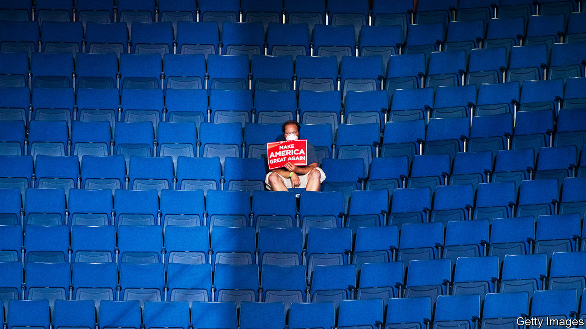

## America’s 2020 election

# Donald Trump faces a much bigger task than he did in 2016

> The polls, political fundamentals and key voters have all turned against the president

> Jul 2nd 2020

DONALD TRUMP’S path to re-election has never looked more difficult. In early June his deficit in the polls against Joe Biden was “just” six percentage points. That may seem large, but it is close enough for the president to conceivably gain the ground required to win an electoral-college victory, even with a minority of the popular vote. He needs to hold Mr Biden to a two- to three-point margin to do so. But nationwide protests, the growing reality of the country’s economic turmoil and a rapidly spreading rebound of covid-19 cases have pushed him even farther behind.

Today he faces a nine-point uphill climb nationally and is behind by between four and eight points in the bellwether states. The president even acknowledged his dire situation in an interview with Fox News last week, saying “Joe Biden is gonna be your president because some people don’t love me, maybe.” According to The Economist’s election-forecasting model, Mr Trump has a one-in-nine chance of winning a second term—down from a one-in-five shot last month.

The president is struggling for at least three reasons. First, he has always relied on defacing his opponents. In 2016 he succeeded in making Hillary Clinton unacceptable to a slightly bigger share of the electorate than the minority that actually liked him. His job was made easier by her low favourability ratings. According to a poll conducted by YouGov on the eve of the election, Mr Trump was rated favourably by 39% of American adults, compared with Mrs Clinton’s 41%; the shares who viewed them unfavourably were 60% and 57%, respectively. Of course, Mr Trump did not have to convince a majority of all American voters that he was preferable to the former secretary of state: his victory depended on persuading a majority of mostly white voters in the Midwest to opt for him.

Mr Trump’s strategy worked (if losing the popular vote by 3m ballots can be counted as working) last time round, when his opponent was already extremely unpopular. But from the start it looked a dicey bet against Mr Biden, who is far more popular than Mrs Clinton was. According to YouGov’s interviews of 1,500 Americans between June 21st and June 23rd, 43% of adults view the former vice-president favourably and only slightly more (47%) dislike him. Mr Trump’s ratings are much harsher: 42% like him and 53% do not. The president’s handling of the pandemic, in particular, makes it hard to imagine he has much room for improvement here.

Second, Mr Trump is being dragged down by the dramatic movement of older voters, horrified by the now-exploding spread of covid-19, away from him. Overall, Mr Biden’s vote margin has increased by about five points over Mrs Clinton’s final performance in 2016 among people who voted last time round, according to an analysis of YouGov’s data. Voters over 65 have led the charge; their vote margin for Mr Biden is six points better than Mrs Clinton’s was, whereas that of voters under 30 has not budged at all. White voters have also fled Mr Trump’s ranks in much larger numbers than voters of colour. Mr Biden is seven points ahead of Mrs Clinton’s position among whites, while Hispanics have moved six points towards Mr Trump (though they still overwhelmingly oppose him).

Third and most important, the president has lost ground with non-college white voters. This group was Mr Trump’s seawall in 2016; it prevented a tide of national ballots from breaching his electoral-college victory. But this time these voters have moved eight points towards his opponent. In swing states their shift is a more modest six percentage points; but in those close contests, such a change, if it sticks, would imperil Mr Trump. He has also lost ground among Christians—both of the evangelical and mainline varieties.

It is unclear why white voters without a college degree have been the most likely to leave Mr Trump’s camp. Some clues may be found in this year’s Democratic presidential primary elections, in which non-college whites were also the most likely to leave Bernie Sanders’s wing of the party. It is likely that Mr Biden represents a more appealing candidacy to these voters than Mrs Clinton did. Social scientists have found that these voters tend to be more racially conservative and harbour more hostile views about feminism than others do. Mr Biden’s candidacy has focused less on the politics of diversity and empowerment than Mrs Clinton’s before him.

Whatever the reason, Mr Trump has lost most support among his stalwart backers from 2016. That may mean, when it comes down to it, that they are likelier than many now imagine to swing back to him on voting day. Perhaps they will. But according to YouGov’s data, the president’s defectors are more likely than others to have voted in the Democratic primaries this year—a sign that many may have been Democrats who did not like Mrs Clinton. They are also 14 percentage points more likely than other voters to believe that race relations have grown worse during Mr Trump’s tenure, and a whopping 22 points likelier to disapprove of how he has handled the coronavirus. Even worse for Mr Trump, they are 30% more likely than other voters to say their personal finances have deteriorated over the past year.

So on all the issues most important to voters at the moment, these voters rate Mr Trump poorly. Though they could move back to him, at present their defection has pushed Mr Trump to clear underdog status. It has also raised a distinct possibility that he could lose by a landslide.

Mr Trump’s allies have raised the possibility that he could win round enough undecided voters to muster an electoral-college victory again. Such voters are a natural crutch for the campaign: wishy-washy voters who last time held their breath until the “October surprise” from James Comey, the FBI director who announced a resumption of the investigation into Mrs Clinton’s emails, perhaps came to Mr Trump’s rescue. But the president’s campaign faces even more bad news on this front.

According to YouGov’s polling, this year’s undecided voters are more likely to be young, non-white and college-educated (all factors that correlate with voting for Democrats). Few are conservatives; 64% voted in this year’s Democratic primary elections. Of those with an opinion about the president, 63% disapprove of his time in office, and they are more likely to oppose him on race relations, covid-19 and the economy than they are to support him.

This puts Mr Trump in a serious bind. For each undecided voter he could win to his cause, he would probably cause two others to vote against him. The same is true for non-voters. According to YouGov’s data, voting-eligible Americans who did not cast ballots in 2016 oppose the president by 20 percentage points.

Many political pundits were stunned by Mr Trump’s upset victory in 2016. Mr Comey himself confessed to being so sure of the outcome of the contest that he took unprecedented steps against one candidate (which may have ended up costing her the election). But the statistical model The Economist built to predict presidential elections would not have been so shocked. Run retroactively on the last cycle, it would have given Mr Trump a 27% chance of winning the contest on election day. In July of 2016 it would have given him a 30% shot.

This time our model points with much greater confidence to a defeat for Mr Trump. Today, it gives him just an 11% chance of winning re-election in November. It is not impossible that he could pull it off. Fans of poker will know that closing an inside straight (which happens in 9% of hands) happens frequently enough to take seriously. It should be taken especially seriously when the leadership of the free world is at stake.

But is Mr Trump capable of doing what is needed to win? He would have to take the country’s ever-worsening outbreak of covid-19 seriously, change his tone and actions on racial justice and pursue economic policies that reverse the coronavirus-induced depression (renewed growth would certainly be a boon to his prospects). And then he would have to perform the nearly impossible task of making himself appear more moderate and likeable than his opponent. Mr Biden is routinely achieving 50% support in opinion polls, far higher than Mrs Clinton or Barack Obama managed in 2016 or 2012.

All this puts Mr Trump on a path to a resounding rebuke of his presidency in November. Every day that passes without a course-correction increases the likelihood of his defeat. ■ 

Dig deeper:

## URL

https://www.economist.com/united-states/2020/07/02/donald-trump-faces-a-much-bigger-task-than-he-did-in-2016
