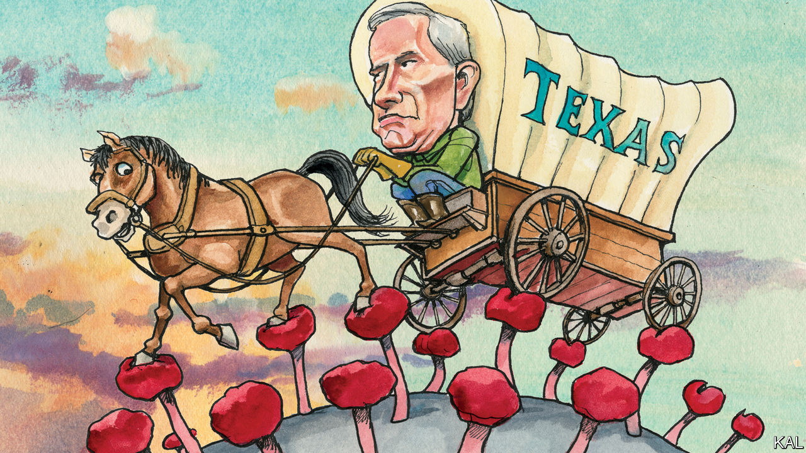

## Lexington

# It’s messing with Texas

> Greg Abbott is battling the coronavirus with one hand and his party’s lunatic fringe with the other

> Jul 2nd 2020

IN THE FIRST months of the coronavirus pandemic, Greg Abbott seemed happy to let Texas’s 254 county and 1,214 city authorities take the lead. The state’s vastness—with its widening contrast between rural reaches and exploding metropolises—argued for local decision-making. And the conservative governor had little to gain by organising an economic lockdown that a minority of Republicans considered tantamount to treason. By late March, however, with Texas still relatively unscathed by the virus, Mr Abbott’s calculation changed. He struck down an effort to make mask-wearing legally enforceable in Houston. He also issued orders—ahead of almost any other governor—to reopen the bars and restaurants that local officials had shuttered. It must have seemed like good politics as well as economics at the time.

Texas is now a centre of the viral wave sweeping the South and West. The state is seeing well over 6,000 new infections a day, five times the number of a month ago. And most are in Houston, where scenes reminiscent of New York in April are unfolding. Last week the biggest hospital network in America’s fourth-biggest city said its intensive-care wards were almost full. Mr Abbott meanwhile ordered bars and other non-essential businesses to close again, forced restaurants to cut their capacity by half and urged Texans to wear masks, as he mostly does. The would-be pioneer of reopening has become the first governor to order a reclosing.

His policy twists have been heavily criticised from both sides of the aisle, with some justification. A cautious politician, whose preference for handing down edicts after slow deliberation reflects his background as a judge, Mr Abbott has shown more calculation than leadership during the crisis. He did not endorse the local officials he deferred to early on, but hid behind them. His move to countermand them reflected a decade-long Republican campaign to centralise power in Austin in order to peg back the Democratic cities. Even so, Mr Abbott deserves to be cut a little slack.

Managing pandemic politics is easiest in states with stable majorities, as Andrew Cuomo of New York and Mike DeWine of Ohio have shown. It is much harder in more divided ones, especially for Republican governors, who cannot get too far out of step with the source of much of the divisiveness, President Donald Trump. And Texas is one of the most politically torn states of all. Its Republican rulers, grown decadent by decades in power, are bitterly feuding even as a tsunami of politico-demographic change rushes towards them. Mr Abbott’s highly politicised management of the pandemic may be about as solid as such pressures allow.

His political balancing act reflects his enigmatic figure. He is much less charismatic than his immediate predecessors, Rick Perry and George W. Bush, and—deep into his second gubernatorial term—less well-known. Having ascended to the governorship via the state Supreme Court bench and attorney-general’s office, he has never faced a tough election. Many Texans have no idea even that he is wheelchair-bound, owing to a freak tree-fall accident he suffered as a teenager—though his courage in battling back from that tragedy is his most admirable quality. Politically, too, Mr Abbott has managed to remain usefully indeterminate.

He took office as a conservative hardliner—boasting of the 31 times he had sued the Obama administration and soon enough echoing Mr Trump’s anti-immigration rhetoric. This earned him credit with a state party that had veered hard to the right. Dan Patrick, leader of the Texan senate and an advocate of American grandparents risking covid-19 infection for the sake of the economy—even unto death—is its most recognisable face. Yet Mr Abbott knows Mr Patrick’s politics is another sort of suicide mission in a state that last had a white majority over a decade ago. The 2018 mid-terms, in which the Democrats flipped 14 seats in the state legislature (and Mr Patrick survived a surprisingly fierce challenge) underlined that reality. Having won his own re-election with ease, Mr Abbott used his increased heft in the party to help launch one of the most quietly impressive Republican rethinks of the Trump era. The state’s next biennial legislative session, held last year, was devoted to property tax and bipartisan education funding, not—as previously—to bathroom bills.

Mr Abbott’s pandemic management has followed a similar pattern. Having covered his right flank, he has ended up in a pretty reasonable place—as indicated by the fact that he is now being criticised most harshly by the crazy right. By permitting local authorities to force companies to use masks, the governor showed “who he is, a traitor to liberty and our constitution,” tweeted a Republican state representative named Jonathan Stickland last week. Someone should tell Mr Stickland how that sort of nonsense is working out for Mr Trump: the president is currently in a tie for Texas with Joe Biden, which raises a possibility of Texas’s state house going Democratic for the first time since 2001.

Mr Abbott’s judiciously disguised pragmatism looks like his party’s best hope of avoiding that fate. It has made him popular in a divided state. His approval rating is 63%, 12 points higher than the president’s. It has also won him the confidence of the conservative donors who may need to spend unprecedented sums in November to shore up the Republican ballot in Texas.

His qualified success also offers his party pointers for the post-Trump future that may be looming over it. In a rapidly diversifying society—nationally as well as in Texas—the Republicans will have to expand their appeal to keep winning elections. Yet it may well take a fire-breathing conservative (or ostensibly one, at least) to effect the shift. Who knows? Perhaps Mr Abbott could even be that fire-breather: defeat for Mr Trump would arguably make him the Republicans’ foremost leader. But that feels like a remote possibility at most. For now the governor has a real-life catastrophe to worry about.■

## URL

https://www.economist.com/united-states/2020/07/02/its-messing-with-texas
